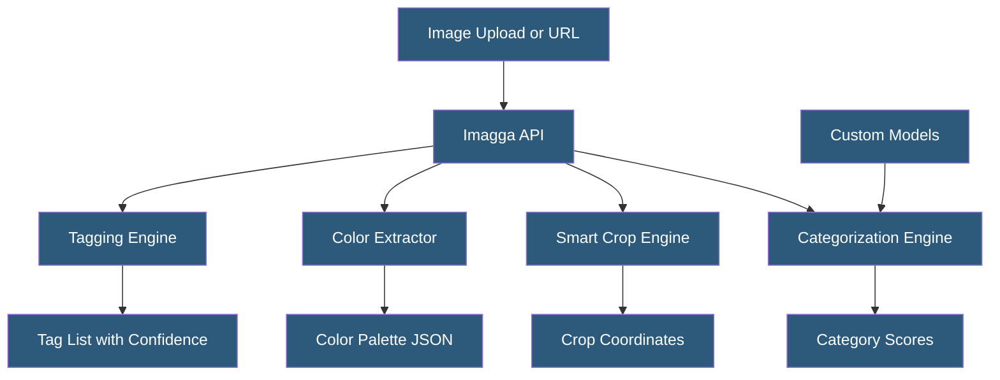

**Category:** Computer Vision Model Hosting
**Difficulty:** Beginner
**Reading time:** 5 min read

---

Imagga is a computer vision API provider specializing in image tagging, categorization, color extraction, and smart cropping. It offers both cloud-hosted API endpoints and on-premise deployment options, with a focus on developer-friendly integration and competitive pricing for content management and media workflows.

- **Tagging API** — returns weighted list of descriptive tags for an image from Imagga's visual taxonomy
- **Categorization API** — classifies images into predefined category hierarchies (NSFW, travel, food, etc.)
- **Color Extraction** — identifies dominant and foreground/background colors with percentage coverage
- **Smart Cropping** — generates optimally focused thumbnails for given aspect ratios
- **Custom Categories** — training custom classification models on user-provided datasets
- **Batch Upload** — processing multiple images in a single API call for throughput optimization
- **On-Premise Deployment** — Docker-based Imagga deployment for data privacy requirements

Imagga's API accepts images via URL or file upload using HTTP multipart form data. The tagging response returns a ranked list of concepts with confidence scores — a photo of a beach might return "beach" (0.97), "ocean" (0.95), "sand" (0.93), "coast" (0.89). The confidence threshold parameter filters low-confidence tags; setting it to 0.5 eliminates guesses while keeping reliable predictions.

Color extraction analyzes pixel distribution to return dominant colors as hex codes with percentage coverage, separately for foreground subjects and background. This powers design tools and visual search applications that match content by color palette. Smart cropping returns bounding box coordinates for the most visually significant region of an image at a requested aspect ratio — useful for generating consistent thumbnails from variable-size input photos.

The categorization API classifies images into mutually exclusive top-level categories or hierarchical taxonomies. Imagga maintains specialized category sets: NSFW (safe/suggestive/explicit), travel destinations, food types, and real estate room types. Custom categories allow training classifiers on user-provided labeled images, with Imagga handling the training infrastructure.

The on-premise deployment option packages the Imagga inference engine in Docker, enabling air-gapped operation for privacy-sensitive image processing. Configuration connects to local GPU or CPU resources. This option is priced separately from the cloud API and targets enterprise customers with data governance requirements preventing cloud data transfer.

- Stock photography platform auto-tagging millions of images for searchability
- E-commerce product catalog enrichment with automated attribute extraction
- Media asset management system organizing photo libraries by visual content
- Content platform automatically generating optimized thumbnails at multiple aspect ratios
- Adult content platform using Imagga's NSFW categorization for moderation

| Advantage | Disadvantage |
|-----------|--------------|
| Competitive pricing compared to AWS/GCP/Azure for tagging workflows | Smaller scale and fewer features than major cloud providers |
| On-premise option for data-sensitive workloads | Tag taxonomy less comprehensive than Google/AWS for specialized domains |
| Color extraction is a unique differentiator not available in competing APIs | Custom model training less automated than Azure Custom Vision or Roboflow |
| Simple API requiring minimal integration code | Limited model architecture transparency |

- [Google Cloud Vision API](google-cloud-vision-api.md)
- [Image Classification Services](image-classification-services.md)
- [Object Detection APIs](object-detection-apis.md)

---
*Part of the [Computer Vision Model Hosting](index.md) category · [Back to Master Index](../../index.md)*
