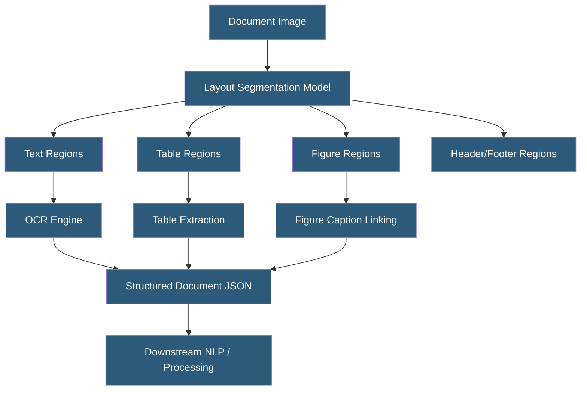

**Category:** Computer Vision Model Hosting
**Difficulty:** Intermediate
**Reading time:** 5 min read

---

Layout analysis APIs segment document images into structural elements — headers, paragraphs, tables, figures, captions, and page numbers — enabling downstream document processing to understand document structure rather than treating pages as bags of text. These capabilities underpin intelligent document processing pipelines for enterprise automation.

- **Document Layout Analysis (DLA)** — computer vision task identifying and classifying regions of a document page
- **Layout Parser** — open-source Python library wrapping pre-trained DLA models (LayoutLM, Detectron2)
- **LayoutLM** — Microsoft's multimodal transformer pre-trained on document images with text and layout understanding
- **Reading Order Detection** — determining the logical sequence for reading multi-column or complex layout documents
- **Region Segmentation** — classifying page regions as text, table, figure, equation, or other element types
- **PubLayNet** — large-scale dataset of scientific document layouts used for DLA model training
- **DocTR** — open-source document text recognition library supporting layout analysis and OCR

Layout analysis uses object detection models trained to identify document region types rather than physical objects. Models like Detectron2 fine-tuned on PubLayNet or DocBank can identify text blocks, titles, figures, tables, and lists with high accuracy on academic and business documents. The detected regions provide context for downstream OCR — applying table extraction algorithms to table regions rather than treating them as undifferentiated text.

LayoutLM and its successors (LayoutLMv2, LayoutLMv3, LayoutXLM) combine visual features (CNN-extracted), text features (BERT-style language model), and layout features (bounding box position embeddings) in a single multimodal transformer. This allows the model to understand that "Invoice Number" appearing at the top-right of a document is likely a header label with its value appearing directly below or to the right. Pre-training on IIT-CDIP (11M business documents) gives LayoutLM strong document understanding.

Cloud Document AI services (Google Document AI, AWS Textract, Azure Document Intelligence) include layout analysis as part of their document processing pipeline — automatically separating text, tables, figures, and selection marks. The layout output can be accessed independently for applications that need document structure without full field extraction.

For self-hosted deployments, Layout Parser provides a Python interface to multiple pre-trained DLA models with a unified API for region detection, reading order detection, and integration with OCR backends (Tesseract, Paddle OCR). It processes PDFs and images, returning structured region objects that applications can filter and process by element type.

- Scientific paper processing pipeline extracting text separately from figures and equations
- Legal contract analysis separating clause text from headers and identifying numbered sections
- Form automation system pre-detecting form regions before targeted field extraction
- Invoice processing accurately extracting line-item tables while preserving row structure
- Book digitization preserving chapter structure, footnotes, and figure captions separately

| Advantage | Disadvantage |
|-----------|--------------|
| Structural awareness dramatically improves downstream text extraction quality | Training data for specialized document types (legal, medical) is limited |
| Open-source options (Layout Parser, DocTR) enable cost-effective self-hosting | Complex multi-column academic layouts still challenge state-of-the-art models |
| LayoutLM multimodal models understand document semantics, not just structure | Layout models trained on Western document styles perform poorly on other formats |
| Pre-segmented regions enable parallel OCR processing of page sections | Integration between layout analysis and OCR requires custom pipeline engineering |

- [Document AI Services](document-ai-services.md)
- [OCR Optical Character Recognition APIs](ocr-optical-character-recognition-apis.md)
- [Tesseract OCR Hosting](tesseract-ocr-hosting.md)

---
*Part of the [Computer Vision Model Hosting](index.md) category · [Back to Master Index](../../index.md)*
