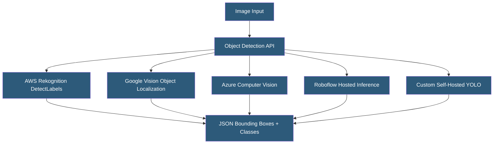

**Category:** Computer Vision Model Hosting
**Difficulty:** Intermediate
**Reading time:** 6 min read

---

Object detection APIs locate and classify multiple objects within images, returning bounding box coordinates, class labels, and confidence scores. Cloud-hosted detection APIs span general-purpose services (AWS, GCP, Azure) and specialized providers, trading infrastructure management for per-request pricing and API-driven integration.

- **Bounding Box** — rectangular region defined by coordinates (x, y, width, height) or (x1, y1, x2, y2) containing a detected object
- **Confidence Score** — probability 0–1 that the detected region contains the specified class
- **NMS (Non-Maximum Suppression)** — post-processing algorithm removing overlapping duplicate detections
- **IoU (Intersection over Union)** — ratio of intersection to union area of two bounding boxes; used as NMS threshold
- **Anchor-Free Detection** — modern architectures (YOLO, DETR) predicting boxes directly without predefined anchor templates
- **Two-Stage Detection** — Faster R-CNN style; first proposes regions, then classifies — higher accuracy, slower speed
- **Class Vocabulary** — the set of object categories the model can detect; varies by API provider

Cloud object detection APIs abstract away model selection, GPU infrastructure, and scaling. The integration pattern is consistent across providers: send an HTTP POST request with an image (URL, base64 bytes, or cloud storage reference), receive a JSON response containing detected objects with their bounding box coordinates, class labels, and confidence scores. Coordinate formats vary — AWS returns pixel coordinates relative to image dimensions; GCP returns normalized 0–1 coordinates; Azure returns both.

Class vocabularies differ substantially between providers. AWS Rekognition DetectLabels returns objects from a broad taxonomy of 3,000+ categories including multi-level hierarchies. Google's Object Localization API returns ~300 object categories with high precision bounding boxes. Azure Computer Vision objects coverage is similar to Google's. All major providers cover common objects (people, vehicles, animals, furniture), but domain-specific objects (industrial parts, medical instruments) require custom model training.

Response latency for cloud detection APIs typically ranges from 200ms to 1 second depending on image size, provider infrastructure, and requested feature set. For real-time video applications requiring <100ms latency, self-hosted YOLO on GPU is the standard approach. For batch processing, cloud APIs offer asynchronous endpoints that accept jobs and return results to a callback URL, enabling high-throughput pipeline integration.

Custom object detection — detecting objects not covered by the provider's standard taxonomy — requires fine-tuning using each provider's custom training services (AWS Custom Labels, Google AutoML Vision, Azure Custom Vision) or migrating to a self-hosted model. The custom training workflow follows the same pattern: upload labeled images, trigger training, deploy to a custom endpoint.

- Retail inventory system counting product instances on shelves via in-store cameras
- Vehicle detection in parking management systems
- Wildlife monitoring identifying animal species in camera trap images
- News wire automatically detecting and tagging subjects in submitted press photos
- Warehouse management system detecting package types on conveyor belts

| Advantage | Disadvantage |
|-----------|--------------|
| No infrastructure management; instant deployment for standard object categories | Cloud APIs are prohibitively expensive at high-volume inference rates |
| Multi-provider options allow cost/accuracy optimization | Latency too high for real-time video applications |
| Consistent API patterns across AWS/GCP/Azure reduce switching costs | Class vocabulary limitations require custom training for domain-specific objects |
| Automatic scaling handles variable traffic without capacity planning | Provider-specific coordinate formats require normalization logic |

- [YOLO Model Hosting](yolo-model-hosting.md)
- [Amazon Rekognition API](amazon-rekognition-api.md)
- [Real-Time Video Inference](real-time-video-inference.md)

---
*Part of the [Computer Vision Model Hosting](index.md) category · [Back to Master Index](../../index.md)*
