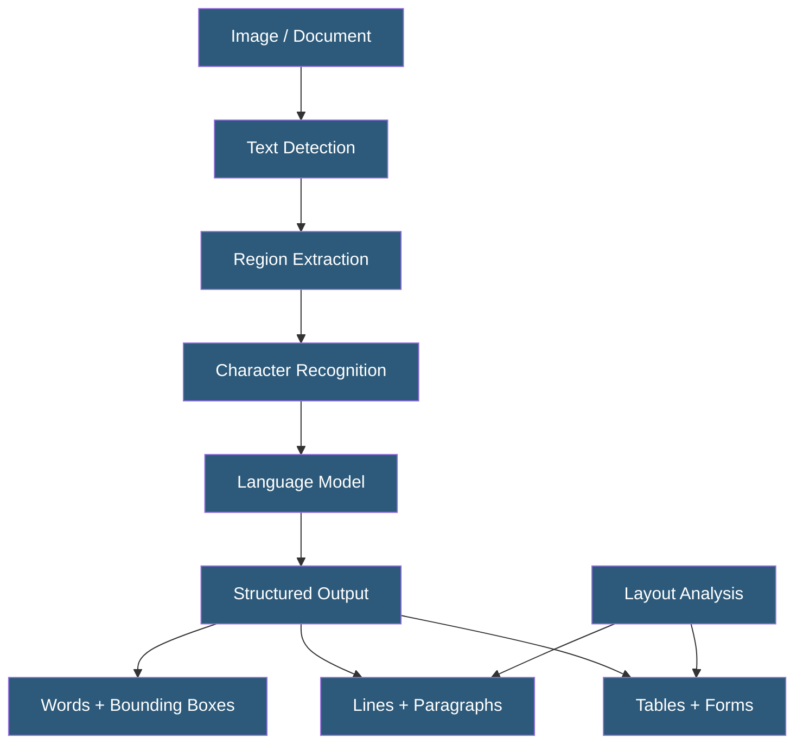

**Category:** Computer Vision Model Hosting
**Difficulty:** Intermediate
**Reading time:** 6 min read

---

OCR APIs extract text from images and documents using deep learning-based recognition models that handle printed text, handwriting, varied fonts, and complex document layouts. Modern OCR services go beyond character recognition to return structured output including word positions, line groupings, and document hierarchy.

- **Scene Text Detection** — locating text regions in natural images (signs, labels, license plates)
- **Document OCR** — extracting text from scanned documents with structured layout analysis
- **Handwriting Recognition** — OCR for cursive and printed handwriting using recurrent or attention-based models
- **Bounding Polygon** — polygon or rectangle coordinates returned with each recognized text region
- **Read Order** — logical reading sequence reconstructed from detected text positions
- **Confidence Score** — per-word or per-character probability that the recognition is correct
- **Language Model** — secondary model improving accuracy by constraining output to valid words in context

Modern deep learning OCR pipelines consist of detection and recognition stages. Text detection uses models (CRAFT, DBNet, TextSnake) to identify text regions as polygons, handling curved, rotated, and perspective-distorted text. Recognition models (CRNN, TrOCR, PaddleOCR) convert cropped text regions to character sequences using CTC loss or attention-based sequence-to-sequence decoding.

Cloud OCR APIs abstract this complexity behind simple endpoints. AWS Textract extends beyond character recognition to return structured document understanding: key-value pairs from forms, cell contents from tables, and reading-order text blocks. Google Cloud Document AI (successor to the Document Understanding API) applies similar structural analysis with specialized processors for invoices, tax forms, receipts, and identity documents. Azure's Read API in Document Intelligence returns detailed page structure including paragraphs, tables, and key-value pairs.

Accuracy varies significantly by document type. Printed high-contrast text on white background achieves >99% character accuracy. Handwritten text on ruled paper achieves 90–95%. Photographs of text on textured surfaces or at oblique angles achieve 80–90%. Poor lighting, low resolution (below 150 DPI), or text mixed with complex backgrounds degrades accuracy further. Preprocessing — deskewing, denoising, contrast enhancement — can improve accuracy 5–15% for difficult documents.

For high-throughput processing, asynchronous APIs accept bulk document batches and return results to cloud storage, enabling processing of millions of pages without synchronous request management. AWS Textract async, GCP async Document AI, and Azure batch Document Intelligence all follow this pattern.

- Invoice processing automation extracting vendor, amount, line items, and payment terms
- Legal document digitization converting thousands of scanned contracts to searchable text
- License plate recognition in parking systems and traffic monitoring
- Prescription medication label reading for pharmacy automation
- Check deposit apps reading MICR line and check amounts from photographed checks

| Advantage | Disadvantage |
|-----------|--------------|
| Cloud OCR eliminates model training requirements for standard document types | Per-page pricing accumulates quickly for high-volume document processing |
| Specialized document processors (invoice, receipt) improve structured extraction accuracy | Document-specific processors may not exist for unusual formats |
| Async batch APIs handle millions of pages without request management overhead | Accuracy degrades significantly for low-quality scans and handwriting |
| Multi-language support covers 100+ languages in major cloud OCR services | Privacy concerns with sending sensitive documents (financial, medical, legal) to cloud |

- [Tesseract OCR Hosting](tesseract-ocr-hosting.md)
- [Document AI Services](document-ai-services.md)
- [Azure Computer Vision API](azure-computer-vision-api.md)

---
*Part of the [Computer Vision Model Hosting](index.md) category · [Back to Master Index](../../index.md)*
