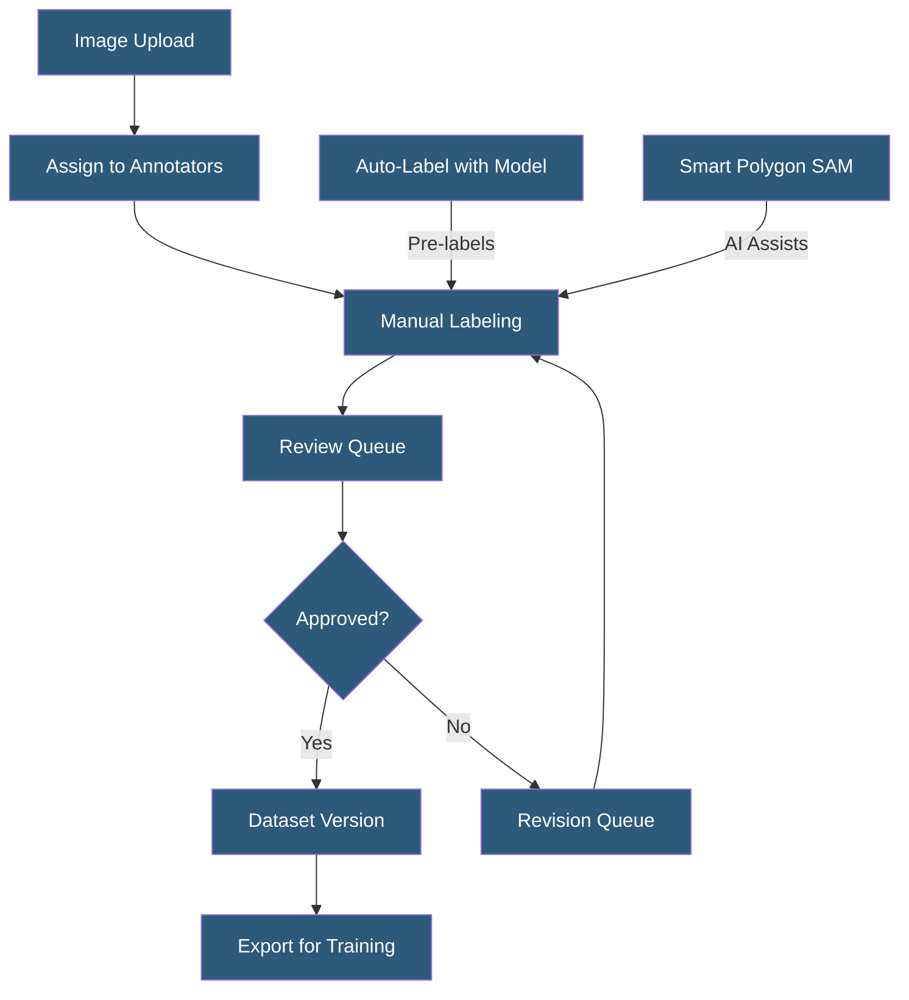

**Category:** Computer Vision Model Hosting
**Difficulty:** Beginner
**Reading time:** 5 min read

---

Roboflow provides a browser-based annotation platform for labeling computer vision datasets with bounding boxes, polygons, keypoints, and classification labels. It includes AI-assisted labeling features, labeling workflows for team collaboration, and quality review mechanisms to produce consistent, high-quality ground truth datasets.

- **Bounding Box** — rectangular annotation defining the location and class of an object in an image
- **Polygon Annotation** — precise boundary tracing for instance segmentation tasks requiring pixel-level accuracy
- **Smart Polygon** — AI-assisted polygon tool using Segment Anything Model (SAM) to auto-trace object boundaries
- **Label Map** — defined set of class names used consistently across all images in a dataset
- **Annotation Queue** — workflow system assigning images to specific annotators with progress tracking
- **Consensus Labeling** — multiple annotators label the same image; agreement determines final ground truth
- **Auto-Label** — using an existing model to pre-label a new batch of images for human review and correction

Roboflow's annotation interface runs entirely in the browser, eliminating local software installation requirements for distributed annotation teams. Images are uploaded in bulk or connected from cloud storage. The annotation editor supports keyboard shortcut-driven workflows for high-speed labeling: pressing a class number key selects the class, then drawing a bounding box completes the annotation in two clicks. Frame-to-frame object tracking in video sequences carries annotations forward to adjacent frames, reducing repetitive labeling for sequential data.

The Smart Polygon feature integrates Meta's Segment Anything Model — the annotator clicks a point on an object, and SAM generates a precise polygon boundary. The annotator can add or remove points to refine the boundary, then accept. This reduces detailed segmentation annotation time by 70–90% compared to manual polygon tracing. Auto-labeling runs a trained model over unlabeled images to generate candidate annotations, which human annotators review and correct at high speed — typically 5–10x faster than labeling from scratch.

Team annotation workflows route images through queues: labeling queue → review queue → approved. Labeling queues can be assigned to specific annotators; review queues are handled by senior labelers or model owners. Consensus annotation assigns the same image to multiple annotators and resolves disagreements by majority vote or expert adjudication, improving label consistency for ambiguous cases.

Quality metrics include annotation velocity per labeler, inter-annotator agreement scores, and class distribution analysis to identify imbalanced datasets. Roboflow also provides dataset health checks flagging issues like duplicate images, null annotations, and class imbalance before dataset versions are finalized for training.

- Building a custom defect detection dataset for a specific manufacturing component
- Medical imaging annotation team labeling radiology images with multi-reviewer consensus
- Wildlife research project labeling drone footage with species bounding boxes
- Retail dataset creation for product recognition models with 100+ SKU classes
- Smart city project annotating pedestrian, vehicle, and cyclist instances for traffic analysis

| Advantage | Disadvantage |
|-----------|--------------|
| Browser-based tool requires no local installation for distributed teams | Large image uploads and annotation projects require good internet connectivity |
| SAM-powered smart polygon dramatically reduces segmentation labeling time | Complex multi-class scenes can be slow even with AI assistance |
| Auto-labeling with existing models accelerates dataset expansion | Auto-label quality depends on existing model performance in new domains |
| Built-in dataset health checks catch quality issues early | Annotation rates and per-image cost higher than dedicated annotation platforms |

- [Roboflow Model Deployment](roboflow-model-deployment.md)
- [Computer Vision Model Versioning](computer-vision-model-versioning.md)
- [Image Classification Services](image-classification-services.md)

---
*Part of the [Computer Vision Model Hosting](index.md) category · [Back to Master Index](../../index.md)*
