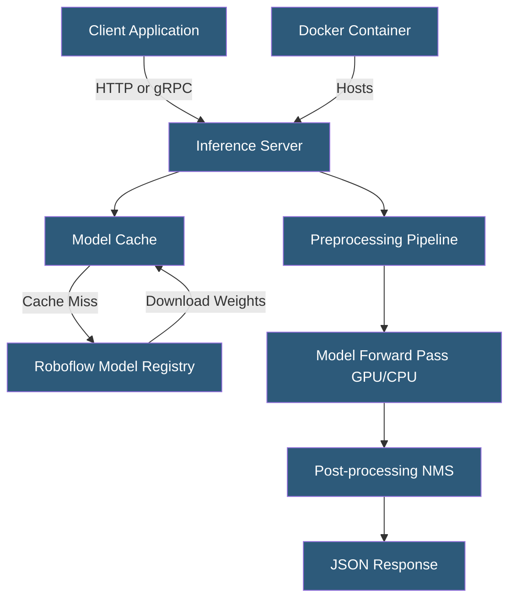

**Category:** Computer Vision Model Hosting
**Difficulty:** Intermediate
**Reading time:** 6 min read

---

The Roboflow Inference Server is an open-source Python package and Docker image that enables self-hosted computer vision model deployment, replicating the Roboflow cloud API contract locally on GPU or CPU hardware. It supports YOLO-family models, SAM, CLIP, and custom model weights, enabling air-gapped and edge deployments.

- **inference package** — Python library (`pip install inference`) providing model loading, preprocessing, and inference execution
- **Model ID** — format `workspace/model-version` identifying models from Roboflow Universe or private workspaces
- **GPU Acceleration** — CUDA-enabled inference using NVIDIA GPUs; falls back to CPU automatically
- **Batch Inference** — processing multiple images in a single forward pass for throughput optimization
- **gRPC vs HTTP** — two available API protocols; gRPC offers lower latency for high-frequency applications
- **Pipeline** — composable graph of processing steps (detection, classification, segmentation) on a single image
- **Supervision** — companion Python library for post-processing detections (drawing, filtering, tracking)

The Roboflow Inference Server is deployed as a Docker container, making it portable across cloud VMs, on-premise servers, and edge devices. On first request for a model, the server downloads and caches the model weights from the Roboflow registry (or uses locally provided weights). Subsequent requests use the cached model, with the server maintaining multiple model versions in memory to support concurrent prediction endpoints.

The server handles the complete inference pipeline: receiving images (via base64 encoding, URL fetch, or file upload), resizing and normalizing input to match the model's expected dimensions, running the neural network forward pass on GPU (via CUDA/TensorRT) or CPU, applying Non-Maximum Suppression (NMS) to filter overlapping detections, and returning structured JSON results matching the Roboflow cloud API schema.

For production deployments, the inference server is commonly placed behind a load balancer with multiple server instances scaled based on request queue depth. GPU utilization monitoring (via NVIDIA Management Library) guides autoscaling decisions. TensorRT optimization can convert ONNX model weights to hardware-optimized execution graphs, reducing inference latency by 2–5x on compatible NVIDIA GPUs.

The `supervision` library integrates tightly with the inference server for post-processing: annotating images with bounding boxes, tracking objects across video frames (ByteTrack algorithm), filtering detections by zone/region, and aggregating counts for analytics. Pipelines combine multiple models — for example, a person detector followed by a PPE classifier — executing sequentially on each detection for compound analysis workflows.

- Industrial quality control system running inference on-premise for data privacy and low latency
- Retail store deploying inference on edge hardware for real-time shelf inventory analysis
- Security camera network running local inference without sending footage to cloud services
- Research lab running large-scale batch inference on GPU cluster without cloud API cost caps
- Autonomous vehicle prototype system requiring deterministic sub-50ms inference latency

| Advantage | Disadvantage |
|-----------|--------------|
| Air-gapped deployment for sensitive or regulated environments | Hardware provisioning and maintenance is operator responsibility |
| Lower per-inference cost at scale vs hosted API | GPU server procurement cost is significant upfront investment |
| Full control over model versions and serving configuration | Requires DevOps expertise to deploy, monitor, and scale |
| Same API contract as cloud, enabling easy migration | No automatic autoscaling — manual capacity planning required |

- [Roboflow Model Deployment](roboflow-model-deployment.md)
- [YOLOv8 Deployment](yolov8-deployment.md)
- [Edge Computer Vision Deployment](edge-computer-vision-deployment.md)

---
*Part of the [Computer Vision Model Hosting](index.md) category · [Back to Master Index](../../index.md)*
