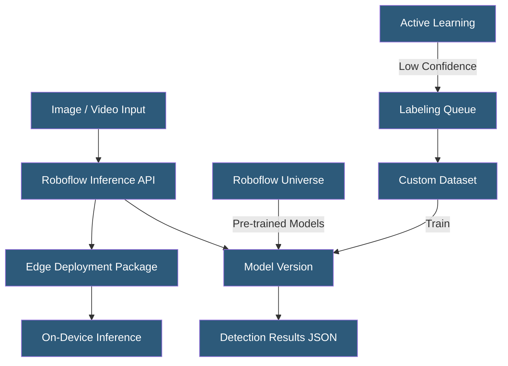

**Category:** Computer Vision Model Hosting
**Difficulty:** Beginner
**Reading time:** 5 min read

---

Roboflow provides an end-to-end computer vision platform enabling teams to annotate datasets, train models, and deploy them to cloud APIs, edge devices, or on-premise servers. Its hosted deployment service abstracts infrastructure concerns, letting developers focus on model accuracy rather than serving infrastructure.

- **Roboflow Universe** — public repository of 200,000+ datasets and 50,000+ pre-trained models available for reuse
- **Workspace** — organizational unit in Roboflow containing projects, datasets, and deployed models
- **Version** — snapshot of a dataset with specific preprocessing and augmentation settings used for training
- **Inference API** — hosted REST API endpoint for running model predictions against uploaded images
- **Confidence Threshold** — minimum prediction confidence score required for a detection to be returned
- **Overlap Threshold** — NMS (Non-Maximum Suppression) threshold for filtering duplicate bounding box detections
- **Active Learning** — feature routing low-confidence inference results back for human labeling to improve models

Roboflow's deployment pipeline begins with dataset preparation: images are uploaded, annotated using the platform's labeling tools, and organized into versioned datasets with configurable preprocessing (resizing, auto-orientation, contrast adjustment) and augmentation (flip, rotation, brightness variation). Each version generates a fixed training snapshot, enabling reproducible training runs.

Models are trained either within Roboflow (using AutoML-style training backed by YOLO architectures) or externally using exported datasets in YOLO, COCO, Pascal VOC, or other formats. Externally trained model weights can be uploaded back to Roboflow for managed deployment. The hosted inference API accepts images via HTTP POST (base64 encoded or URL reference), runs the model, and returns bounding box coordinates, class labels, and confidence scores as JSON.

Infrastructure management is fully abstracted: Roboflow handles model serving, auto-scaling, and request routing behind its API. For latency-sensitive or offline deployments, Roboflow provides the open-source `inference` server package that can run locally on GPU or CPU hardware, edge devices (NVIDIA Jetson, Raspberry Pi), or within a self-hosted Docker environment — using the same model weights and API contract as the hosted service.

Active learning closes the training loop: detections below the confidence threshold are flagged and routed to a labeling queue for human review. Corrected annotations feed back into future training versions, continuously improving model accuracy on the organization's specific domain data.

- Retail loss prevention systems detecting unpaid merchandise in checkout zones
- Agricultural monitoring identifying crop diseases from drone imagery
- Manufacturing quality control detecting assembly defects on production lines
- Construction site safety monitoring detecting missing PPE (hard hats, vests)
- Wildlife conservation camera trap analysis identifying animal species at scale

| Advantage | Disadvantage |
|-----------|--------------|
| End-to-end platform reduces time from dataset to deployed API | Hosted inference costs scale with request volume |
| Active learning continuously improves model with production data | Limited control over underlying serving infrastructure |
| Roboflow Universe provides pre-trained starting points | Advanced training configurations require external training pipelines |
| Unified API across cloud and edge deployments | Data privacy concerns with uploading sensitive imagery to cloud |

- [Roboflow Inference Server](roboflow-inference-server.md)
- [YOLO Model Hosting](yolo-model-hosting.md)
- [Edge Computer Vision Deployment](edge-computer-vision-deployment.md)

---
*Part of the [Computer Vision Model Hosting](index.md) category · [Back to Master Index](../../index.md)*
