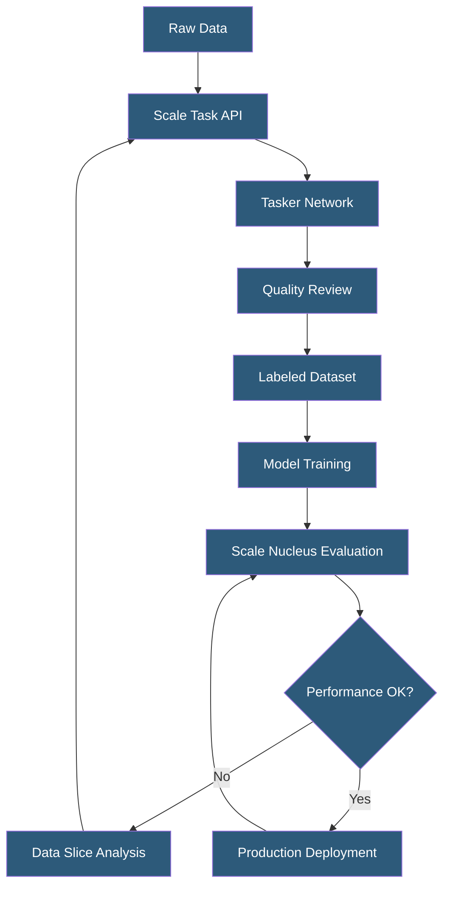

**Category:** Computer Vision Model Hosting
**Difficulty:** Advanced
**Reading time:** 6 min read

---

Scale AI provides enterprise-grade data labeling, model evaluation, and deployment infrastructure for computer vision applications. Its platform combines human-in-the-loop annotation with automated quality assurance, serving as the data engine for production CV systems at companies ranging from autonomous vehicles to defense contractors.

- **Scale Data Engine** — platform for creating, managing, and iterating on AI training datasets with integrated human review
- **RLHF (Reinforcement Learning from Human Feedback)** — Scale's human feedback pipeline for aligning model behavior
- **Nucleus** — Scale's dataset management and model evaluation platform for post-deployment monitoring
- **Tasker** — Scale's workforce of annotators completing labeling tasks via its API-driven crowdsourcing platform
- **Sensor Fusion** — annotation of 3D point clouds combined with camera images for autonomous vehicle datasets
- **Model Quality** — Scale Nucleus feature tracking model accuracy metrics over time on production data slices
- **Consensus** — Scale's quality mechanism running multiple annotators on the same item and reconciling disagreements

Scale AI operates as a managed data labeling and model evaluation service rather than a direct model hosting provider. Organizations integrate Scale via its Task API to programmatically submit batches of images, video clips, or sensor data for annotation. The platform routes tasks to its global annotator workforce, applies automated quality checks (geometric validation, class consistency, coverage checks), and returns labeled data with quality scores and audit trails.

Scale Nucleus is the model evaluation and dataset management layer. After deployment, production inference results can be uploaded to Nucleus alongside ground truth labels for ongoing accuracy monitoring. Nucleus computes metrics by data slice — detecting when model performance degrades on specific subsets (e.g., nighttime images, specific geographic regions, rare object classes). This slice-based analysis identifies the exact data needed to improve model performance in failing scenarios.

For autonomous vehicle customers, Scale supports LiDAR cuboid annotation, 2D/3D fusion tasks, lane marking annotation, and sensor calibration validation. The annotation quality requirements for AV applications are extremely high, requiring cm-level precision in 3D space — Scale's QA pipeline combines automated geometry checks with human expert review at multiple stages.

The Donovan platform extends Scale's capabilities to government and defense customers with FedRAMP compliance, air-gapped deployment options, and security clearance-appropriate access controls for sensitive imagery annotation.

- Autonomous vehicle company annotating LiDAR and camera fusion data at scale
- Satellite imagery analysis company labeling geospatial datasets for infrastructure detection
- Medical AI company creating ground truth datasets for radiology model training
- Robotics company labeling manipulation training data with 6-DOF pose annotations
- Government agency evaluating CV model performance on classified imagery

| Advantage | Disadvantage |
|-----------|--------------|
| Enterprise-grade quality controls exceed in-house annotation quality | Significant cost compared to in-house annotation teams for high volumes |
| Nucleus enables continuous model monitoring post-deployment | Requires data sharing with Scale; data governance review needed |
| Rapid scaling of annotation workforce for large data batches | Less control over annotator selection and training for specialized domains |
| Sensor fusion capabilities unavailable in most competing platforms | API-driven workflow requires engineering integration work |

- [Roboflow Annotation Tools](roboflow-annotation-tools.md)
- [Computer Vision Model Versioning](computer-vision-model-versioning.md)
- [Object Detection APIs](object-detection-apis.md)

---
*Part of the [Computer Vision Model Hosting](index.md) category · [Back to Master Index](../../index.md)*
