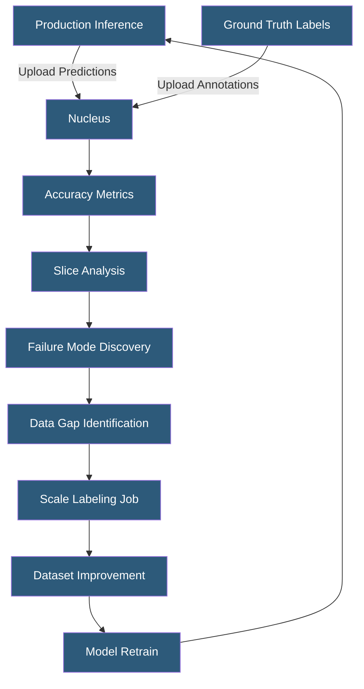

**Category:** Computer Vision Model Hosting
**Difficulty:** Advanced
**Reading time:** 6 min read

---

Scale Nucleus is a dataset management and model evaluation platform that enables computer vision teams to curate datasets, compare model versions, and diagnose performance issues through slice-based analysis. It serves as the intelligence layer connecting production inference results back to the data improvement cycle.

- **Dataset** — collection of images or scenes uploaded to Nucleus with annotations and metadata
- **Slice** — filtered subset of a dataset (by metadata, annotation attributes, or model output) used for focused analysis
- **Prediction Upload** — ingesting model inference results into Nucleus alongside ground truth for accuracy measurement
- **IoU (Intersection over Union)** — primary metric for measuring bounding box prediction accuracy
- **Scene** — multi-sensor data unit (camera + LiDAR) for 3D perception evaluation in autonomous systems
- **Model Run** — versioned set of predictions from a specific model checkpoint uploaded for comparison
- **Autotag** — ML-powered feature automatically clustering similar images to reveal dataset distribution patterns

Scale Nucleus operates as a centralized dataset intelligence platform. Teams upload raw images alongside their annotations (bounding boxes, polygons, keypoints) and model predictions. Nucleus computes accuracy metrics — precision, recall, mAP, and IoU distributions — both globally and segmented by metadata attributes such as time of day, weather condition, geographic location, or custom tags applied during data collection.

Slice analysis is Nucleus's core capability. A slice is a queryable subset defined by filter criteria: "all images where precipitation = rain AND model confidence < 0.7" isolates exactly the failure modes worth investigating. Comparing model versions on the same slice reveals whether new training runs improved or regressed on specific scenarios. This targeted analysis is far more actionable than aggregate accuracy metrics, which can mask localized model failures.

Autotag uses embedding-based clustering to automatically identify visually similar image groups, revealing dataset imbalances: "87% of your traffic scenes are daytime suburban; nighttime rural is underrepresented." This guides targeted data collection and annotation efforts. The integration with Scale's labeling platform allows creating annotation jobs directly from Nucleus slices — clicking "Label this slice" creates a Scale task for all images matching the filter criteria.

The Nucleus Python SDK enables programmatic interaction: uploading predictions after each training run, querying metrics by slice, and building automated dashboards tracking model performance trends over time. This creates a structured model development loop: train → evaluate on slices → identify gaps → collect data → annotate → retrain.

- AV team comparing LiDAR detection model performance across weather and lighting conditions
- Medical imaging company monitoring diagnostic AI model accuracy on rare pathology subsets
- Retail AI company identifying which product categories have highest detection error rates
- Satellite imagery company using Autotag to discover underrepresented scene types in training data
- Safety system team ensuring model performance meets regulatory thresholds across all demographic slices

| Advantage | Disadvantage |
|-----------|--------------|
| Slice analysis reveals hidden model failures missed by aggregate metrics | Requires uploading predictions and labels to Scale infrastructure |
| Direct integration with Scale labeling pipeline closes the data flywheel | Nucleus cost scales with dataset size and prediction volume |
| Autotag reduces manual effort in dataset curation | Autotag clustering requires interpretation to translate into actionable insights |
| Model version comparison guides model selection objectively | Requires ML engineering to integrate prediction upload into training pipeline |

- [Scale AI Model Deployment](scale-ai-model-deployment.md)
- [Computer Vision Model Versioning](computer-vision-model-versioning.md)
- [Object Detection APIs](object-detection-apis.md)

---
*Part of the [Computer Vision Model Hosting](index.md) category · [Back to Master Index](../../index.md)*
