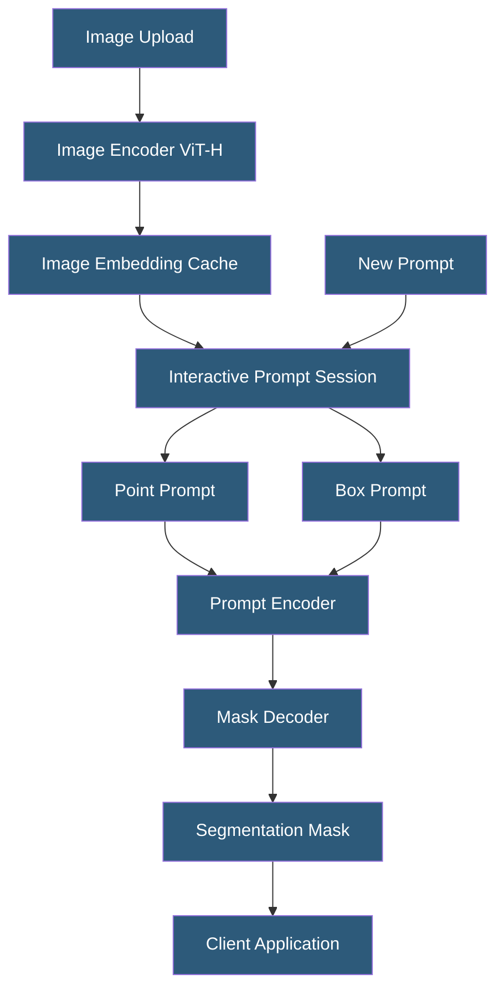

**Category:** Computer Vision Model Hosting
**Difficulty:** Advanced
**Reading time:** 6 min read

---

Meta's Segment Anything Model (SAM) is a foundation model for image segmentation that can segment any object in any image with minimal prompting — a single click, bounding box, or text description. Hosting SAM for production requires managing its large model size (2.4GB for ViT-H), GPU requirements, and prompt-driven interactive inference patterns.

- **Image Encoder** — ViT (Vision Transformer) backbone that processes the entire image once into embeddings (the expensive step)
- **Prompt Encoder** — lightweight encoder for point, box, or text prompts; runs per-request
- **Mask Decoder** — fast decoder generating segmentation masks from image + prompt embeddings
- **Automatic Mask Generation** — SAM mode generating masks for all objects in an image without prompts
- **SAM 2** — Meta's 2024 update extending SAM to video with memory-based tracking across frames
- **EfficientSAM** — lightweight distilled version achieving similar quality at 20x smaller model size
- **Mobile SAM** — further optimized variant for edge and mobile deployment

SAM's architecture separates into a heavy image encoder (ViT-H with 632M parameters) and lightweight prompt processing components. This design is fundamental to efficient interactive segmentation: the expensive image encoding runs once per image (~0.15 seconds on an A100 GPU), and the result is cached. Subsequent prompt interactions (each click, box adjustment, or text query) use the cached embedding and run in ~50ms through the prompt encoder and mask decoder. This enables real-time interactive annotation workflows.

For production hosting, the serving architecture stores image embeddings in memory (or fast storage) for active annotation sessions. A session-based API pattern maps user sessions to image embeddings: `POST /embed {image}` returns a session_id; `POST /predict {session_id, prompts}` returns masks. Session timeout and memory eviction policies prevent memory exhaustion.

Automatic mask generation mode runs SAM across a uniform grid of point prompts to segment all objects in an image, returning polygon masks for potentially hundreds of objects. This is significantly more computationally expensive than prompted inference — useful for dataset annotation but not suitable for real-time applications.

EfficientSAM and MobileSAM are distilled variants achieving comparable segmentation quality with dramatically reduced computational requirements. EfficientSAM uses a ViT-Tiny or ViT-Small encoder (~10x fewer parameters), running at ~30ms on CPU. These are the practical choice for edge deployment, batch processing at scale, or applications where annotation infrastructure cost is a concern. SAM 2 adds temporal consistency across video frames, caching object memories to track instances across sequences.

- Medical image annotation tool where radiologists click once to segment anatomical structures
- Satellite imagery analysis segmenting buildings, roads, and vegetation without pre-defined classes
- Robotics manipulation system identifying object boundaries for grasp planning
- Video editing platform enabling one-click object isolation for compositing workflows
- E-commerce background removal using SAM for high-accuracy product segmentation

| Advantage | Disadvantage |
|-----------|--------------|
| Zero-shot segmentation — no domain-specific training required | ViT-H requires A100-class GPU for real-time performance |
| Caching image embeddings enables fast interactive annotation workflows | Automatic mask generation mode is computationally expensive |
| EfficientSAM and MobileSAM enable edge and cost-sensitive deployments | Text prompting requires Grounding DINO integration — not natively supported |
| SAM 2 extends segmentation to video with memory-based object tracking | Large model file size (2.4GB) complicates edge deployment packaging |

- [CLIP Model Deployment](clip-model-deployment.md)
- [Image Segmentation Services](image-segmentation-services.md)
- [Edge Computer Vision Deployment](edge-computer-vision-deployment.md)

---
*Part of the [Computer Vision Model Hosting](index.md) category · [Back to Master Index](../../index.md)*
