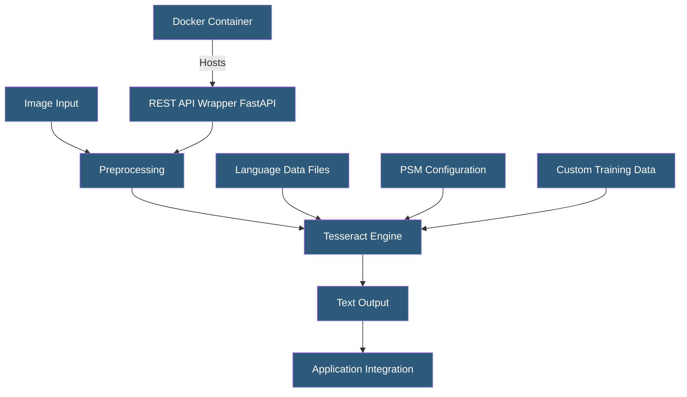

**Category:** Computer Vision Model Hosting
**Difficulty:** Intermediate
**Reading time:** 5 min read

---

Tesseract is an open-source OCR engine originally developed by HP and maintained by Google, capable of recognizing text in 100+ languages from images and PDFs. Self-hosting Tesseract provides unlimited processing without API costs, making it attractive for high-volume workloads, air-gapped deployments, and applications where cloud data transfer is prohibited.

- **tesseract-ocr** — the core C++ engine and command-line tool
- **pytesseract** — Python wrapper providing OCR integration in Python applications
- **LSTM Engine** — Tesseract 4+ uses an LSTM-based recognition model (--oem 1) with significantly better accuracy than legacy mode
- **PSM (Page Segmentation Mode)** — parameter controlling how Tesseract segments the image (single character, single word, single line, full page, etc.)
- **Language Pack** — language-specific trained data files (`.traineddata`) required for recognition
- **Whitelist / Blacklist** — configuration limiting recognized characters to specific sets (e.g., digits only)
- **DPI** — recommended 300 DPI minimum; below 150 DPI accuracy degrades significantly

Tesseract runs as a command-line tool or library called from Python, Java, .NET, or other languages via bindings. The standard deployment pattern wraps Tesseract in a REST API service using FastAPI or Flask, packaged in a Docker container for consistent deployment. The Docker image includes Tesseract, language packs, and the API wrapper — a typical image with English and a few additional languages is 1–2GB.

Preprocessing dramatically affects Tesseract accuracy. The `opencv-python` library is commonly used for preprocessing: converting to grayscale, binarizing with adaptive thresholding (better than fixed threshold for varying lighting), deskewing (detecting and correcting text rotation using the Hough transform), denoising, and scaling to meet the 300 DPI recommendation. Tesseract expects clean, high-contrast text — applying appropriate preprocessing for the input source is the most impactful accuracy improvement.

Page Segmentation Mode (PSM) is a critical parameter. PSM 6 (uniform block of text) is the default for documents; PSM 7 (single text line) works better for form fields; PSM 8 (single word) and PSM 10 (single character) handle focused extractions. PSM 3 (fully automatic) handles mixed layouts but runs slower. The character whitelist (`-c tessedit_char_whitelist=0123456789`) constrains recognition to specific characters, dramatically improving accuracy for numeric-only fields like invoice totals.

Custom training allows fine-tuning Tesseract's LSTM model on domain-specific fonts or scripts. The `tesstrain` framework provides the training pipeline: prepare ground truth image+text pairs, run training epochs, validate accuracy on a test set, and replace the base `.traineddata` file with the fine-tuned version. Custom models improve accuracy 10–30% for specialized fonts compared to the general LSTM model.

- High-volume invoice processing where per-page cloud API costs are prohibitive
- Air-gapped factory environment extracting text from part labels and quality documentation
- Healthcare system processing millions of medical records locally for privacy compliance
- Bank check processing system reading MICR encoded account numbers
- Legal discovery platform processing hundreds of thousands of scanned contract pages

| Advantage | Disadvantage |
|-----------|--------------|
| Zero per-page cost enables unlimited processing | Accuracy lower than cloud APIs (AWS Textract, GCP Document AI) for complex documents |
| Air-gapped deployment for privacy-sensitive document processing | Preprocessing pipeline requires significant engineering for poor-quality inputs |
| Full control over configuration and custom model training | No native structured extraction (tables, key-value pairs) — requires post-processing |
| Active open-source community with regular improvements | Scaling requires manual load balancing and capacity management |

- [OCR Optical Character Recognition APIs](ocr-optical-character-recognition-apis.md)
- [Document AI Services](document-ai-services.md)
- [Edge Computer Vision Deployment](edge-computer-vision-deployment.md)

---
*Part of the [Computer Vision Model Hosting](index.md) category · [Back to Master Index](../../index.md)*
