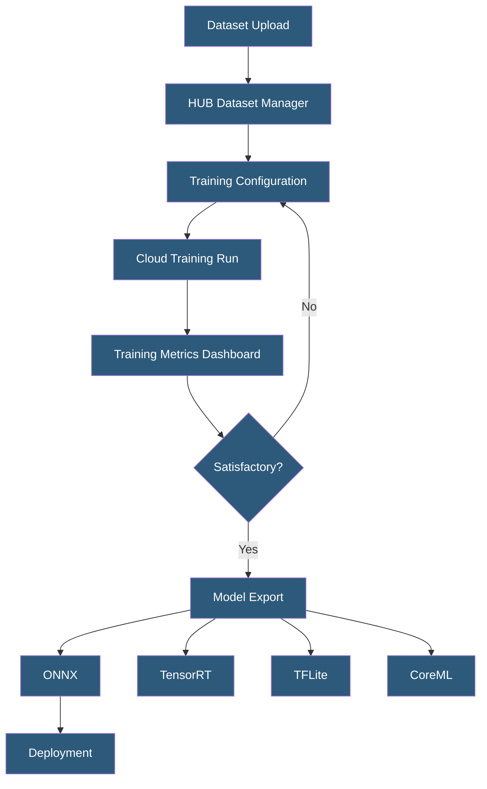

**Category:** Computer Vision Model Hosting
**Difficulty:** Intermediate
**Reading time:** 6 min read

---

Ultralytics HUB is a cloud platform for training, evaluating, and deploying YOLO models without writing code. It provides dataset management, visual training dashboards, model performance analytics, and one-click export to multiple deployment formats including ONNX, TensorRT, CoreML, and TFLite.

- **Ultralytics HUB** — cloud-hosted SaaS platform for YOLO model training and deployment management
- **YOLO** — You Only Look Once; family of single-stage object detection architectures developed by Ultralytics
- **Training Session** — cloud-based training run consuming GPU hours on Ultralytics infrastructure
- **mAP (mean Average Precision)** — primary accuracy metric for object detection models across all classes
- **Export Format** — target deployment format (ONNX, TensorRT, CoreML, TFLite, OpenVINO, PaddlePaddle)
- **Model Hub** — gallery of pre-trained YOLO models fine-tunable on custom datasets
- **Ultralytics Python Package** — `ultralytics` pip package for local training and inference, synchronized with HUB

Ultralytics HUB provides a GUI-driven interface over the capabilities of the open-source `ultralytics` Python package. Users upload datasets in YOLO format (images with corresponding text annotation files) or link external datasets. The platform validates dataset structure, computes class statistics, and previews sample annotations before training begins.

Training configuration exposes YOLO's key hyperparameters: model size (YOLOv8n/s/m/l/x with increasing accuracy-speed tradeoff), number of epochs, batch size, image size, optimizer, and learning rate schedule. Cloud training runs on Ultralytics' GPU fleet, with real-time streaming of training metrics (box loss, class loss, mAP@0.5, mAP@0.5:0.95) visualized as live charts. Training runs can be paused and resumed; multiple runs can be compared on the same chart to evaluate hyperparameter choices.

Upon training completion, models are evaluated on the validation split with per-class precision, recall, F1, and confusion matrix visualizations. The export system converts trained PyTorch `.pt` weights to deployment-target formats: ONNX for cross-platform compatibility, TensorRT `.engine` for NVIDIA GPU optimized inference, CoreML for iOS/macOS deployment, TFLite for Android and embedded deployment, and OpenVINO for Intel hardware optimization.

HUB also provides a deployment API — a hosted inference endpoint that accepts images and returns detections, similar to Roboflow's Inference API. Local development uses the `ultralytics` package with model weights stored in HUB, enabling seamless transition from cloud training to local or server-side inference.

- Teams without ML infrastructure training production YOLO models on cloud GPU
- Iterating on model size (nano vs small vs medium) to find the accuracy-latency optimum for a specific use case
- Exporting trained models to CoreML for deployment in an iOS application
- Comparing multiple training runs with different augmentation strategies
- Building a custom object detection model from pre-trained YOLO weights on domain-specific data

| Advantage | Disadvantage |
|-----------|--------------|
| No-code training interface lowers barrier for non-ML engineers | Cloud GPU training credits are expensive at scale |
| Tight integration with ultralytics package for local inference | Limited to YOLO family; other architectures require external training |
| Multi-format export covers most deployment targets | Less flexibility than custom training pipelines for advanced researchers |
| Live training metrics reduce debugging cycle time | Dataset size limits on free/starter tiers |

- [YOLO Model Hosting](yolo-model-hosting.md)
- [YOLOv8 Deployment](yolov8-deployment.md)
- [On-Device Inference Optimization](on-device-inference-optimization.md)

---
*Part of the [Computer Vision Model Hosting](index.md) category · [Back to Master Index](../../index.md)*
