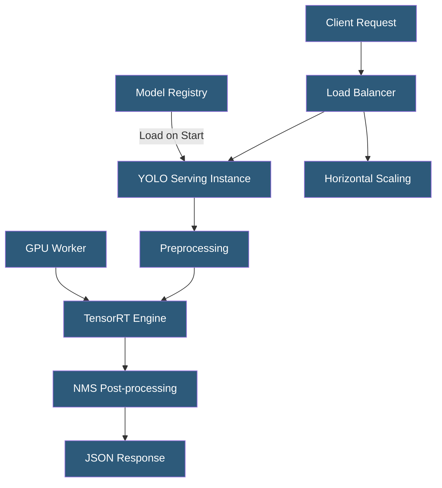

**Category:** Computer Vision Model Hosting
**Difficulty:** Intermediate
**Reading time:** 6 min read

---

YOLO (You Only Look Once) models are single-stage object detection architectures known for their speed-accuracy balance, making them the dominant choice for production computer vision deployments. Hosting YOLO models for inference requires selecting the appropriate serving infrastructure — from lightweight REST APIs to TensorRT-optimized GPU servers — based on latency, throughput, and cost requirements.

- **Single-Stage Detection** — YOLO predicts bounding boxes and class probabilities in a single network pass, unlike two-stage detectors (R-CNN)
- **YOLO Variants** — YOLOv8 (Ultralytics), YOLOv9, YOLOv10, YOLO-NAS (Deci AI), RT-DETR; each offers different accuracy-speed tradeoffs
- **TensorRT** — NVIDIA's inference optimization library that converts ONNX models to hardware-specific execution graphs
- **FP16 / INT8 Quantization** — reducing weight precision from FP32 to FP16 or INT8 to improve throughput with minimal accuracy loss
- **Triton Inference Server** — NVIDIA's open-source serving framework supporting YOLO via TensorRT backend
- **Dynamic Batching** — server-side batching of concurrent requests to maximize GPU utilization
- **Warm-up** — pre-loading model weights and running dummy inference on server start to eliminate cold-start latency

YOLO model hosting begins with model optimization for the target hardware. PyTorch `.pt` weights are exported to ONNX using Ultralytics export utilities, then converted to a TensorRT engine using `trtexec` or the Ultralytics TensorRT export flag. TensorRT applies layer fusion, precision calibration (FP16 or INT8), and hardware-specific kernel selection to generate an optimized execution graph. For an NVIDIA T4 GPU, TensorRT optimization typically reduces YOLOv8m inference from ~15ms to ~5ms per image.

The serving layer wraps the TensorRT engine in a REST or gRPC API. Common stacks include: FastAPI + `ultralytics` package (simple, developer-friendly), NVIDIA Triton Inference Server (production-grade with dynamic batching, model versioning, and concurrent model execution), or BentoML (framework-agnostic serving with packaging and deployment tools). Triton is preferred for high-throughput production deployments as its dynamic batching collects requests arriving within a configurable window into a single GPU batch, dramatically improving throughput under load.

Preprocessing includes resizing input images to the model's expected dimensions (640×640 for standard YOLO), normalizing pixel values to [0,1], and converting to NCHW tensor format. Post-processing applies NMS to filter overlapping detections using confidence and IOU thresholds. Response serialization should use JSON with bounding box coordinates normalized to [0,1] relative to image dimensions (more portable than pixel coordinates for variable-size inputs).

Autoscaling uses GPU utilization metrics: below 60% utilization, scale down instances; above 80%, scale up. Queue depth monitoring from a message broker (Redis, Kafka) enables reactive scaling for bursty workloads. Cold-start mitigation requires maintaining at minimum one warm instance at all times.

- E-commerce platform performing real-time product detection in user-uploaded images
- Security camera system running 30 FPS YOLO inference on RTSP video streams
- Autonomous drone navigation using YOLO obstacle detection at 100ms latency budget
- Medical imaging platform detecting anomalies in radiological scans for radiologist review
- Sports analytics platform tracking players and ball across broadcast video

| Advantage | Disadvantage |
|-----------|--------------|
| TensorRT optimization achieves 2–5x speedup over PyTorch baseline | TensorRT engines are hardware-specific; must rebuild for each GPU type |
| Triton dynamic batching maximizes GPU utilization under load | Triton configuration complexity is high for teams unfamiliar with NVIDIA stack |
| Single-stage architecture enables real-time inference on consumer GPUs | Large models (YOLOv8l/x) require A100-class GPUs for high-throughput serving |
| INT8 quantization reduces memory footprint by 4x vs FP32 | INT8 calibration requires representative dataset; errors degrade accuracy |

- [YOLOv8 Deployment](yolov8-deployment.md)
- [Ultralytics HUB Platform](ultralytics-hub-platform.md)
- [Real-Time Video Inference](real-time-video-inference.md)

---
*Part of the [Computer Vision Model Hosting](index.md) category · [Back to Master Index](../../index.md)*
