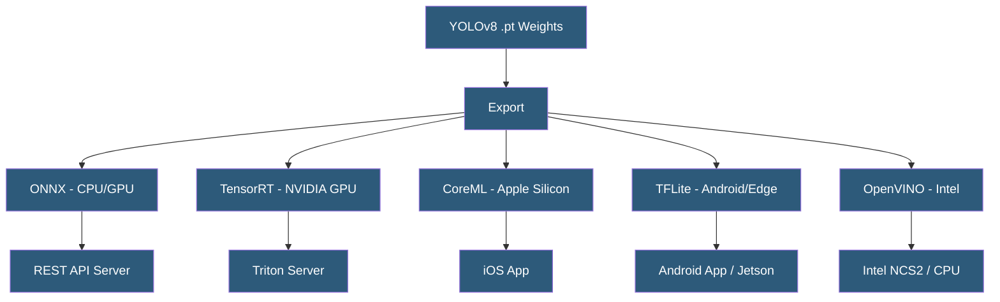

**Category:** Computer Vision Model Hosting
**Difficulty:** Intermediate
**Reading time:** 6 min read

---

YOLOv8 is Ultralytics' eighth-generation YOLO architecture, supporting object detection, instance segmentation, pose estimation, classification, and oriented bounding boxes in a unified framework. Deploying YOLOv8 to production requires selecting appropriate model size, export format, and serving infrastructure based on application latency and accuracy requirements.

- **Model Tiers** — YOLOv8n (nano), YOLOv8s (small), YOLOv8m (medium), YOLOv8l (large), YOLOv8x (extra large)
- **Task Variants** — `-detect` (bounding box), `-seg` (instance segmentation), `-pose` (keypoints), `-cls` (classification), `-obb` (oriented boxes)
- **ONNX Runtime** — cross-platform inference engine supporting YOLOv8 ONNX exports for CPU deployment
- **CoreML Export** — generates `.mlpackage` for native iOS/macOS deployment via Apple's inference engine
- **Edge TPU** — Google Coral hardware accelerator; YOLOv8 can export to EdgeTPU-compatible TFLite
- **Benchmark Mode** — `model.benchmark()` method measuring inference speed across export formats on current hardware
- **Predict Mode** — `model.predict(source)` accepting images, video files, webcam streams, directories, and URLs

YOLOv8 deployment begins with selecting the appropriate model size. YOLOv8n runs at ~80ms on CPU (Intel i7) with 37.3% mAP on COCO, while YOLOv8x requires GPU but achieves 53.9% mAP. For most production applications, YOLOv8m or YOLOv8l balance accuracy and speed. The task suffix selects the architecture head: `-detect` for standard bounding boxes, `-seg` for pixel-level instance masks, `-pose` for 17-keypoint human body pose.

The `ultralytics` Python package provides the unified deployment interface. `model.export(format='onnx')` generates an ONNX model file with dynamic input shapes by default, enabling variable batch size inference. `model.export(format='engine')` triggers TensorRT conversion on the current GPU, building an execution graph optimized for that specific hardware. Benchmarking `model.benchmark(data='coco128.yaml', imgsz=640, half=True)` measures inference speed and accuracy across all export formats to guide format selection.

For cloud API deployment, the pattern is: load the ONNX or TensorRT model at server startup (warm-up with 10 dummy inferences to stabilize GPU memory allocation), accept HTTP requests with base64 images, run inference, filter by confidence threshold, apply NMS, and return JSON detections. FastAPI handles concurrency through async request handling while a single GPU worker processes requests synchronously. For higher throughput, Celery or Ray Serve add task queuing and parallel worker management.

Docker images using `nvcr.io/nvidia/pytorch` as base include CUDA drivers and cuDNN, ensuring TensorRT compatibility. For edge deployment, Ultralytics provides `docker pull ultralytics/ultralytics:latest-jetson-jetpack5` — a pre-built image for NVIDIA Jetson platforms.

- Mobile app integrating YOLOv8n CoreML model for real-time object detection on-device
- Factory automation system using YOLOv8-seg for precise component segmentation before robotic pick
- Sports technology platform using YOLOv8-pose for athlete movement analysis
- Video surveillance system running YOLOv8l on NVIDIA T4 servers for person detection
- Autonomous robot using YOLOv8n-detect for obstacle avoidance at 60+ FPS on embedded GPU

| Advantage | Disadvantage |
|-----------|--------------|
| Unified framework for detection, segmentation, pose, and classification | Model accuracy still below two-stage detectors for small object detection |
| Extensive export format support covers all deployment targets | TensorRT engines are not portable across different GPU generations |
| Active development with regular improvements in YOLOv9/v10 | Python package version pinning required to prevent breaking API changes |
| Pre-trained COCO weights enable fast fine-tuning on custom datasets | Large segmentation models require significant GPU memory (8GB+) |

- [YOLO Model Hosting](yolo-model-hosting.md)
- [Ultralytics HUB Platform](ultralytics-hub-platform.md)
- [On-Device Inference Optimization](on-device-inference-optimization.md)

---
*Part of the [Computer Vision Model Hosting](index.md) category · [Back to Master Index](../../index.md)*
