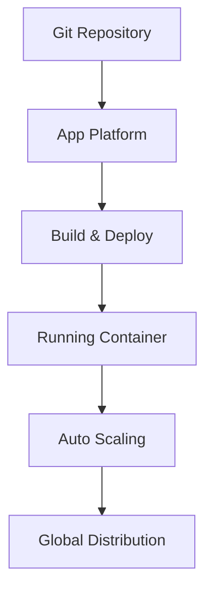

**Category:** Container & Orchestration Hosting
**Difficulty:** Intermediate
**Reading time:** 6 min read

---

DigitalOcean App Platform is a fully managed Platform-as-a-Service (PaaS) that deploys and scales containerized applications without managing underlying infrastructure. It provides automated deployments, scaling, and operational features designed for developers.

- **Containerized Apps** — Docker container deployment
- **Automatic Scaling** — horizontal scaling based on metrics
- **Git Integration** — automatic deployment on push
- **Managed Services** — databases and caching included
- **Global CDN** — content delivery network

DigitalOcean App Platform provides a managed environment for running containerized applications. Developers connect a GitHub repository and configure the application. The platform automatically builds Docker containers from code, runs tests, and deploys to production on every push. Applications scale horizontally based on CPU and memory metrics without manual intervention. The platform handles SSL certificates, domain management, and environment variable configuration. Built-in managed services like PostgreSQL, MySQL, and Redis can be provisioned as app components. A global CDN automatically caches and distributes content. Applications receive a unique domain or can use custom domains. Logs and metrics are available through the dashboard.

- Deploying Node.js, Python, Ruby, or Go applications
- Running containerized microservices
- Scaling applications automatically
- Integrating with GitHub for continuous deployment
- Using managed databases alongside applications

| Advantage | Disadvantage |
|-----------|--------------|
| Simple deployment process | Limited customization vs Kubernetes |
| Automatic scaling | Less control over infrastructure |
| Managed databases included | Learning curve for app config |
| GitHub integration | Limited multi-region deployment |
| Cost-effective for small apps | Vendor lock-in risk |

- [DigitalOcean Kubernetes (DOKS)](digitalocean-kubernetes-doks.md)
- [DigitalOcean Droplets](digitalocean-droplets.md)
- [Heroku Dynos architecture](heroku-dynos-architecture.md)

---
*Part of the [Container & Orchestration Hosting](container-orchestration-hosting/index.md) category · [Back to Master Index](../../index.md)*
