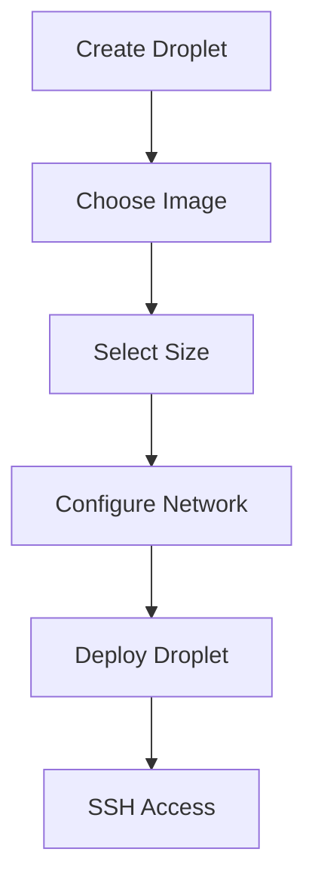

**Category:** Container & Orchestration Hosting
**Difficulty:** Intermediate
**Reading time:** 6 min read

---

DigitalOcean Droplets are virtual machines (VPS) that provide scalable computing resources. They serve as the foundation for running applications, databases, and services with simple provisioning and management through DigitalOcean's cloud platform.

- **Virtual Machines** — on-demand computing resources
- **Image Templates** — pre-configured OS and software
- **Size Options** — variable CPU, memory, and storage
- **Networking** — virtual private cloud and firewalls
- **Snapshots** — point-in-time disk images

Droplets are Linux or Windows virtual machines you can provision in seconds. You choose from pre-built images (Ubuntu, Debian, CentOS, etc.) or custom snapshots. Select a size based on your CPU and memory requirements, with options ranging from entry-level to high-performance. Configure networking including VPC assignment, firewall rules, and floating IPs. The Droplet starts within seconds and you can SSH or RDP in immediately. You pay only for active Droplets with hourly or monthly billing options. DigitalOcean provides snapshots to back up and clone Droplets. You can resize Droplets, add block storage volumes, and manage multiple Droplets through the control panel or API.

- Running custom applications and services
- Hosting databases and caching layers
- Managing web servers and application servers
- Building private cloud environments
- Running CI/CD infrastructure

| Advantage | Disadvantage |
|-----------|--------------|
| Simple provisioning | Manual configuration required |
| Good pricing | Less abstraction than PaaS |
| Full OS control | Requires Linux/Windows knowledge |
| Flexible sizing | Backup and scaling overhead |
| Global data centers | Manual updates needed |

- [DigitalOcean App Platform](digitalocean-app-platform.md)
- [DigitalOcean Kubernetes (DOKS)](digitalocean-kubernetes-doks.md)
- [DigitalOcean Managed Databases](digitalocean-managed-databases.md)

---
*Part of the [Container & Orchestration Hosting](container-orchestration-hosting/index.md) category · [Back to Master Index](../../index.md)*
