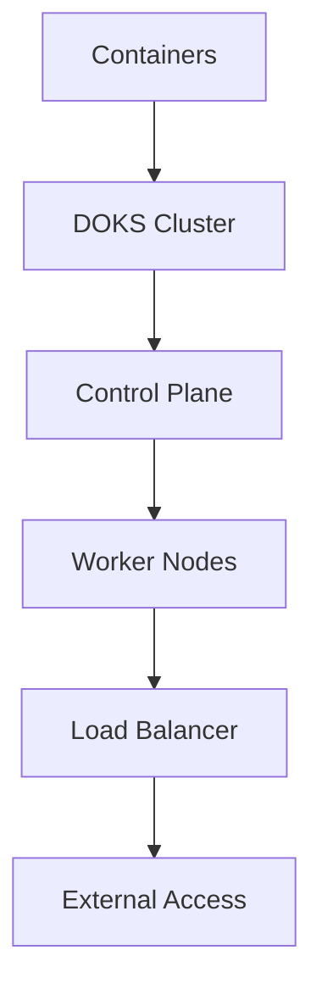

**Category:** Container & Orchestration Hosting
**Difficulty:** Intermediate
**Reading time:** 6 min read

---

DigitalOcean Kubernetes Service (DOKS) is a managed Kubernetes offering that handles cluster management, scaling, and updates. It provides a cost-effective way to run containerized workloads with full Kubernetes capabilities without managing the control plane.

- **Managed Control Plane** — DigitalOcean manages Kubernetes masters
- **Worker Nodes** — compute resources for containers
- **Auto Scaling** — automatic worker node scaling
- **Load Balancing** — integrated load balancer service
- **Storage** — persistent volume management

DigitalOcean Kubernetes Service manages the Kubernetes control plane while you manage worker nodes. The cluster automatically maintains Kubernetes components and applies security patches. You configure the cluster size and node types, and the system scales nodes based on resource demand. DigitalOcean provides integrated load balancing for service exposure. Persistent storage is available through DigitalOcean Block Storage volumes. The platform integrates with DigitalOcean Container Registry for private image storage. Monitoring and logging integrations track cluster health and application performance. You can access the cluster via kubectl and deploy applications using standard Kubernetes manifests.

- Running complex microservice architectures
- Managing containerized applications at scale
- Using Kubernetes features like StatefulSets and DaemonSets
- Deploying CI/CD pipelines
- Running stateful applications with persistent storage

| Advantage | Disadvantage |
|-----------|--------------|
| Full Kubernetes capabilities | Higher learning curve |
| Managed control plane | More operational overhead |
| Cost-effective | Requires Kubernetes expertise |
| Integrated storage | Complex networking |
| Included load balancing | Vendor lock-in |

- [DigitalOcean App Platform](digitalocean-app-platform.md)
- [DigitalOcean Droplets](digitalocean-droplets.md)
- [Linode Kubernetes Engine (LKE)](linode-kubernetes-engine-lke.md)

---
*Part of the [Container & Orchestration Hosting](container-orchestration-hosting/index.md) category · [Back to Master Index](../../index.md)*
