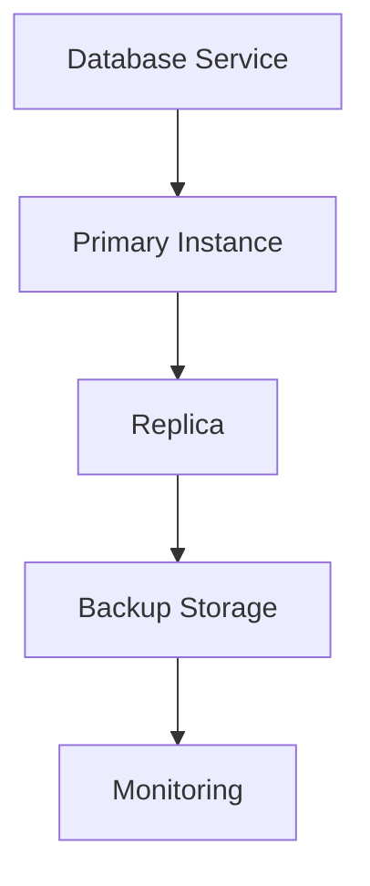

**Category:** Container & Orchestration Hosting
**Difficulty:** Intermediate
**Reading time:** 6 min read

---

DigitalOcean Managed Databases provide fully managed database services for PostgreSQL, MySQL, Redis, and MongoDB. They handle backups, replication, patching, and scaling automatically, allowing you to focus on application development.

- **Managed Service** — DigitalOcean handles operations
- **High Availability** — automatic failover and replication
- **Backups** — automated backup and point-in-time recovery
- **Scaling** — vertical and horizontal scaling options
- **Monitoring** — built-in performance monitoring

Managed Databases eliminate database administration overhead. You provision a database cluster specifying the engine, version, and size. DigitalOcean automatically manages the underlying infrastructure, OS patching, and database upgrades. The service provides automatic daily backups with point-in-time recovery capability. You can configure replicas for high availability with automatic failover. Connection pooling reduces connection overhead for applications. Monitoring dashboards show performance metrics including query latency and resource usage. Database performance insights identify slow queries and optimization opportunities. Backups are encrypted and stored redundantly.

- Running production databases without ops overhead
- Setting up high-availability database clusters
- Accessing managed backup and recovery
- Scaling databases as application needs grow
- Using managed Redis for caching

| Advantage | Disadvantage |
|-----------|--------------|
| No database administration | Less control vs self-hosted |
| Automatic backups | Higher cost than self-managed |
| High availability included | Limited customization |
| Automatic patching | Vendor lock-in risk |
| Monitoring included | Less advanced features |

- [DigitalOcean Droplets](digitalocean-droplets.md)
- [DigitalOcean Kubernetes (DOKS)](digitalocean-kubernetes-doks.md)
- [Linode managed databases](linode-managed-databases.md)

---
*Part of the [Container & Orchestration Hosting](container-orchestration-hosting/index.md) category · [Back to Master Index](../../index.md)*
