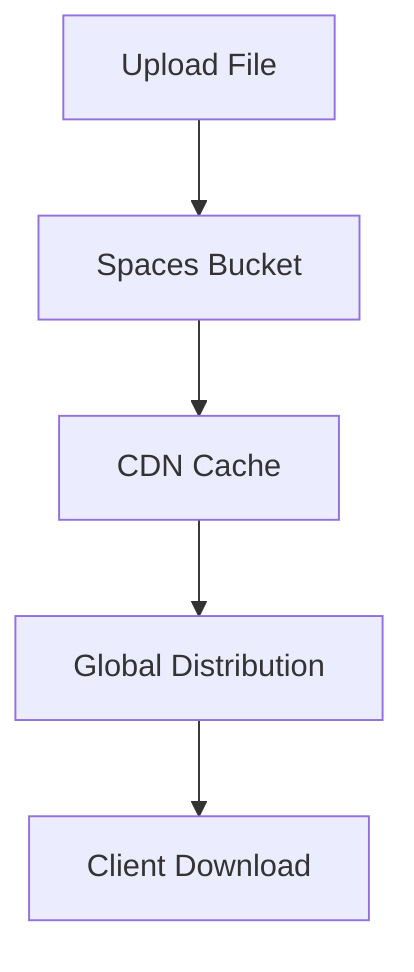

**Category:** Container & Orchestration Hosting
**Difficulty:** Intermediate
**Reading time:** 6 min read

---

DigitalOcean Spaces is an S3-compatible object storage service designed for storing and serving files at scale. It provides affordable, reliable file storage with CDN integration perfect for backups, media files, and static assets.

- **Object Storage** — key-value file storage
- **S3 Compatibility** — AWS S3-compatible API
- **CDN Integration** — global content delivery
- **Access Control** — fine-grained permissions
- **Scalability** — unlimited storage capacity

Spaces provides S3-compatible object storage stored in DigitalOcean data centers. You create named buckets and upload objects using the S3 API or web console. Files are accessible via HTTPS URLs. The service integrates with the DigitalOcean CDN to cache and distribute content globally. You can configure access controls including public/private buckets and signed URLs. CORS policies allow cross-origin requests. The service includes versioning and lifecycle policies for automatic cleanup. Costs scale based on storage volume and bandwidth. You manage Spaces through the dashboard, API, or AWS SDK-compatible tools.

- Storing application backups
- Hosting media files and images
- Serving static website content
- Storing user-generated content
- Building content libraries

| Advantage | Disadvantage |
|-----------|--------------|
| S3-compatible API | Regional limitations |
| Affordable pricing | Less mature than AWS S3 |
| CDN included | Egress costs |
| Simple management | Learning curve for S3 API |
| Unlimited storage | Limited advanced features |

- [DigitalOcean Droplets](digitalocean-droplets.md)
- [Linode Object Storage](linode-object-storage.md)
- [DigitalOcean Container Registry](digitalocean-container-registry.md)

---
*Part of the [Container & Orchestration Hosting](container-orchestration-hosting/index.md) category · [Back to Master Index](../../index.md)*
