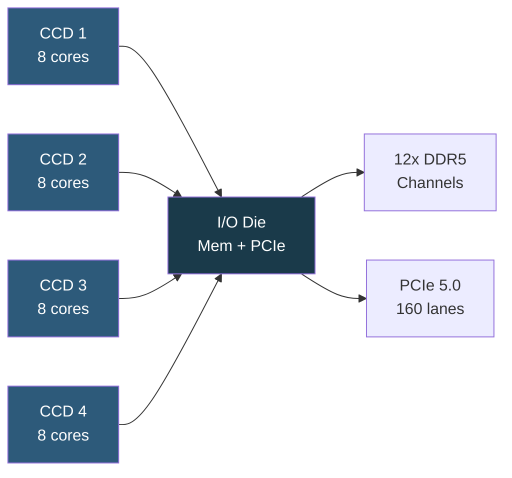

**Category:** CPU Architecture & Performance
**Difficulty:** Intermediate
**Reading time:** 6 min read

---

AMD EPYC processors use a chiplet-based design called MCM (Multi-Chip Module) to deliver industry-leading core counts, memory channels, and PCIe lane density at competitive pricing. The EPYC lineup (Naples → Rome → Milan → Genoa → Turin) has disrupted the server market with aggressive performance-per-dollar metrics.

- **CCD (Core Chiplet Die)** — compute chiplet containing 8 cores with L3 cache, multiple stitched together per package
- **IOD (I/O Die)** — central die handling memory controllers, PCIe, and inter-CCD communication
- **Infinity Fabric** — AMD's on-package interconnect linking CCDs to the IOD and enabling NUMA
- **3D V-Cache** — stacked SRAM cache technology that dramatically reduces L3 miss latency for cache-sensitive workloads
- **Zen 4 / Zen 5** — microarchitecture generations underlying Genoa and Turin EPYC families
- **SMT (Simultaneous Multi-Threading)** — 2 threads per core across all EPYC generations
- **Secure Encrypted Virtualization (SEV)** — AMD memory encryption technology for VM isolation

EPYC's chiplet architecture separates compute and I/O into distinct dies manufactured on optimal process nodes. Genoa (EPYC 9004) uses up to 12 Zen 4 CCDs (each 5nm TSMC) connected via Infinity Fabric to a 6nm IOD, yielding up to 96 cores per socket. The IOD provides 12 DDR5 memory channels (vs Intel's 8) and 160 PCIe 5.0 lanes, making EPYC exceptionally I/O-dense for storage-heavy or GPU-attached workloads.

Infinity Fabric operates at memory-frequency-derived clock rates, and EPYC exposes sub-NUMA clustering (NPS modes: NPS1, NPS2, NPS4) allowing BIOS-level partitioning of the package into 1, 2, or 4 NUMA nodes to match application locality requirements. In NPS4 mode, each group of 3 CCDs plus a memory controller slice forms one NUMA domain, giving memory-latency-sensitive applications tighter locality.

Milan-X and Genoa-X variants add 3D V-Cache stacking 192 MB of additional L3 SRAM atop CCDs, reducing database and simulation working-set miss rates by 40–60% in microbenchmarks. SEV-SNP adds memory integrity checking on top of encryption, providing hardware-verified VM isolation for confidential computing.

- Cloud service provider hosts requiring maximum core density per rack unit
- High-frequency trading and simulation benefiting from 3D V-Cache
- Storage servers exploiting 160 PCIe 5.0 lanes for NVMe arrays
- Confidential computing workloads using SEV-SNP
- Scientific HPC clusters where memory bandwidth is the bottleneck

| Advantage | Disadvantage |
|-----------|--------------|
| More PCIe lanes and memory channels than Intel Xeon | Infinity Fabric latency between CCDs adds variance for latency-sensitive code |
| Competitive price per core | Platform ecosystem historically smaller than Intel's |
| 3D V-Cache variants reduce cache-miss penalties dramatically | NPS mode tuning requires BIOS and application expertise |
| SEV-SNP for confidential computing | Inter-CCD Infinity Fabric bandwidth can bottleneck cross-NUMA traffic |

- [Intel Xeon Processor Families](intel-xeon-processor-families.md)
- [NUMA Optimization](numa-non-uniform-memory-access-optimization.md)
- [CPU Security Features](cpu-security-features-sgx-sev.md)

---
*Part of the [CPU Architecture & Performance](index.md) category · [Back to Master Index](../../index.md)*
