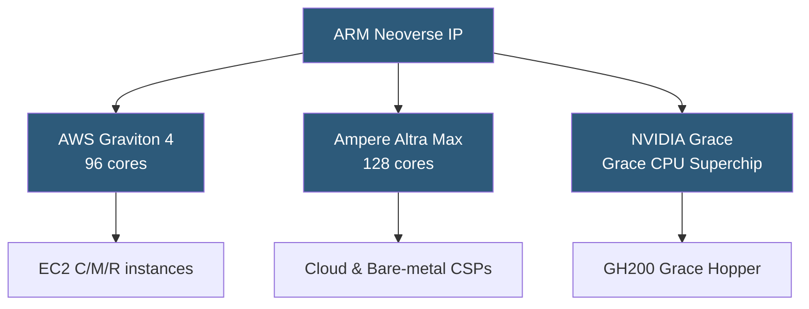

**Category:** CPU Architecture & Performance
**Difficulty:** Intermediate
**Reading time:** 6 min read

---

ARM-based server processors offer compelling performance-per-watt advantages by leveraging the RISC instruction set architecture optimized for throughput workloads. AWS Graviton, Ampere Altra, and NVIDIA Grace represent a new generation of datacenter ARM silicon challenging x86 incumbents on both efficiency and total cost of ownership.

- **AArch64 (ARM64)** — 64-bit ARM instruction set used in all modern server ARM processors
- **AWS Graviton** — Amazon's custom ARM Neoverse-based SoC used in EC2 instances (Graviton2/3/4)
- **Ampere Altra** — cloud-native ARM server CPU with up to 128 single-threaded cores per socket
- **NVIDIA Grace** — ARM Neoverse V2 CPU tightly integrated with Hopper GPU via NVLink-C2C
- **Neoverse platform** — ARM's IP core family (N1, N2, V1, V2) targeting cloud and HPC server workloads
- **SVE/SVE2** — Scalable Vector Extension, ARM's variable-width SIMD for HPC workloads
- **TLS (Thread-Level Scaling)** — ARM's efficient single-thread-per-core model used by Altra Max

ARM server processors implement the AArch64 ISA on microarchitectures designed for throughput rather than single-threaded peak frequency. Ampere Altra runs up to 128 physical cores at ~3.0 GHz with each core being a single-threaded Neoverse N1 — no SMT, eliminating contention between threads sharing execution resources. This model delivers predictable, consistent latency for cloud-native microservices.

AWS Graviton3 (2022) uses Neoverse V1 cores with 256-bit SVE for vectorized compute and DDR5 memory. Graviton3E adds 2× wider vector units for HPC and ML workloads. Graviton4 (Neoverse V2, 2024) scales to 96 cores with 12-channel DDR5.

NVIDIA Grace pairs 72 Neoverse V2 cores with an H100 GPU via NVLink-C2C at 900 GB/s bidirectional bandwidth — orders of magnitude faster than PCIe — enabling the CPU to act as GPU memory bandwidth multiplier for LLM inference.

Software compatibility has matured: AWS Lambda, ECS/EKS, major Linux distributions, Java/Python/Go runtimes, and most open-source stacks run natively on ARM64 with no cross-compilation needed. ISA differences from x86 require recompilation but rarely source changes.

- Web API and microservice workloads where throughput-per-watt matters
- CI/CD build farms reducing compute cost 30–50% vs x86
- AI/ML inference on Grace Hopper for large language models
- Cloud cost reduction by migrating to Graviton EC2 instance families
- Batch processing pipelines with parallelizable embarrassingly parallel jobs

| Advantage | Disadvantage |
|-----------|--------------|
| 20–40% better performance-per-watt vs x86 at comparable workloads | Some legacy x86-only software requires cross-compilation or emulation |
| Competitive total cost of ownership in public cloud | Bare-metal ARM server hardware ecosystem is smaller than x86 |
| No SMT eliminates noisy-neighbor CPU contention | Single-threaded peak performance below top Xeon/EPYC at same power |
| ARM ISA royalty model enables diverse custom silicon | Debugging ARM-specific performance issues requires specialist knowledge |

- [Intel Xeon Processor Families](intel-xeon-processor-families.md)
- [CPU Core Count vs Clock Speed Tradeoffs](cpu-core-count-vs-clock-speed-tradeoffs.md)
- [Power Efficiency Metrics](power-efficiency-metrics-performance-per-watt.md)

---
*Part of the [CPU Architecture & Performance](index.md) category · [Back to Master Index](../../index.md)*
