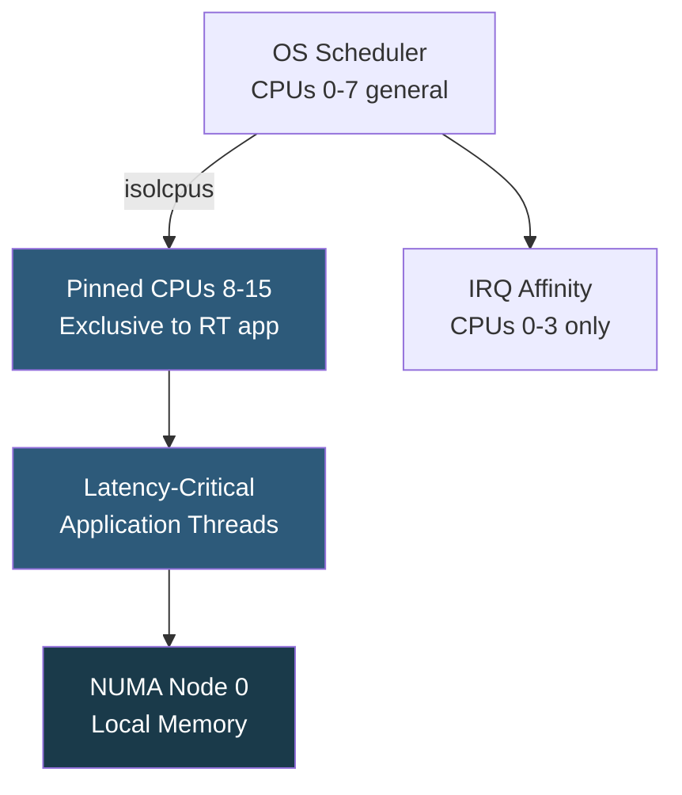

**Category:** CPU Architecture & Performance
**Difficulty:** Advanced
**Reading time:** 6 min read

---

CPU affinity binds processes or threads to specific CPU cores, preventing the OS scheduler from migrating them. Pinning eliminates scheduling overhead, improves cache reuse, and enables NUMA-optimal placement — critical for low-latency trading, real-time processing, and high-throughput database servers.

- **CPU affinity mask** — bitmask indicating which CPUs a thread is allowed to run on
- **taskset** — Linux command to set or view a process's CPU affinity (`taskset -c 0-7 ./app`)
- **sched_setaffinity** — Linux syscall for programmatic affinity setting within an application
- **cgroup cpuset** — Linux control group subsystem that restricts a group of processes to specified CPUs and NUMA nodes
- **isolcpus** — kernel boot parameter reserving CPUs exclusively for pinned workloads, removing them from scheduler
- **IRQ affinity** — binding hardware interrupt handlers to specific CPUs to avoid interrupting pinned workloads
- **NUMA balancing conflict** — automatic NUMA balancing may conflict with manual pinning decisions

By default, the Linux CFS (Completely Fair Scheduler) migrates threads between CPUs to balance load, which warms up new caches and incurs TLB shootdowns on the old CPU. For latency-sensitive workloads, these migrations add unpredictable microseconds. Pinning prevents migration, keeping thread data warm in per-core L1/L2 caches between scheduling intervals.

The complete pinning recipe for latency-critical workloads: (1) Reserve CPUs with `isolcpus=8-15 nohz_full=8-15 rcu_nocbs=8-15` in kernel cmdline; (2) Bind the process with `taskset -c 8-15`; (3) Set IRQ affinity via `/proc/irq/*/smp_affinity` to keep interrupt handlers off pinned CPUs; (4) Use `numactl --cpunodebind=0 --membind=0` to ensure NUMA-local memory; (5) Disable automatic NUMA balancing for the process.

In containerized environments, Kubernetes CPU Manager Policy `static` guarantees exclusive core allocation to QoS Guaranteed pods. The kubelet allocates integer CPU counts from the `isolcpus` pool and sets cgroup cpuset accordingly. Pods using fractional CPU (e.g., `500m`) receive shared CPUs, while pods requesting whole CPUs (e.g., `4`) receive exclusive pinning.

DPDK (Data Plane Development Kit) for network packet processing relies on pinned polling threads (lcore threads) that busy-poll NIC receive queues without interrupts, achieving sub-microsecond packet processing latency that would be impossible with unpinned scheduler-driven processing.

- HFT and algorithmic trading: sub-100 µs order path requires pinned threads and isolated cores
- Real-time audio/video processing: guaranteed scheduler access prevents glitches
- Kubernetes CPU Manager for Guaranteed QoS pods needing predictable compute
- DPDK network applications: exclusive cores for polling packet I/O
- Database server pinning: separate NUMA nodes for DB engine vs OS/monitoring

| Advantage | Disadvantage |
|-----------|--------------|
| Eliminates scheduler-induced cache misses and TLB shootdowns | Pinned CPUs cannot serve other workloads, reducing utilization |
| Enables sub-microsecond scheduling jitter for real-time workloads | Requires careful manual topology analysis; wrong pinning worsens performance |
| isolcpus removes CPUs from scheduler's general pool entirely | IRQ affinity misconfiguration allows hardware interrupts to preempt pinned threads |
| Compatible with NUMA-aware memory binding for combined optimization | NUMA balancing and CPU pinning can conflict if not both configured explicitly |

- [NUMA Optimization](numa-non-uniform-memory-access-optimization.md)
- [Hyper-Threading and SMT Technology](hyper-threading-and-smt-technology.md)
- [Container CPU Limit Configuration](container-cpu-limit-configuration.md)

---
*Part of the [CPU Architecture & Performance](index.md) category · [Back to Master Index](../../index.md)*
