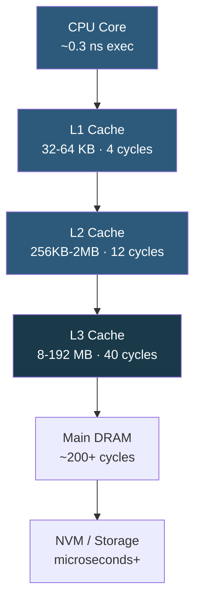

**Category:** CPU Architecture & Performance
**Difficulty:** Intermediate
**Reading time:** 6 min read

---

CPU caches are small, fast SRAM memories arranged in a hierarchy to bridge the latency gap between CPU execution speed (~0.3 ns) and main DRAM (~70 ns). Understanding cache sizes, associativity, and latency at each level is essential for writing cache-friendly code and diagnosing memory-bound performance bottlenecks.

- **L1 cache** — fastest cache, split into instruction (L1i) and data (L1d), 32–64 KB per core, ~4 cycle latency
- **L2 cache** — unified, 256 KB–2 MB per core, ~12 cycle latency, acts as victim cache for L1 misses
- **L3 cache (LLC)** — large shared cache across all cores, 8–192 MB depending on CPU, ~40 cycle latency
- **Cache line** — fundamental unit of cache transfer, 64 bytes on x86; all reads/writes operate on whole lines
- **Associativity** — number of ways a memory address can map into cache sets; higher associativity reduces conflict misses
- **Cache coherence** — MESI/MESIF protocols ensuring all cores see consistent data when sharing
- **3D V-Cache** — AMD's stacked SRAM adding up to 192 MB of additional L3 via TSV die stacking

When the CPU requests a memory address, it first checks L1. On a miss, it checks L2, then L3, then issues a DRAM request. Each level is larger but slower, creating a latency/capacity tradeoff pyramid. The hardware prefetcher monitors access patterns and proactively loads cache lines before they are requested, reducing effective miss latency for sequential and strided patterns.

Cache lines are the atomic unit: reading 1 byte loads the entire 64-byte line into cache. This means accessing data structures larger than the cache line wastes bandwidth unless multiple fields are accessed together (temporal locality). Struct-of-arrays layouts outperform array-of-structs when processing single fields in bulk because all elements fit on fewer cache lines.

L3 is shared across all cores, creating contention in multi-tenant environments. When multiple cores evict and reload each other's data (cache thrashing), performance degrades. In NUMA systems, each socket has its own L3; accessing data cached in another socket's L3 incurs additional hop latency.

Cache coherence protocols (MESI) tag each line as Modified, Exclusive, Shared, or Invalid. A core writing a shared line must broadcast an invalidation to all other cores holding that line, creating "false sharing" when multiple cores write to different variables that happen to occupy the same cache line — a common multithreaded performance bug fixed with cache-line-aligned padding.

- Database buffer pool sizing: keeping hot pages in L3 reduces DRAM access
- JVM GC tuning: aligning object allocation to cache lines reduces false sharing
- SIMD vectorization: processing 64-byte chunks aligns with cache line size
- Network packet processing: prefetching packet headers reduces pipeline stalls
- 3D V-Cache CPUs: dramatically increase effective LLC for database workloads

| Advantage | Disadvantage |
|-----------|--------------|
| L1/L2 hit eliminates DRAM latency (10–50× speedup) | Cache capacity is expensive; limited to MBs not GBs |
| Hardware prefetcher automatically optimizes sequential access | Random access patterns defeat prefetching and cause many cache misses |
| Larger LLC reduces off-chip bandwidth pressure | Shared LLC creates noisy-neighbor contention between cores |
| Cache-friendly code improvements are portable across hardware | Profiling cache behavior requires hardware performance counters |

- [NUMA Optimization](numa-non-uniform-memory-access-optimization.md)
- [CPU Benchmarking Methodologies](cpu-benchmarking-methodologies.md)
- [Workload-Specific CPU Optimization](workload-specific-cpu-optimization.md)

---
*Part of the [CPU Architecture & Performance](index.md) category · [Back to Master Index](../../index.md)*
