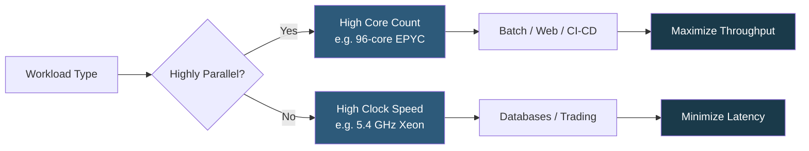

**Category:** CPU Architecture & Performance
**Difficulty:** Beginner
**Reading time:** 5 min read

---

Choosing between more CPU cores and higher clock speed is a fundamental server sizing decision. Throughput-oriented workloads (web serving, batch processing) benefit from many cores, while latency-sensitive workloads (databases, gaming) benefit from the highest possible single-thread clock speed.

- **Base clock** — guaranteed minimum operating frequency under sustained load within TDP
- **Boost/Turbo clock** — maximum frequency achievable on a subset of cores when power and thermal headroom permits
- **IPC (Instructions Per Clock)** — measure of architectural efficiency; newer generations do more work per cycle
- **Amdahl's Law** — the theoretical speedup of parallelizing a workload is limited by its sequential fraction
- **All-core turbo** — frequency achieved when all cores are simultaneously active, typically lower than single-core boost
- **TDP (Thermal Design Power)** — nominal power envelope the cooler must sustain; governs sustained frequency
- **Thread contention** — performance degradation when more software threads compete for shared caches or memory bandwidth than cores can efficiently serve

CPU performance depends on two dimensions: how many tasks can run simultaneously (core count) and how fast each task executes (clock speed × IPC). Modern server CPUs face a power wall: operating all cores at maximum boost frequency would exceed TDP, so microcontrollers throttle frequency based on active core count and thermal state.

A 32-core CPU at 3.2 GHz all-core turbo delivers ~6× the throughput of a 4-core at 5.0 GHz for perfectly parallel workloads, but the 4-core wins decisively for a single-threaded benchmark at 5.0 GHz vs 3.2 GHz (56% faster per thread). Real workloads fall between these extremes.

Database engines like Oracle or SQL Server frequently operate with high-frequency, low-latency single-query paths. OLTP benefits from fast cores, while OLAP/analytics benefits from parallelism. Web application servers running Node.js or Python WSGI workers are embarrassingly parallel and scale almost linearly with core count until shared resource saturation (memory bandwidth, I/O).

When sizing, calculate concurrent active threads: if your application peaks at 64 simultaneous threads, buying 128 cores provides diminishing returns unless you run multiple workloads. Clock speed matters most when p99 latency is the SLA — each extra millisecond saved per request multiplies across all users.

- High-core-count: CI/CD build farms, Kafka consumers, container schedulers
- High-clock: MySQL/PostgreSQL OLTP, HFT order management, game servers
- Mixed: JVM application servers where GC stop-the-world benefits from clock speed but steady-state from cores
- Memory-bandwidth-bound: analytics workloads where adding cores beyond memory channel saturation yields no gain
- Cloud right-sizing: matching instance vCPU count to actual concurrency to minimize cost

| Advantage | Disadvantage |
|-----------|--------------|
| High core count maximizes parallel throughput | More cores increase memory bandwidth contention |
| High clock speed reduces per-request latency | High-clock CPUs typically have lower core counts and higher cost per core |
| Newer IPC improvements can substitute for raw clock gains | All-core turbo is significantly lower than single-core boost |
| SMT/Hyper-threading doubles logical cores cheaply | SMT threads share execution units, not doubling real throughput |

- [Hyper-Threading and SMT Technology](hyper-threading-and-smt-technology.md)
- [CPU Governor Settings for Different Workloads](cpu-governor-settings-for-different-workloads.md)
- [Single-Threaded vs Multi-Threaded Performance](single-threaded-vs-multi-threaded-performance.md)

---
*Part of the [CPU Architecture & Performance](index.md) category · [Back to Master Index](../../index.md)*
