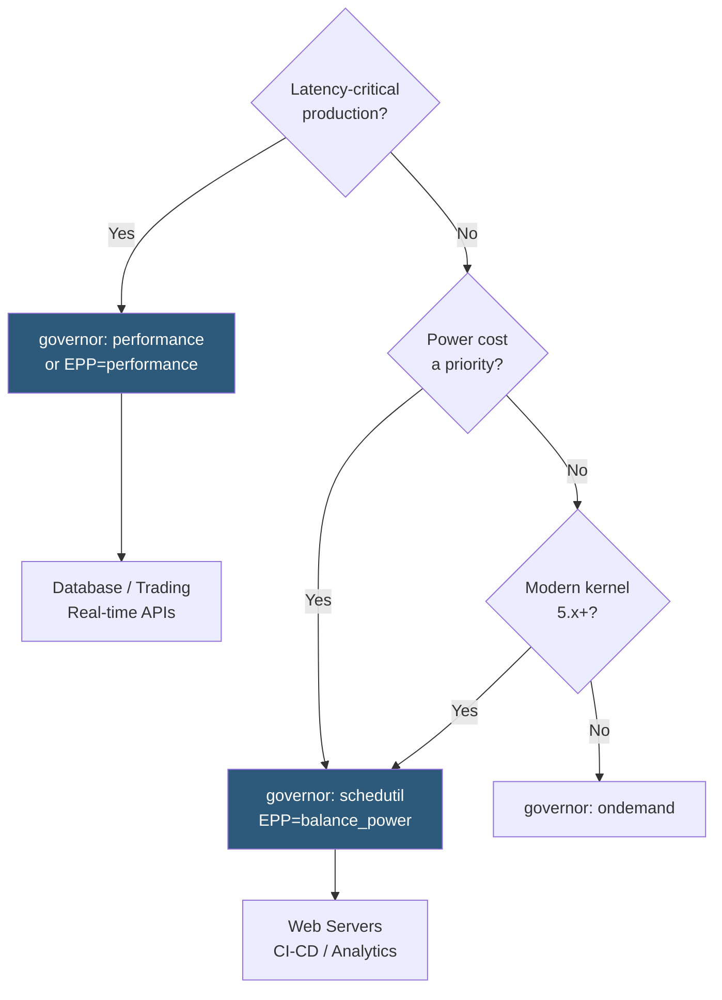

**Category:** CPU Architecture & Performance
**Difficulty:** Intermediate
**Reading time:** 5 min read

---

Linux CPU frequency governors control how the kernel adjusts CPU P-states (frequency/voltage) in response to workload demand. Selecting the correct governor for each workload type can significantly affect both performance and power consumption without any application changes.

- **cpufreq governor** — kernel policy module controlling CPU frequency scaling decisions
- **performance** — locks CPU at maximum frequency; eliminates frequency scaling overhead; recommended for latency-sensitive production servers
- **powersave** — locks CPU at minimum frequency; maximizes efficiency for idle or light systems
- **schedutil** — modern governor that integrates with CFS scheduler utilization signals; best for mixed workloads
- **ondemand** — legacy governor that ramps frequency up quickly on load, drops slowly; adequate but less responsive than schedutil
- **P-state driver** — Intel (intel_pstate) and AMD (amd-pstate) provide hardware-native scaling bypassing legacy cpufreq governors
- **EPP (Energy Performance Preference)** — hint register (0=performance, 128=balanced, 255=power save) read by intel_pstate/amd-pstate

The Linux cpufreq subsystem exposes per-CPU frequency controls via `/sys/devices/system/cpu/cpuN/cpufreq/`. Setting `scaling_governor` to `performance` locks frequency at `scaling_max_freq`. The governor decision runs in kernel context on a scheduler tick or utilization change event.

Modern Intel and AMD processors use hardware P-state (HWP) mode where the CPU microcontroller manages frequency internally based on EPP hints from the OS. `intel_pstate` driver in active mode bypasses the software governor loop entirely, providing faster frequency response (~10 ms vs ~100 ms for software governors). Setting `energy_performance_preference` to `performance` tells the CPU to prioritize frequency over power savings.

The `schedutil` governor integrates directly with CFS: each time a scheduler tick updates a CPU's utilization estimate, schedutil calculates required frequency proportional to utilization and sends a request to the P-state driver. This provides better responsiveness than `ondemand`'s polling approach and better efficiency than `performance`'s locked-high approach.

For Kubernetes and virtualized environments, the host governor applies to all guest vCPUs mapping to a physical CPU. Guests cannot override host governors unless the hypervisor exposes `x86_energy_perf_policy` or equivalent. Cloud providers typically run `performance` governor on bare metal to ensure consistent VM SLAs.

- `performance` governor: production databases, trading systems, real-time APIs
- `schedutil` with EPP balanced: general-purpose web servers, microservices
- `powersave`: batch overnight jobs, idle development machines
- `ondemand`: legacy systems on kernels before 4.14 where schedutil is unavailable
- Custom EPP tuning: HPC clusters balancing throughput jobs vs energy budget

| Advantage | Disadvantage |
|-----------|--------------|
| `performance` eliminates frequency transition latency for consistent p99 | `performance` wastes power during idle periods |
| `schedutil` adapts intelligently to utilization without manual tuning | `schedutil` response time (~1–2 ms) still introduces latency vs hardware HWP |
| No application code changes required; purely OS-level configuration | Governor mismatch for workload type can cost 10–30% performance or efficiency |
| EPP exposes hardware HWP hints for sub-millisecond response | EPP semantics differ between Intel and AMD implementations |

- [Power Efficiency Metrics](power-efficiency-metrics-performance-per-watt.md)
- [CPU Thermal Design Power Management](cpu-thermal-design-power-tdp-management.md)
- [Turbo Boost and Precision Boost Technology](turbo-boost-and-precision-boost-technology.md)

---
*Part of the [CPU Architecture & Performance](index.md) category · [Back to Master Index](../../index.md)*
