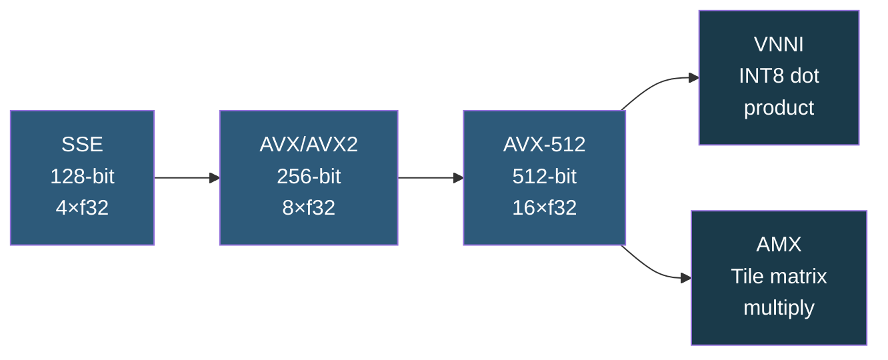

**Category:** CPU Architecture & Performance
**Difficulty:** Advanced
**Reading time:** 7 min read

---

SIMD (Single Instruction, Multiple Data) instruction extensions like SSE, AVX, AVX2, and AVX-512 allow CPUs to process multiple data elements in parallel within a single instruction. These extensions are critical for high-throughput numerical computing, cryptography, compression, and AI inference workloads.

- **SIMD** — Single Instruction Multiple Data; one instruction operates on multiple data elements simultaneously
- **AVX/AVX2** — 256-bit vector registers (8× float32 or 4× float64 per instruction), available on most modern CPUs
- **AVX-512** — 512-bit vector registers with 32 ZMM registers; Intel Xeon exclusive, 2× the width of AVX2
- **VNNI (Vector Neural Network Instructions)** — AVX-512 extension for int8/int16 dot products; critical for DL inference
- **AMX (Advanced Matrix Extensions)** — Intel Sapphire Rapids tile-based matrix multiply engine, separate from AVX-512
- **Frequency throttling** — AVX-512 usage can reduce CPU frequency by 200–600 MHz due to increased power draw
- **ISA detection** — `cpuid` instruction or `/proc/cpuinfo` flags reveal supported extensions at runtime

Modern CPUs contain dedicated vector execution units alongside scalar ALUs. When the compiler or runtime generates SIMD instructions, the CPU loads 256 or 512 bits of data from memory into vector registers and performs the operation on all elements simultaneously. A single `vmulps ymm0, ymm1, ymm2` instruction multiplies 8 float32 pairs in the same cycles as one scalar multiply.

AVX-512 doubles the data width and introduces 16 new ZMM registers (totaling 32), mask registers for predicated execution, and a richer instruction set including scatter/gather, conflict detection, and the critical VNNI extension. VNNI computes INT8 dot products 4 elements at a time per multiply-accumulate, enabling 4× the throughput of FP32 GEMM for quantized neural network inference.

The frequency throttling caveat is significant: sustained AVX-512 workloads on Skylake-SP drew enough additional power to trigger CPU microcode to reduce all-core frequency, impacting co-located non-AVX workloads. Cascade Lake improved this; Ice Lake (Xeon 3rd gen) essentially eliminated the penalty for VNNI. Operators running mixed workloads should benchmark whether AVX-512 frequency reduction impacts neighboring services on the same core.

Libraries like Intel MKL, OpenBLAS, and BLAS LAPACK automatically dispatch to the widest available SIMD path. NumPy, PyTorch CPU, and ONNX Runtime detect and use AVX-512/VNNI at runtime. Compilers (GCC `-march=native`, LLVM `-march=native`) auto-vectorize eligible loops.

- Deep learning inference with INT8 quantization using VNNI
- HPC simulation loops (molecular dynamics, CFD finite element)
- Media encoding/decoding with SIMD-optimized codecs
- Cryptographic operations (AES-NI, SHA-NI are separate but adjacent SIMD features)
- Database scan/filter operations using SIMD comparisons over column chunks

| Advantage | Disadvantage |
|-----------|--------------|
| 2–16× throughput increase for vectorizable workloads | AVX-512 frequency reduction can affect co-located scalar workloads |
| VNNI/AMX enable competitive on-CPU AI inference | AVX-512 is Intel Xeon-exclusive; not on consumer Core or AMD EPYC (EPYC has AVX2 only) |
| Auto-vectorization requires no source code changes | Non-vectorizable code (pointer chasing, branches) gets no benefit |
| Runtime dispatch allows single binary across ISA levels | CPUID detection and dispatch adds code complexity in libraries |

- [Intel Xeon Processor Families](intel-xeon-processor-families.md)
- [Workload-Specific CPU Optimization](workload-specific-cpu-optimization.md)
- [CPU Benchmarking Methodologies](cpu-benchmarking-methodologies.md)

---
*Part of the [CPU Architecture & Performance](index.md) category · [Back to Master Index](../../index.md)*
