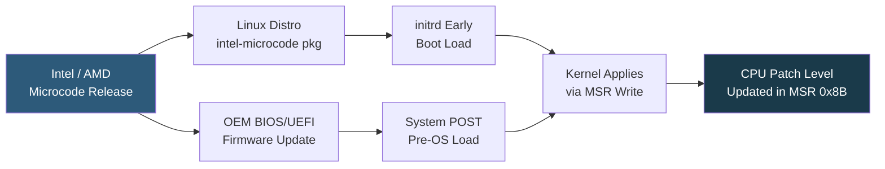

**Category:** CPU Architecture & Performance
**Difficulty:** Intermediate
**Reading time:** 5 min read

---

CPU microcode is firmware embedded in the processor that implements instruction behaviors and controls microarchitectural features. Microcode updates are delivered via BIOS/UEFI firmware or OS early boot mechanisms and are essential for patching security vulnerabilities and correcting hardware errata without physical CPU replacement.

- **Microcode** — firmware layer inside the CPU translating complex CISC instructions into simpler microoperations
- **CPUID stepping** — CPU revision identifier; microcode updates increment the patch level within a stepping
- **Early microcode update** — OS loads updated microcode from `/lib/firmware/intel-ucode/` or `/lib/firmware/amd-ucode/` before SMP initialization
- **BIOS-delivered microcode** — UEFI loads microcode before OS boot; most secure delivery method as it covers pre-OS attack surface
- **Errata** — documented CPU bugs with workarounds implemented in microcode updates
- **Spectre/Meltdown patches** — high-profile security fixes delivered via microcode (IBRS, IBPB, STIBP for Spectre v2)
- **MCADD (Machine Check Architecture)** — hardware error reporting mechanism also updated via microcode

Microcode is loaded into the CPU's internal ROM overlay during boot. When the CPU encounters an instruction or condition covered by a microcode patch, the overlay redirects execution to the patched microoperation sequence rather than the original hardware implementation. This allows complex behavioral changes (like adding serialization barriers for Spectre) without silicon modification.

Intel distributes microcode updates as binary blobs tied to CPU family/model/stepping identifiers. Linux `intel-microcode` package places these under `/lib/firmware/intel-ucode/`; the initramfs includes them as early initrd modules loaded before SMP brings up secondary cores (ensuring all CPUs receive identical microcode).

Verifying current microcode level: `grep -m1 microcode /proc/cpuinfo` shows hex patch level. Intel's microcode repository on GitHub maps stepping to revision history. `iucode-tool -S` shows the installed microcode and whether it matches the running CPU.

BIOS delivery is preferred because some vulnerabilities affect the system before the OS loads (e.g., UEFI runtime services). However, OS-delivered microcode provides faster update cycles without rebooting for BIOS flashing. Best practice: keep both BIOS and OS microcode packages current, with BIOS as the floor version.

- Routine patching pipeline: include `intel-microcode`/`amd-ucode` in OS package updates
- Spectre v2 mitigation: IBRS/eIBRS microcode required before OS-level IBPB/STIBP are effective
- Hardware errata workarounds: avoid CPU bugs without OS kernel changes
- Compliance audits: verify microcode patch level as part of CVE remediation evidence
- Cloud hypervisors: ensure all hosts run consistent microcode for uniform guest security posture

| Advantage | Disadvantage |
|-----------|--------------|
| Fixes CPU hardware bugs and security vulnerabilities without physical replacement | Some microcode updates introduce measurable performance regressions (Spectre mitigations) |
| OS-delivered updates faster than BIOS reflashing cycles | Microcode only loads at boot; updates require reboot to activate |
| Transparent to applications; no source code changes needed | Mis-matched BIOS and OS microcode levels can cause confusion in audit trails |
| Early initrd delivery ensures all cores get updates before SMP starts | Downgrade paths are limited; older microcode cannot always be loaded after newer version |

- [Spectre and Meltdown Mitigation Impact](spectre-and-meltdown-mitigation-impact.md)
- [CPU Security Features](cpu-security-features-sgx-sev.md)
- [Intel Xeon Processor Families](intel-xeon-processor-families.md)

---
*Part of the [CPU Architecture & Performance](index.md) category · [Back to Master Index](../../index.md)*
