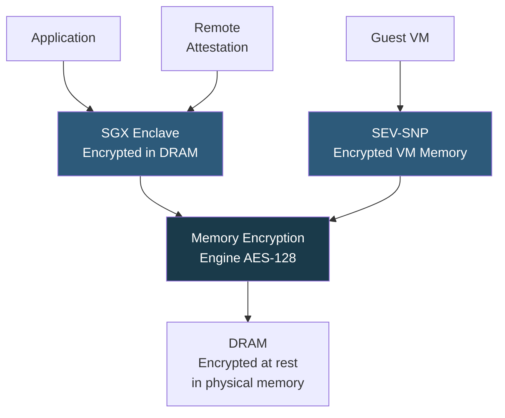

**Category:** CPU Architecture & Performance
**Difficulty:** Advanced
**Reading time:** 7 min read

---

Hardware-based CPU security features like Intel SGX (Software Guard Extensions) and AMD SEV (Secure Encrypted Virtualization) provide confidential computing capabilities — protecting data in use from privileged software, hypervisors, and physical memory attacks — enabling new trust models for cloud and multi-tenant environments.

- **SGX (Software Guard Extensions)** — Intel feature creating encrypted "enclaves" in user-space memory protected from OS/hypervisor
- **SEV (Secure Encrypted Virtualization)** — AMD technology encrypting VM memory with per-VM keys in hardware
- **SEV-SNP** — SEV Secure Nested Paging, adds memory integrity protection against replay/remapping attacks
- **Enclave** — SGX-protected memory region; CPU encrypts contents in DRAM with an enclave-specific key
- **Remote attestation** — cryptographic proof that code is running inside a genuine, unmodified enclave/TEE
- **TEE (Trusted Execution Environment)** — generic term for hardware-isolated confidential compute environments
- **Memory encryption engine** — hardware AES engine in the CPU's memory controller performing transparent encryption

Intel SGX reserves encrypted page cache (EPC) regions where enclave pages are stored. When the CPU accesses EPC pages, the Memory Encryption Engine (MEE) decrypts them into CPU caches transparently; on eviction back to DRAM, they are re-encrypted and MAC-tagged. Even a privileged OS reading physical DRAM sees only ciphertext. Enclave code runs in ring-3 (user mode) but is isolated from the OS by hardware-enforced page table entry bits and the MEE.

SGX remote attestation uses the CPU's fused attestation key to produce a signed quote proving that a specific enclave hash is running on genuine Intel hardware. Cloud providers (Azure Confidential Computing, Google Confidential Space) use this to allow customers to verify workload integrity before submitting sensitive data.

AMD SEV operates at the VM level rather than the application level. Each guest VM is assigned a unique encryption key managed by the AMD Secure Processor (ARM TrustZone-based secure co-processor on die). SEV-ES additionally encrypts CPU register state on VM-Exit, preventing the hypervisor from reading guest registers. SEV-SNP adds VMPL (VM Permission Levels) and Reverse Map Tables (RMP) to prevent hypervisor remapping of guest physical pages, closing replay and aliasing attack vectors.

Performance overhead varies: SEV adds ~3–10% for memory-intensive workloads due to encryption engine latency; SGX enclaves incur higher costs for EPC cache misses when working sets exceed EPC size (historically limited to 128 MB–512 MB, expanded to 512 GB on 3rd-gen Xeon).

- Confidential ML training on sensitive customer data in cloud environments
- Secure multi-party computation where mutually untrusting parties compute on shared data
- Blockchain smart contract execution in verified enclaves
- GDPR-compliant processing of personal data in shared cloud infrastructure
- Key management services requiring hardware-protected key storage

| Advantage | Disadvantage |
|-----------|--------------|
| Protects data-in-use from privileged software and hypervisor attacks | Performance overhead from encryption engine and EPC cache misses |
| Remote attestation enables hardware-rooted trust without trusting the cloud provider | SGX EPC size historically limited; large working sets thrash encrypted memory |
| SEV-SNP prevents hypervisor remapping attacks on VM memory | Complex programming model for SGX enclaves; requires SDK and code restructuring |
| Enables new regulatory compliance models for multi-tenant cloud | Hardware supply chain trust is a prerequisite; compromised fuses break the model |

- [CPU Virtualization Extensions](cpu-virtualization-extensions-vt-x-amd-v.md)
- [AMD EPYC Server Processor Lineup](amd-epyc-server-processor-lineup.md)
- [Spectre and Meltdown Mitigation Impact](spectre-and-meltdown-mitigation-impact.md)

---
*Part of the [CPU Architecture & Performance](index.md) category · [Back to Master Index](../../index.md)*
