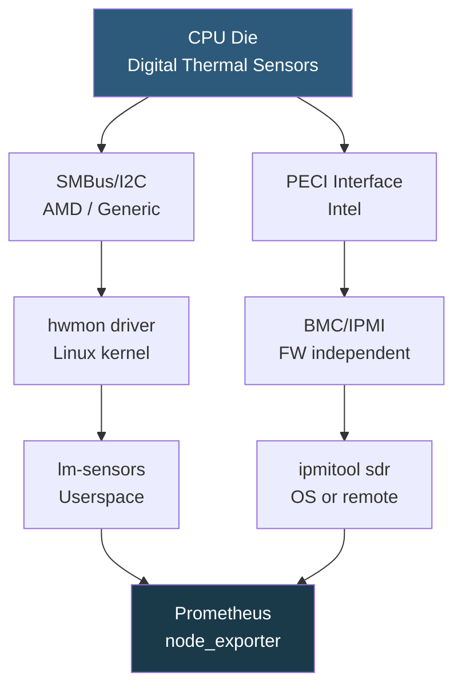

**Category:** CPU Architecture & Performance
**Difficulty:** Beginner
**Reading time:** 5 min read

---

CPU temperature monitoring is fundamental to datacenter operations, preventing thermal damage and detecting cooling failures before they cause downtime. Modern server CPUs embed dozens of digital thermal sensors accessible through multiple OS and hardware interfaces.

- **Tjunction (Tj)** — individual core junction temperature measured at the silicon die; the primary thermal metric
- **Tcase** — temperature at the CPU package lid/IHS (Integrated Heat Spreader); measured by motherboard NTC thermistor
- **Tj Max** — maximum allowable junction temperature (Intel: 95–105°C; AMD EPYC: 95°C) before throttling
- **lm-sensors** — Linux userspace tool reading temperature sensors via hwmon kernel driver
- **IPMI/BMC** — Baseboard Management Controller reads platform-level temperatures independent of the OS
- **PECI (Platform Environment Control Interface)** — Intel proprietary serial interface for CPU temperature and power telemetry
- **thermal zone** — Linux kernel abstraction exposing thermal sensors via `/sys/class/thermal/thermal_zoneN/temp`

Intel Xeon CPUs embed a Digital Thermal Sensor (DTS) in every core that measures temperature as an offset below Tj Max (reported as negative values in raw MSR 0x19C). The `coretemp` kernel module reads these via PECI and exposes them as hwmon sensors. `sensors` command from lm-sensors package shows all CPU core temperatures in human-readable form.

AMD EPYC uses the `k10temp` kernel driver to expose Tdie (computed die temperature) and Tctl (control temperature with offset for compatibility). Tdie is the actual temperature; Tctl may have a 10°C offset on some SKUs. Socket temperatures are also available via hwmon.

BMC/IPMI provides platform-level thermal telemetry independent of the OS through PECI on Intel platforms. `ipmitool sdr type Temperature` lists all thermal sensors in the server's Sensor Data Record, including CPU, ambient inlet, exhaust, and memory temperatures — accessible even when the OS is unresponsive, making it essential for out-of-band monitoring.

Prometheus `node_exporter` with the `hwmon` collector exports all lm-sensors readings as metrics. Grafana dashboards visualize temperature trends; alerting rules trigger when any core exceeds 85°C (10°C below Tj Max as a safe threshold) for sustained periods. IPMI exporters provide BMC sensor data to the same Prometheus stack for unified monitoring.

- Capacity planning: sustained operation at 75°C+ signals inadequate airflow or CPU workload increase
- Incident response: temperature spike correlates with performance degradation timeline
- Hardware failure detection: one core at 100°C while others are at 60°C indicates defective TIM or heatsink contact
- Cooling system validation: confirm temperature drops after blanking panel installation or airflow rebalancing
- Predictive maintenance: trending temperature rise over months identifies TIM dryout requiring reapplication

| Advantage | Disadvantage |
|-----------|--------------|
| Per-core DTS provides granular hot-spot detection | lm-sensors requires driver support; some enterprise platforms need custom kernel modules |
| IPMI/BMC temperature monitoring works without OS running | PECI and IPMI protocols are vendor-specific; tooling varies between HPE, Dell, Supermicro |
| node_exporter integration enables fleet-wide thermal monitoring in Prometheus | Temperature sensor names in hwmon differ across CPU families; dashboards need per-platform tuning |
| Real-time monitoring enables pre-throttle alerting | Ambient temperature rise in datacenters is normal during cooling maintenance and seasonal changes |

- [CPU Thermal Design Power Management](cpu-thermal-design-power-tdp-management.md)
- [CPU Throttling Detection and Prevention](cpu-throttling-detection-and-prevention.md)
- [CPU Utilization Monitoring and Analysis](cpu-utilization-monitoring-and-analysis.md)

---
*Part of the [CPU Architecture & Performance](index.md) category · [Back to Master Index](../../index.md)*
