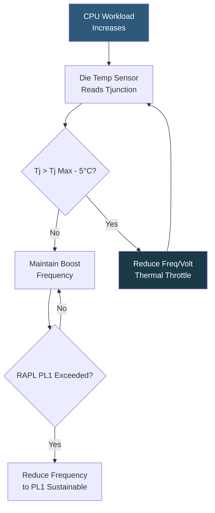

**Category:** CPU Architecture & Performance
**Difficulty:** Intermediate
**Reading time:** 6 min read

---

Thermal Design Power defines the maximum sustained heat a cooling solution must dissipate to keep a CPU within operational temperature limits. Proper TDP management ensures stability, prevents thermal throttling, and is critical for accurate power provisioning in dense datacenter deployments.

- **TDP** — rated heat dissipation at maximum sustained load within normal operating conditions
- **Tjunction (Tj Max)** — maximum die temperature before thermal throttling activates (typically 90–105°C for server CPUs)
- **Thermal throttling** — automatic frequency and voltage reduction when Tj approaches Tj Max
- **TIM (Thermal Interface Material)** — compound between CPU die and heatsink; quality affects thermal resistance
- **PL1/PL2** — Intel's two power limits: sustained (PL1=TDP) and burst (PL2, allowed for short intervals)
- **cTDP Down/Up** — BIOS-configurable TDP range for power efficiency or performance modes
- **RAPL (Running Average Power Limit)** — Intel's per-domain energy metering and capping interface

Server CPUs embed dozens of digital thermal sensors distributed across the die. The PCU (Power Control Unit) samples these continuously and computes the thermal margin — the difference between current temperature and Tj Max. When margin shrinks, the PCU begins reducing core voltage and frequency via P-states to lower power consumption and heat generation.

Intel's RAPL interface exposes per-domain energy counters and power limits via MSRs (Model Specific Registers), accessible through `turbostat`, `powertop`, or directly via `/sys/class/powercap/intel-rapl`. Operators can set `power_limit_uw` values to cap CPU power below the hardware maximum — useful when rack power budget is constrained. Setting PL1 below TDP reduces peak performance but provides headroom for more dense server packing.

In dense 1U/2U rack deployments with 400W+ CPUs (e.g., Xeon Platinum W9-3595X at 350W), the cooling solution must handle full TDP simultaneously on all installed sockets. Thermal paste reapplication every 2–3 years prevents dryout-induced thermal resistance increase. Liquid cooling (direct-to-chip or immersion) provides substantially better thermal resistance than air cooling, enabling sustained operation near boost frequencies.

AMD's Precision Boost 2 integrates thermal monitoring directly into the boost algorithm, proactively reducing frequency before hard thermal throttle engages. The `k10temp` kernel module exposes EPYC temperatures; `hwmon` integrations feed these to monitoring systems.

- Rack power planning: total rack TDP × safety factor → PDU and UPS sizing
- cTDP Down for edge deployments with limited cooling capacity
- RAPL power capping on shared HPC clusters to enforce per-job power limits
- Thermal throttle detection in monitoring (Prometheus node-exporter + CPU throttle metrics)
- Validating cooling adequacy during load testing with sustained synthetic workloads

| Advantage | Disadvantage |
|-----------|--------------|
| Automatic thermal protection prevents hardware damage | Thermal throttling degrades performance unpredictably during unexpected heat events |
| RAPL power capping enables precise power budgeting | Setting PL1 too low leaves performance on the table |
| cTDP Down reduces power consumption for edge or low-cooling environments | TDP ratings are at base clock; boost workloads can transiently exceed TDP significantly |
| Modern CPUs provide millisecond-resolution thermal telemetry | Thermal paste degradation silently increases Tj under the same load over time |

- [Turbo Boost and Precision Boost Technology](turbo-boost-and-precision-boost-technology.md)
- [CPU Temperature Monitoring Systems](cpu-temperature-monitoring-systems.md)
- [CPU Throttling Detection and Prevention](cpu-throttling-detection-and-prevention.md)

---
*Part of the [CPU Architecture & Performance](index.md) category · [Back to Master Index](../../index.md)*
