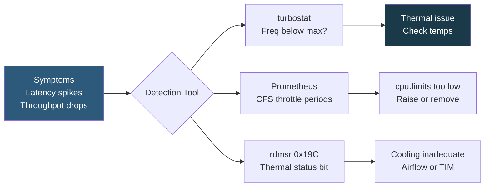

**Category:** CPU Architecture & Performance
**Difficulty:** Intermediate
**Reading time:** 6 min read

---

CPU throttling occurs when the processor or OS reduces clock frequency below baseline to manage power, thermal, or resource limits. Undetected throttling causes erratic performance degradation that mimics application bugs, making detection tooling and prevention strategies essential for stable production systems.

- **Thermal throttling** — CPU reduces frequency when Tjunction approaches Tj Max (typically 90–105°C)
- **Power throttling** — frequency reduction when power draw exceeds PL1/PL2 sustained limits
- **Container CPU throttling** — Linux CFS bandwidth control limits container CPU usage below its `cpu.limits` quota
- **VM CPU steal** — hypervisor preempts vCPU time; appears as reduced throughput without OS-level detection
- **turbostat** — Intel tool reporting per-core frequency, C-state residency, and package power in real time
- **CFS bandwidth throttle counters** — `container_cpu_cfs_throttled_periods_total` in cAdvisor/Prometheus
- **MSR 0x19C** — Intel IA32_THERM_STATUS MSR; bit 4 set indicates thermal throttle active on that core

Hardware throttling manifests when `turbostat` shows per-core frequency consistently below the expected all-core turbo. The columns `Avg_MHz` vs `Bzy_MHz` (busy-MHz weighted average) reveal whether the CPU is spending time at reduced frequency. If Avg_MHz is 2.4 GHz but Bzy_MHz is 2.4 GHz and the all-core turbo should be 3.4 GHz, thermal or power throttling is active.

Reading Intel MSR 0x19C with `rdmsr -p <core> 0x19C` returns the IA32_THERM_STATUS register. Bit 4 is the "Thermal Throttle Active" bit — set means the core is currently throttling. AMD equivalent uses the same information via `k10temp` and hwmon: `cat /sys/class/hwmon/hwmon*/temp*_input` shows die temperatures; compare against `temp*_crit`.

Container CPU throttling is a separate mechanism from hardware throttling. Linux CFS assigns each container a CPU bandwidth quota: `cpu.cfs_period_us` (default 100ms) and `cpu.cfs_quota_us` (e.g., 200ms for 2 CPUs). If a container uses its full quota before the period expires, it is throttled — blocked from CPU for the remainder of the period. This causes periodic ~100ms latency spikes for burst-heavy workloads.

Prevention strategies: for hardware throttling, ensure adequate airflow, reapply thermal paste, and consider liquid cooling for high-TDP CPUs. For container throttling, set `cpu.limits` at least 2× the average CPU request to accommodate bursts, or remove limits entirely for latency-sensitive pods with resource governance handled at the namespace quota level.

- Production alerting: Prometheus alert on `container_cpu_cfs_throttled_periods_total / container_cpu_cfs_periods_total > 0.25`
- Post-incident analysis: `turbostat` during load test reveals frequency collapse at high utilization
- Data center temperature monitoring: correlate ambient temperature spikes with CPU frequency drops
- Right-sizing container CPU limits: observe 95th percentile CPU usage before setting `cpu.limits`
- VM CPU steal detection: alert on EC2 `CPUCreditBalance` approaching 0 for T-family instances

| Advantage | Disadvantage |
|-----------|--------------|
| CFS throttling prevents noisy containers from starving neighbors | CPU throttle causes unpredictable latency spikes, harder to debug than OOM kills |
| Thermal throttling protects hardware from heat damage | By the time thermal throttle activates, performance impact is already occurring |
| turbostat provides real-time per-core frequency visibility | MSR access requires root; cloud VMs often restrict direct MSR reads |
| Container throttle metrics are exposed by cAdvisor with no overhead | Removing cpu.limits entirely risks one container starving all others on a node |

- [CPU Thermal Design Power Management](cpu-thermal-design-power-tdp-management.md)
- [CPU Utilization Monitoring and Analysis](cpu-utilization-monitoring-and-analysis.md)
- [Container CPU Limit Configuration](container-cpu-limit-configuration.md)

---
*Part of the [CPU Architecture & Performance](index.md) category · [Back to Master Index](../../index.md)*
