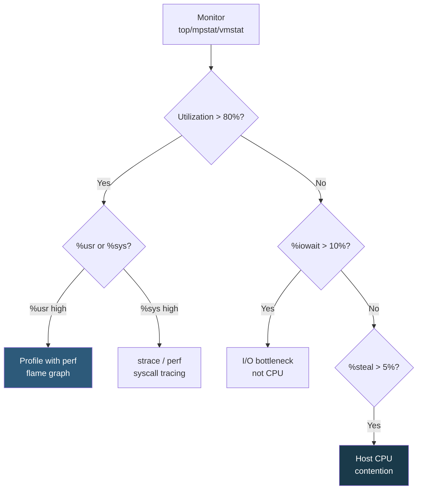

**Category:** CPU Architecture & Performance
**Difficulty:** Intermediate
**Reading time:** 6 min read

---

CPU utilization metrics expose how workloads consume compute resources, but raw utilization percentages are often misleading. Distinguishing between user, system, iowait, steal, and hardware interrupt time — and correlating with hardware performance counters — provides actionable insight for capacity planning and bottleneck identification.

- **%usr / %user** — time spent executing user-space code; the primary application compute indicator
- **%sys / %system** — time in kernel context (syscalls, interrupts); high values suggest I/O or network overhead
- **%iowait** — CPU idle while waiting for I/O completion; does not indicate CPU bottleneck but disk/network constraint
- **%steal** — in VMs, time the hypervisor stole from this vCPU for another workload; indicates CPU contention on host
- **%irq / %softirq** — hardware and software interrupt processing time; high values indicate NIC or storage driver overhead
- **PMU (Performance Monitoring Unit)** — hardware counters for IPC, cache misses, branch mispredictions; accessed via `perf`
- **runqueue depth** — number of threads waiting for CPU time; sustained >1 per core indicates CPU saturation

The Linux kernel exports CPU time accounting via `/proc/stat`, which tools like `top`, `htop`, `mpstat`, and `sar` parse. `mpstat -P ALL 1` shows per-CPU breakdown every second. The `%idle` metric being non-zero means CPUs have spare capacity; approaching 0% idle with high %usr indicates genuine CPU saturation.

`%steal` is the most insidious metric in virtualized environments: it means the physical CPU is busy running other VMs. A server with 90% %usr and 10% %steal effectively has 10% of its compute budget silently consumed. Cloud providers like AWS display CloudWatch metric `CPUCreditBalance` for burstable T instances; below zero means throttling.

Hardware performance counters (PMU) reveal why CPU time is being consumed. `perf stat -a sleep 10` reports aggregate IPC, cache miss rates, and branch misprediction rates. IPC below 1.0 suggests memory-bound workloads (many L3/DRAM misses stalling execution). IPC above 3.0 indicates good cache behavior and compute efficiency. `perf top` and `perf record + perf report` identify hot functions; Brendan Gregg's FlameGraph visualizes call stacks proportionally.

For containers, `kubectl top pods --containers` and cAdvisor provide container-level CPU metrics. Container CPU throttle events (exposed via `container_cpu_cfs_throttled_periods_total` in Prometheus) indicate the container has hit its `cpu.limits` CPU quota, even when host utilization is low.

- Capacity planning: sustained >70% usr utilization triggers CPU upgrade or horizontal scaling
- %steal monitoring: alert on >5% steal in VMs as evidence of noisy neighbor or instance resize need
- perf + FlameGraph: identify which function accounts for 40% of CPU time in a Node.js API
- Container CPU throttle alerts: detect pods hitting cpu.limits causing latency spikes
- iowait differentiation: confirm disk latency (not CPU) is the bottleneck before ordering faster CPUs

| Advantage | Disadvantage |
|-----------|--------------|
| Per-CPU mpstat reveals unbalanced workload distribution across cores | %utilization alone doesn't reveal whether CPU time is productive (high IPC) or stalled |
| %steal is a cloud-only metric exposing host-level contention invisible otherwise | PMU hardware counter access requires root or CAP_PERFMON; often restricted in cloud VMs |
| Container CPU throttle metrics provide granular per-workload visibility | Container cpu.limits throttling is invisible in host-level CPU utilization metrics |
| FlameGraph + perf provides line-level attribution without application changes | High-frequency perf sampling adds ~1–5% overhead; avoid in latency-sensitive production paths |

- [CPU Throttling Detection and Prevention](cpu-throttling-detection-and-prevention.md)
- [CPU Benchmarking Methodologies](cpu-benchmarking-methodologies.md)
- [Container CPU Limit Configuration](container-cpu-limit-configuration.md)

---
*Part of the [CPU Architecture & Performance](index.md) category · [Back to Master Index](../../index.md)*
