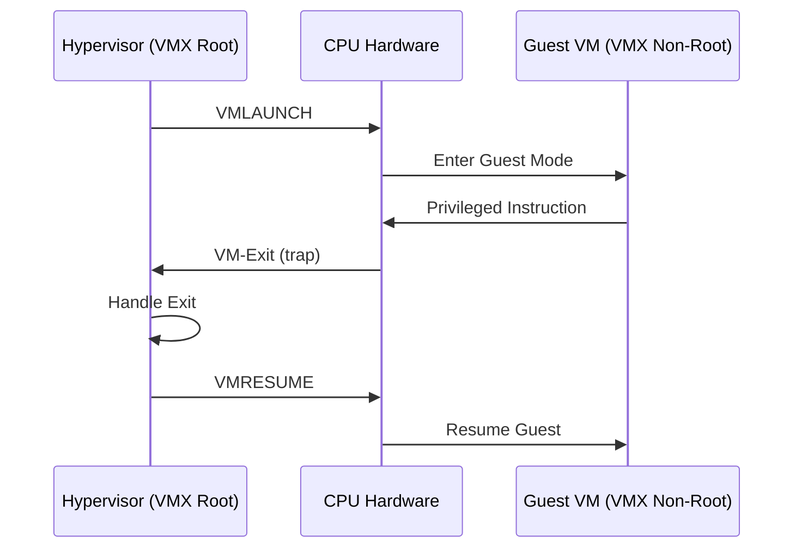

**Category:** CPU Architecture & Performance
**Difficulty:** Intermediate
**Reading time:** 6 min read

---

Hardware virtualization extensions (Intel VT-x and AMD-V/SVM) enable hypervisors to run guest operating systems with near-native performance by providing CPU-level trapping and handling of privileged operations, eliminating the software emulation overhead of early virtualization techniques.

- **VT-x (VMX)** — Intel Virtualization Technology for x86; introduces VMXON/VMXOFF/VMLAUNCH/VMRESUME instructions
- **AMD-V (SVM)** — AMD Secure Virtual Machine; AMD's equivalent of VT-x
- **VMCS (Virtual Machine Control Structure)** — Intel's per-VM hardware data structure storing guest/host state
- **VMCB (VM Control Block)** — AMD's equivalent to VMCS
- **EPT / RVI (Rapid Virtualization Indexing)** — hardware second-level address translation; eliminates shadow page tables
- **VT-d / AMD-Vi (IOMMU)** — I/O virtualization for direct device assignment (passthrough) to VMs
- **VM-Exit / VM-Entry** — transitions between hypervisor (root mode) and guest (non-root mode); each costs ~1000–5000 cycles

Before hardware virtualization, hypervisors used binary translation (VMware's original approach) or paravirtualization (Xen's PV mode) to handle privileged instructions. VT-x introduced a new CPU execution mode: VMX non-root mode for guests, where certain privileged operations (like writing CR3 for page table switches or accessing MSRs) automatically trigger a VM-Exit trap to the hypervisor without software interception.

The VMCS/VMCB data structure stores the complete guest architectural state (segment registers, CR registers, RIP, RSP) and exit/entry controls. VMRESUME restores guest state from VMCS and resumes execution with one instruction. VM-Exit saves guest state and jumps to the hypervisor's handler. The exit reason codes identify what caused the trap, allowing the hypervisor to emulate or pass through the operation.

EPT (Extended Page Tables) eliminates the performance-critical shadow page table path: guests manage their own GVA→GPA mappings; hardware performs an additional page walk (GPA→HPA) transparently, allowing guest page table modifications without VM-Exits for TLB management.

VT-d/IOMMU enables direct device assignment (PCIe passthrough) by providing hardware address translation for DMA operations from physical devices, allowing them to access VM memory without hypervisor involvement. This enables near-native I/O performance for GPU passthrough, NVMe passthrough, and SR-IOV virtual functions.

- KVM, Xen, VMware ESXi, and Hyper-V all require VT-x/AMD-V
- Nested virtualization: running VMs within VMs for cloud development and testing
- GPU passthrough to VMs using VT-d/IOMMU for ML or CAD workloads
- Container-based VMs (Kata Containers, gVisor) using hardware virtualization for isolation
- SR-IOV NIC virtual functions for high-performance VM networking

| Advantage | Disadvantage |
|-----------|--------------|
| Near-native performance vs software binary translation | Each VM-Exit costs 1000–5000 cycles; high exit rates degrade performance |
| EPT eliminates shadow page table complexity and VM-Exit storms | IOMMU/VT-d adds complexity to device driver and PCIe topology management |
| VT-d enables SR-IOV and GPU passthrough at near-native I/O speed | Nested virtualization (VT-x within VT-x) adds additional overhead layers |
| Standard across all modern x86 CPUs for broad hypervisor support | CPU features must be exposed to nested guests in cloud environments (may be limited) |

- [CPU Resource Allocation in Virtualized Environments](cpu-resource-allocation-in-virtualized-environments.md)
- [CPU Security Features](cpu-security-features-sgx-sev.md)
- [Hyper-Threading and SMT Technology](hyper-threading-and-smt-technology.md)

---
*Part of the [CPU Architecture & Performance](index.md) category · [Back to Master Index](../../index.md)*
