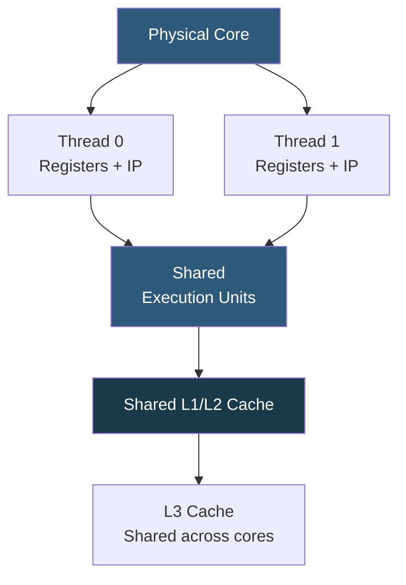

**Category:** CPU Architecture & Performance
**Difficulty:** Intermediate
**Reading time:** 6 min read

---

Hyper-Threading (Intel) and Simultaneous Multi-Threading (AMD/ARM) allow a single physical CPU core to execute two hardware threads simultaneously by duplicating architectural state (registers, instruction pointers) while sharing execution units. This increases CPU utilization during memory stalls but introduces resource contention under fully loaded conditions.

- **SMT** — Simultaneous Multi-Threading, the generic term; Intel calls their implementation Hyper-Threading (HT)
- **Logical CPU** — OS-visible CPU created by SMT; a 16-core CPU with SMT-2 exposes 32 logical CPUs
- **Execution unit sharing** — both SMT threads share ALUs, FPUs, caches, and TLBs within the core
- **Thread stall hiding** — while one SMT thread waits on a cache miss, the other thread executes
- **L1/L2 cache pressure** — two active threads compete for the same private cache, increasing miss rates
- **BIOS SMT disable** — option to present only physical cores to the OS, often used for HPC or security
- **sibling threads** — /sys/devices/system/cpu/cpuN/topology/thread_siblings in Linux identifies SMT pairs

Modern out-of-order CPUs have deep pipelines with multiple execution units that are rarely 100% utilized by a single thread due to memory latency stalls, branch mispredictions, and data dependencies. SMT exploits this by maintaining two complete sets of architectural state (registers, program counters, flags) per core, enabling the processor's instruction fetch and dispatch logic to issue instructions from either thread in any given cycle.

The scheduler hardware interleaves instructions from both threads in the same pipeline. When Thread 0 stalls waiting on a cache miss (~100 cycles for L3, ~200 for DRAM), Thread 1's instructions fill the execution units. In I/O-heavy or memory-latency-bound workloads, SMT delivers near 30–40% additional throughput at zero hardware cost.

However, under compute-bound workloads where both threads are actively executing, they compete for the same ALUs, L1/L2 cache capacity, and TLB entries. In worst cases, SMT can reduce single-thread throughput by 10–20% due to cache eviction pressure. For latency-sensitive applications like low-latency trading, disabling SMT and dedicating physical cores eliminates this contention.

Security implications: Spectre-class vulnerabilities partially exploit SMT's shared microarchitectural state. Some environments (public cloud hypervisors, certain government deployments) disable SMT entirely as a mitigation, accepting the throughput reduction.

- Web servers and API backends with high concurrency and I/O wait
- Virtualization hosts where guest VMs have bursty workloads
- CI/CD build systems running many parallel compilation jobs
- Batch analytics jobs with significant memory access patterns
- Cost-optimized general-purpose compute where maximum logical CPUs are needed

| Advantage | Disadvantage |
|-----------|--------------|
| Effectively doubles logical core count for OS schedulers | Execution unit contention under compute-bound load |
| Exploits memory stall cycles to improve throughput | Shared L1/L2 cache increases miss rates under dual-thread load |
| No additional silicon area for doubled architectural state | Security risk from cross-thread microarchitectural side channels |
| Typically 20–30% throughput gain on real mixed workloads | Latency percentiles can increase due to cache competition |

- [CPU Core Count vs Clock Speed Tradeoffs](cpu-core-count-vs-clock-speed-tradeoffs.md)
- [CPU Affinity and Pinning Strategies](cpu-affinity-and-pinning-strategies.md)
- [CPU Security Features](cpu-security-features-sgx-sev.md)

---
*Part of the [CPU Architecture & Performance](index.md) category · [Back to Master Index](../../index.md)*
