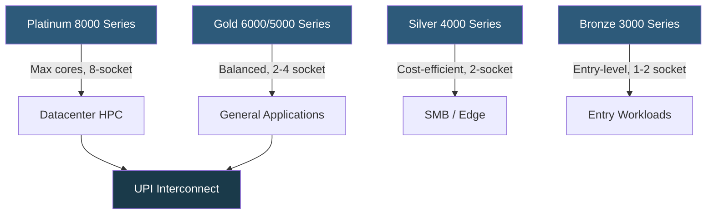

**Category:** CPU Architecture & Performance
**Difficulty:** Intermediate
**Reading time:** 6 min read

---

Intel Xeon processors are the dominant server-grade CPU line optimized for multi-socket configurations, ECC memory, and high core counts. From the Xeon E to the Xeon Scalable (Platinum/Gold/Silver/Bronze) generations, Intel has continuously iterated on core counts, memory channels, and PCIe lane availability to meet datacenter workloads.

- **Xeon Scalable** — Intel's current server CPU brand, replacing Xeon E5/E7, offered in Platinum, Gold, Silver, and Bronze tiers
- **Ice Lake / Sapphire Rapids** — recent Xeon microarchitectures featuring PCIe 5.0, DDR5, and HBM variants
- **UPI (Ultra Path Interconnect)** — high-speed CPU-to-CPU link for multi-socket topologies replacing QPI
- **AVX-512** — 512-bit SIMD instruction extension available on Xeon for vectorized workloads
- **RAS features** — Reliability, Availability, Serviceability capabilities including machine check architecture
- **NUMA domains** — per-socket memory locality zones critical for performance tuning
- **TDP tiers** — power envelopes ranging from 60W to 350W+ across the Xeon lineup

Intel Xeon Scalable processors are built around a mesh interconnect architecture (replacing the ring bus used in earlier generations). Each core communicates with LLC (Last Level Cache) slices and I/O controllers via the mesh, reducing worst-case latency variance at high core counts. Current Sapphire Rapids processors support up to 60 cores per socket, DDR5-4800 across 8 memory channels, PCIe 5.0 with 80 lanes, and CXL 1.1 for memory expansion.

Multi-socket configurations use UPI links (up to 4 links at 16 GT/s on Platinum) for cache-coherent NUMA across sockets. Each socket forms a NUMA node; memory accesses to remote sockets incur ~60–90 ns additional latency versus local DRAM, making NUMA-aware application placement critical.

Xeon-specific features include Intel Speed Select Technology (SST) for per-core frequency and power management, hardware-accelerated crypto via QAT, and Intel DL Boost (VNNI instructions) for INT8 inference acceleration. RAS features such as memory mirroring, scrubbing, and patrol scrub differentiate Xeon from consumer Core CPUs.

- Multi-tenant virtualization hosts requiring large core counts and ECC
- In-memory database servers leveraging 8-channel DDR5 bandwidth
- HPC clusters exploiting AVX-512 vectorization
- AI inference at scale using DL Boost / AMX instructions
- Financial trading platforms requiring RAS and multi-socket scalability

| Advantage | Disadvantage |
|-----------|--------------|
| Mature ecosystem with broad OS and hypervisor support | Higher cost per core vs AMD EPYC at equivalent performance |
| Extensive RAS features for mission-critical workloads | AVX-512 can reduce all-core turbo frequency significantly |
| PCIe 5.0 and CXL support on latest generation | NUMA complexity increases with socket count |
| Intel vPro / AMT for out-of-band management | Thermal design requires careful airflow planning |

- [AMD EPYC Server Processor Lineup](amd-epyc-server-processor-lineup.md)
- [NUMA Optimization](numa-non-uniform-memory-access-optimization.md)
- [CPU Virtualization Extensions](cpu-virtualization-extensions-vt-x-amd-v.md)

---
*Part of the [CPU Architecture & Performance](index.md) category · [Back to Master Index](../../index.md)*
