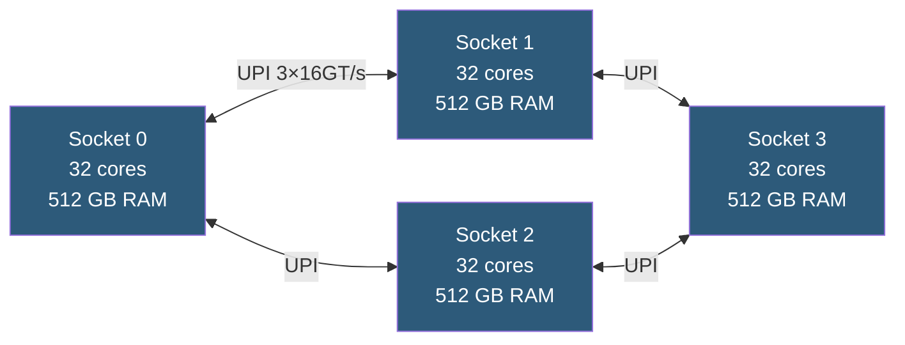

**Category:** CPU Architecture & Performance
**Difficulty:** Advanced
**Reading time:** 6 min read

---

Multi-socket servers install two or more physical CPUs in a single chassis, connected via high-speed processor interconnects. They deliver massive core counts, memory capacity, and I/O density for demanding enterprise workloads, but require careful NUMA-aware configuration to avoid performance pitfalls.

- **UPI (Ultra Path Interconnect)** — Intel's CPU-to-CPU link (up to 4 links at 16 GT/s on Platinum)
- **Infinity Fabric** — AMD's equivalent inter-socket link for EPYC multi-socket configurations
- **2S/4S/8S** — shorthand for 2-socket, 4-socket, 8-socket server configurations
- **NUMA distance** — relative memory access latency between NUMA nodes expressed as BIOS-reported table values
- **Remote memory bandwidth** — inter-socket link bandwidth limit (typically 200–400 GB/s) constrains remote DRAM access
- **HBM (High Bandwidth Memory)** — on-package stacked DRAM available on some Xeon Max variants, providing local TB/s bandwidth
- **Memory interleaving** — BIOS option distributing memory allocation across both sockets (improves bandwidth, harms locality)

In a 2-socket server, each CPU connects to its own DRAM channels and to the other CPU via UPI or Infinity Fabric links. The combined system presents up to 4 TB of DRAM (Xeon with DDR5 and 8 channels × 128 GB DIMMs per socket) and 192+ cores (dual 96-core EPYC Genoa). The OS ACPI SRAT/SLIT tables describe the NUMA topology; Linux uses these to build the kernel's NUMA distance matrix.

4-socket configurations typically use a full mesh or partial mesh UPI topology. In a full 4S mesh, each socket connects to every other socket, keeping maximum hop count at 1. In butterfly/ring topologies, some socket pairs communicate via an intermediate hop, adding latency. Server vendors document the exact topology in their configuration guides.

The critical performance concern: inter-socket bandwidth via UPI/Infinity Fabric is typically 200–400 GB/s, while local DDR5 bandwidth per socket is 300–500 GB/s. Applications that assume flat memory access patterns perform poorly at scale. NUMA-aware placement (numactl, jemalloc arena-per-node, JVM UseNUMA) pins working sets to local memory.

BIOS options control whether DRAM is presented as interleaved (single large UMA pool) or NUMA-split. Interleaving maximizes bandwidth for the fraction of workloads that access all memory uniformly but increases average latency by involving remote socket memory controllers on 50% of allocations.

- Large in-memory databases (SAP HANA, Oracle In-Memory) requiring TB-scale DRAM
- ERP/CRM application servers with many concurrent users and large caches
- HPC simulations benefiting from tightly coupled high-bandwidth compute
- Virtualization hosts needing maximum vCPU and vRAM density per chassis
- Legacy scale-up workloads that cannot be sharded horizontally

| Advantage | Disadvantage |
|-----------|--------------|
| Maximum DRAM capacity per chassis (up to 12 TB in 8S) | Significantly higher cost vs equivalent-core single-socket configurations |
| High core count enables massive VM density | NUMA complexity requires OS, application, and hypervisor tuning |
| Single OS image manages all resources | Remote memory latency (2× local) degrades NUMA-unaware applications significantly |
| Mature platform with broad software certification | 4S and 8S configurations are niche; limited OEM support and longer supply chains |

- [NUMA Optimization](numa-non-uniform-memory-access-optimization.md)
- [Intel Xeon Processor Families](intel-xeon-processor-families.md)
- [CPU Resource Allocation in Virtualized Environments](cpu-resource-allocation-in-virtualized-environments.md)

---
*Part of the [CPU Architecture & Performance](index.md) category · [Back to Master Index](../../index.md)*
