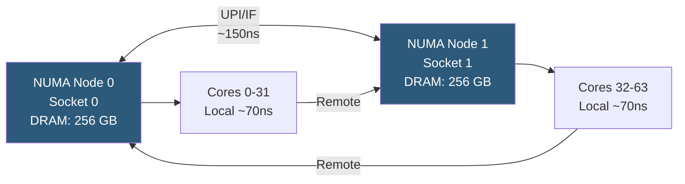

**Category:** CPU Architecture & Performance
**Difficulty:** Advanced
**Reading time:** 7 min read

---

NUMA architectures emerge when multiple CPU sockets each have local DRAM, connected via high-speed links. Memory accesses to local DRAM are faster than to remote sockets' DRAM, and failing to account for this topology can cause severe performance degradation in multi-socket and high-core-count systems.

- **NUMA node** — a group of CPU cores and their directly attached DRAM controllers (typically one per socket)
- **Local memory access** — accessing DRAM attached to the same socket as the running CPU core (~70 ns)
- **Remote memory access** — accessing DRAM on a different socket via UPI/Infinity Fabric (~120–200 ns)
- **numactl** — Linux utility to bind processes to specific NUMA nodes and memory policies
- **NUMA balancing** — Linux kernel feature that transparently migrates pages toward the NUMA node where they are most accessed
- **NPS mode** — EPYC BIOS setting creating sub-NUMA clusters within a single socket (NPS1/2/4)
- **First-touch policy** — Linux default: allocates pages on the NUMA node of the thread that first touches the memory

In a 2-socket server, two NUMA nodes exist. The kernel's memory allocator defaults to first-touch policy: whichever CPU core first writes to a page determines which NUMA node's local memory is used. Applications that initialize data on one socket but execute primarily on another experience systematic remote memory penalties on every cache miss.

`numactl --cpunodebind=0 --membind=0 ./application` pins a process to Node 0's CPUs and allocates all memory from Node 0's local DRAM, eliminating remote accesses for single-NUMA workloads. For databases like PostgreSQL, binding the server process to a single NUMA node doubles cache-miss throughput compared to OS-default placement.

NUMA-aware memory allocators (jemalloc's arena-per-node, TCMalloc's NUMA support) partition thread-local allocation arenas to node-local memory. The Linux kernel's automatic NUMA balancing (`/proc/sys/kernel/numa_balancing`) tracks access patterns via access faults and migrates frequently-accessed pages to the accessing node — effective but incurs a ~2% overhead from page fault instrumentation.

For AMD EPYC in NPS4 mode, a single 96-core socket appears as 4 NUMA nodes to the OS. Applications unaware of this topology may schedule threads across all 4 nodes, incurring Infinity Fabric hops. `lscpu` shows NUMA node topology; `numastat -m` shows per-node allocation statistics.

- Multi-socket database servers: bind PostgreSQL, MySQL, or Redis instances to individual NUMA nodes
- JVM heap allocation: use `-XX:+UseNUMA` to enable NUMA-aware allocation in HotSpot
- HPC simulations: MPI rank pinning with `--map-by numa` in OpenMPI
- Hypervisors: KVM with `numatune` pins VM vCPUs and guest memory to same NUMA node
- Memory bandwidth benchmarking: STREAM benchmark reveals per-NUMA-node bandwidth limits

| Advantage | Disadvantage |
|-----------|--------------|
| Local DRAM access eliminates remote latency penalty | NUMA-aware programming adds complexity to application design |
| numactl enables zero-code performance improvements | First-touch policy can silently create remote allocations in threaded init |
| NUMA balancing automates page migration transparently | Automatic NUMA balancing overhead ~1–3% and may migrate hot pages at wrong time |
| NPS sub-NUMA modes increase memory channel locality | NPS4 mode increases NUMA node count, requiring OS and app tuning |

- [Intel Xeon Processor Families](intel-xeon-processor-families.md)
- [AMD EPYC Server Processor Lineup](amd-epyc-server-processor-lineup.md)
- [CPU Affinity and Pinning Strategies](cpu-affinity-and-pinning-strategies.md)

---
*Part of the [CPU Architecture & Performance](index.md) category · [Back to Master Index](../../index.md)*
