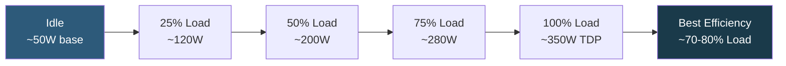

**Category:** CPU Architecture & Performance
**Difficulty:** Intermediate
**Reading time:** 5 min read

---

Performance per watt is the primary efficiency metric in modern datacenter design, directly impacting operational electricity costs, cooling requirements, and carbon footprint. As power density increases with higher core counts, understanding and optimizing energy efficiency has become as important as raw throughput.

- **Performance per watt** — throughput or work completed divided by power consumed; the key efficiency ratio
- **PUE (Power Usage Effectiveness)** — total facility power divided by IT equipment power; 1.0 is perfect, cloud hyperscalers achieve ~1.1–1.2
- **SPECpower_ssj** — industry benchmark measuring server performance per watt across load levels from 10% to 100%
- **P-states (ACPI)** — operating frequency/voltage states; higher P-states reduce frequency and power for idle workloads
- **C-states** — CPU sleep states during idle; deeper C-states (C6/C7) power down cores to microwatts
- **DVFS (Dynamic Voltage and Frequency Scaling)** — coordinated reduction of both voltage and frequency as load decreases
- **Energy proportionality** — ideal servers consume power proportional to load; reality is ~50% power at idle

CPU power scales non-linearly with load due to idle power floors and dynamic power. The relationship is approximately P = P_idle + C × f³ × V², where f is frequency and V is voltage. Since voltage and frequency are closely linked (lower frequency allows lower voltage), halving frequency reduces dynamic power by ~8×. This is why aggressive DVFS at idle dramatically reduces power without proportionally reducing throughput.

Modern server CPUs expose energy telemetry via RAPL (Intel) or HSMP (AMD), allowing per-socket and per-core energy measurements at millisecond resolution. Cloud providers and HPC centers use these to track workload energy consumption and optimize scheduling toward more efficient servers.

SPECpower_ssj2008 is the canonical benchmark: it measures Java server-side throughput at 10 discrete load levels and computes ssj_ops/W at each level. Top results for modern 2-socket servers reach 10,000–15,000 ssj_ops/watt. ARM Graviton consistently outperforms x86 on this benchmark at equivalent throughput due to lower idle and peak power.

At the system level, PUE multiplies CPU power: a server drawing 500W at PUE 1.5 effectively costs 750W from the utility meter. Improving PUE from 1.5 to 1.2 saves 20% of total facility power without touching the hardware. Modern hyperscalers at PUE ~1.1 achieve near-perfect electrical efficiency.

- Cloud instance right-sizing: smaller instances with higher utilization improve efficiency
- HPC cluster job scheduling weighted by energy cost per operation
- Comparing CPU generations for refresh decisions using SPECpower
- Greenfield datacenter design: selecting CPUs based on efficiency at expected utilization
- ESG reporting: quantifying scope 2 emissions from IT infrastructure

| Advantage | Disadvantage |
|-----------|--------------|
| Optimizing performance-per-watt directly reduces OpEx | Highest efficiency often occurs at 70–80% utilization, not 100%, complicating capacity planning |
| ARM/EPYC efficiency gains can justify hardware refresh cycles | SPECpower benchmarks don't capture all real-world workload characteristics |
| C-state aggressive sleep reduces idle power significantly | Deep C-states increase wake-up latency, impacting interrupt-sensitive workloads |
| DVFS and RAPL provide fine-grained per-core power controls | Complex tuning required to balance efficiency and latency SLAs simultaneously |

- [CPU Thermal Design Power Management](cpu-thermal-design-power-tdp-management.md)
- [CPU Governor Settings for Different Workloads](cpu-governor-settings-for-different-workloads.md)
- [ARM-Based Server Processors](arm-based-server-processors.md)

---
*Part of the [CPU Architecture & Performance](index.md) category · [Back to Master Index](../../index.md)*
