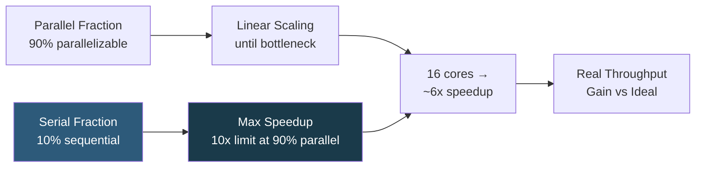

**Category:** CPU Architecture & Performance
**Difficulty:** Beginner
**Reading time:** 5 min read

---

Single-threaded performance measures how fast a CPU executes sequential code, while multi-threaded performance measures aggregate throughput across all cores. The right balance depends entirely on workload parallelism — Amdahl's Law quantifies the fundamental limits of parallelization.

- **Single-threaded performance** — determined by IPC (instructions per clock) × clock frequency; critical for latency-sensitive paths
- **Multi-threaded throughput** — aggregate work per unit time across all cores; scales with core count for parallel workloads
- **Amdahl's Law** — maximum speedup = 1 / (S + (1-S)/N) where S is the serial fraction and N is core count
- **Gustafson's Law** — as problem size grows, the parallel fraction dominates; more optimistic than Amdahl for HPC
- **Thread-level parallelism (TLP)** — exploiting multiple concurrent threads; requires application or runtime multi-threading
- **ILP (Instruction-Level Parallelism)** — exploiting parallelism within a single thread via out-of-order execution
- **Scalability ceiling** — point where adding more cores yields no throughput improvement due to serial bottlenecks

Single-threaded execution speed is determined by two factors: clock frequency (GHz) and IPC. IPC improvements come from deeper out-of-order execution windows, better branch predictors, wider instruction issue ports, and architectural improvements like larger ROB (Reorder Buffer). Intel's Core i9 and AMD Ryzen achieve 5.0+ GHz with high IPC; server Xeon and EPYC trade per-core frequency for more cores and ECC at lower frequencies (~2.5–4.0 GHz).

For a webserver handling 100 concurrent requests, each request's path is largely independent — processing is embarrassingly parallel. Adding 4× cores provides near 4× throughput until shared bottlenecks emerge (database connection pool, kernel network stack locks, shared caches). However, a single SQL query's execution plan often has serialized steps; adding cores does not speed up a single query below its sequential latency floor.

Thread synchronization overheads limit scaling: mutex lock/unlock costs ~50 ns; CAS (Compare-And-Swap) costs ~10 ns on uncontested paths; contended locks can serialize entire code paths. Designing for lock-free data structures (using atomic operations) or lock-per-shard approaches allows multi-threaded code to approach theoretical core-count scaling.

JVM and Python GIL-based runtimes add additional serialization above the hardware level. Python's GIL prevents true multi-core CPU parallelism within a single interpreter process; CPU-bound Python benefits from multiprocessing (separate processes) rather than threading.

- Web API servers: multi-threaded throughput dominates; use many vCPUs for concurrent requests
- Database query optimization: focus on single-thread IPC for per-query latency reduction
- Python CPU-bound code: use multiprocessing.Pool to bypass GIL and achieve multi-core parallelism
- Node.js: single-threaded event loop; add instances or worker_threads for CPU tasks
- Compiler benchmarking: SPECrate2017_int tests multi-threaded compilation; SPECspeed tests single-threaded

| Advantage | Disadvantage |
|-----------|--------------|
| High single-thread performance reduces tail latency for all request types | Single-thread performance improvements require newer CPU generation or higher-binned SKU |
| Multi-threaded throughput scales predictably for parallel workloads | Amdahl's Law caps gains; serial bottlenecks eliminate benefit of additional cores |
| Thread parallelism allows horizontal scaling within a single server | Thread synchronization overhead can negate gains for fine-grained parallel code |
| Modern out-of-order CPUs extract ILP automatically from sequential code | Lock contention and false sharing can cause multi-threaded code to underperform single-threaded |

- [CPU Core Count vs Clock Speed Tradeoffs](cpu-core-count-vs-clock-speed-tradeoffs.md)
- [CPU Benchmarking Methodologies](cpu-benchmarking-methodologies.md)
- [Hyper-Threading and SMT Technology](hyper-threading-and-smt-technology.md)

---
*Part of the [CPU Architecture & Performance](index.md) category · [Back to Master Index](../../index.md)*
