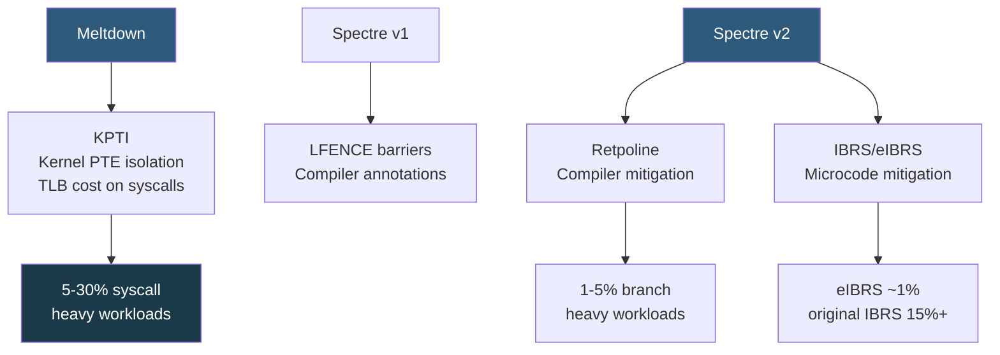

**Category:** CPU Architecture & Performance
**Difficulty:** Advanced
**Reading time:** 7 min read

---

Spectre and Meltdown are classes of hardware vulnerabilities exploiting speculative execution to leak secrets across privilege boundaries. The software and microcode mitigations have measurable performance costs — ranging from 1% to over 30% depending on workload — making them critical considerations for production infrastructure planning.

- **Speculative execution** — CPU executes instructions beyond branches before knowing if they are needed, for performance; the root enabler of both vulnerabilities
- **Meltdown (CVE-2017-5754)** — allows user-space code to read kernel memory via speculative execution and cache side channels; mitigated by KPTI
- **Spectre v1 (CVE-2017-5753)** — bounds-check bypass; exploits speculative execution past bounds checks within same privilege level
- **Spectre v2 (CVE-2017-5715)** — branch target injection; attacks indirect branch predictor to redirect speculative execution
- **KPTI (Kernel Page Table Isolation)** — Meltdown mitigation unmapping kernel memory from user-space page tables; adds TLB flush cost on syscalls
- **IBRS/eIBRS** — Indirect Branch Restricted Speculation; microcode mitigation for Spectre v2; eIBRS (Enhanced) has lower overhead
- **Retpoline** — compiler-generated software mitigation replacing indirect branches with a return-based trampoline, avoiding branch predictor

Meltdown exploits the window between speculative execution reading kernel memory and the permission check raising a fault. In that window, cache state is modified based on the secret data. A user-space flush+reload attack measures cache timing to reconstruct the secret byte. KPTI breaks this by maintaining separate page tables for user and kernel mode — kernel mappings are absent from user-space page tables entirely. The cost: every syscall must switch CR3 (page table base) and flush TLBs, adding ~200–400 ns per syscall on pre-PCID CPUs. Modern CPUs with PCID (Process Context Identifiers) tag TLB entries, allowing selective flushing that reduces KPTI overhead to ~10–20 ns.

Spectre v2 manipulates the Branch Target Buffer (BTB) to poison indirect branch predictions, redirecting speculative execution to attacker-controlled gadgets. Retpoline replaces indirect branches with a call/return sequence; the return's RSB (Return Stack Buffer) entry points to a safe speculation trap (an infinite LFENCE loop), preventing useful speculative execution. eIBRS (available on Ice Lake+) keeps branch predictions isolated between privilege levels in hardware, making retpoline optional on supported CPUs.

Real-world overhead measurements from Google (2018): KPTI cost 5% on database servers, 1% on compute-heavy CPU bound workloads, up to 30% on syscall-intensive I/O workloads. 2024 measurements on modern CPUs with PCID and eIBRS show typical overheads of 1–5% for mixed workloads.

- Benchmark calibration: establish pre/post-mitigation performance baselines for capacity planning
- Cloud provider instance comparisons: newer instance generations use eIBRS+PCID, significantly reducing overhead
- SMT disable decisions: some CVEs (MDS, TAA) require SMT disable for full mitigation, accepting significant throughput loss
- Kernel mitigation flags: `mitigations=off` boot parameter (for isolated air-gapped test environments only)
- Audit trail: `cat /sys/devices/system/cpu/vulnerabilities/*` shows current mitigation status per CVE

| Advantage | Disadvantage |
|-----------|--------------|
| Full mitigation closes real attack vectors exploited in the wild | KPTI adds measurable overhead for syscall-heavy workloads |
| eIBRS on modern CPUs nearly eliminates Spectre v2 mitigation cost | MDS/TAA full mitigation requires SMT disable, losing 20–30% throughput |
| Retpoline is a compile-time change with minimal runtime overhead | `mitigations=off` is only safe in fully isolated environments |
| Modern CPUs designed post-Spectre/Meltdown have hardware mitigations | Spectre v1 requires manual annotation in kernel code; ongoing maintenance burden |

- [CPU Microcode Updates and Security Patches](cpu-microcode-updates-and-security-patches.md)
- [CPU Security Features](cpu-security-features-sgx-sev.md)
- [Hyper-Threading and SMT Technology](hyper-threading-and-smt-technology.md)

---
*Part of the [CPU Architecture & Performance](index.md) category · [Back to Master Index](../../index.md)*
