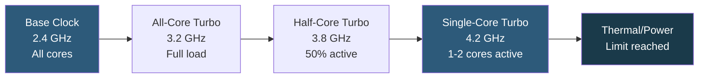

**Category:** CPU Architecture & Performance
**Difficulty:** Intermediate
**Reading time:** 5 min read

---

Intel Turbo Boost and AMD Precision Boost are automatic frequency scaling technologies that opportunistically raise CPU clock speeds above rated base frequency when power and thermal headroom allows, providing burst performance without manual overclocking.

- **Base clock** — sustained frequency the CPU guarantees can run indefinitely within TDP
- **Turbo Boost / Precision Boost** — dynamic frequency increase when cores are below TDP ceiling
- **All-core turbo** — boost frequency when all cores are active simultaneously; always lower than single-core boost
- **Single-core turbo** — maximum boost frequency achievable on one core when others are idle
- **Power Limit (PL1/PL2)** — Intel's sustained and burst power limits; PL2 allows brief high-power bursts
- **cTDP (configurable TDP)** — BIOS-adjustable TDP range enabling performance or efficiency tuning
- **Boost override** — Intel XMP/AMD Precision Boost Overdrive for manual boost headroom expansion

Both Intel and AMD implement boost through per-core power sensors and thermal monitors that feed a microcontroller (Intel's PCU, AMD's SMU) running a real-time algorithm. Every millisecond, the controller checks current power draw, temperature, and the number of active cores, then calculates the maximum allowable frequency for each core without exceeding configured limits.

Intel Turbo Boost 3.0 identifies the two fastest cores (highest guardbanded frequency) and prioritizes workloads there via Intel Speed Select Technology. Intel Thread Director (12th gen+) extends this by communicating application thread priority hints from the OS scheduler to the microcontroller.

AMD Precision Boost 2 uses a curve-based algorithm: frequency scales continuously as a function of thermal headroom (temperature delta to Tmax), electrical headroom (current draw vs VRM limits), and die-level power. Rather than discrete frequency steps, PB2 can increment in 25 MHz steps every millisecond, providing smoother response than Intel's more discrete tables.

In server environments, BIOS settings control PL1 (sustained power limit, equals TDP by default) and PL2 (burst power, 1.25–1.5× TDP for short durations). Cloud providers often set PL1 = PL2 = TDP to eliminate frequency variance and ensure predictable performance for SLA purposes. On-premises operators can raise PL2 to allow longer-duration boost if cooling permits.

- Bursty web API workloads that benefit from single-core boost during request spikes
- Database systems where query compilation and planning are single-threaded
- Development workstations where compilation bursts benefit from turbo
- Gaming servers requiring consistent single-thread responsiveness
- Monitoring turbo state to detect thermal throttling in production

| Advantage | Disadvantage |
|-----------|--------------|
| Free performance gain without manual tuning | Boost frequencies are not guaranteed; vary with thermal/power state |
| Single-core boost significantly exceeds base for latency work | All-core boost is much lower than peak single-core; bulk workloads see base closer |
| No end-user action required; automatic and transparent | Burst power draw during PL2 window creates unpredictable rack power budgeting |
| AMD PB2 fine-grained steps reduce frequency hunting | Sustained AVX-512 workloads may reduce boost frequency for neighboring cores |

- [CPU Thermal Design Power Management](cpu-thermal-design-power-tdp-management.md)
- [CPU Governor Settings for Different Workloads](cpu-governor-settings-for-different-workloads.md)
- [CPU Throttling Detection and Prevention](cpu-throttling-detection-and-prevention.md)

---
*Part of the [CPU Architecture & Performance](index.md) category · [Back to Master Index](../../index.md)*
