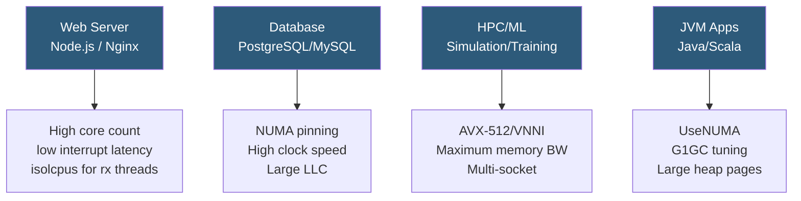

**Category:** CPU Architecture & Performance
**Difficulty:** Advanced
**Reading time:** 7 min read

---

Different application types have radically different CPU optimization profiles. Databases benefit from cache locality and NUMA pinning; web servers need high concurrency and low interrupt latency; HPC codes require SIMD vectorization and memory bandwidth. Understanding workload characteristics enables targeted optimization.

- **Working set size** — amount of data actively accessed; must fit in LLC for cache-resident performance
- **OLTP (Online Transaction Processing)** — many short, high-frequency transactions; latency-sensitive, benefits from high clock speed
- **OLAP (Online Analytical Processing)** — large aggregation queries; benefits from SIMD and memory bandwidth
- **Memory-bound vs compute-bound** — whether IPC is limited by memory latency or execution unit throughput
- **Roofline model** — theoretical performance ceiling as a function of arithmetic intensity (FLOPS/byte)
- **JIT compilation** — Just-In-Time compilers (JVM, V8) produce optimized native code that benefits from CPU feedback
- **NUMA-aware allocation** — directing memory allocation to the NUMA node local to the running CPU

Web servers (Nginx, Node.js, Go HTTP) are I/O multiplexing workloads: the CPU primarily handles network syscalls, TLS operations, and brief compute bursts per request. Optimization focuses on reducing interrupt latency (pin RX queues to isolated cores with `ethtool -N` RSS + irqbalance), enabling TCP BBR congestion control, and sizing worker thread pools to avoid context switch overhead. `SO_REUSEPORT` distributes accept() across worker processes without lock contention.

Relational databases have split personalities: OLTP (index lookups, row locking) benefits enormously from fast single-core clock speed and large LLC for hot index pages. OLAP (table scans, aggregations) is memory-bandwidth bound and benefits from SIMD-accelerated column scan routines in PostgreSQL's vectorized execution or ClickHouse's native columnar engine. Pin the database process to one NUMA node with `numactl --cpunodebind=0 --membind=0` to keep buffer pool reads local.

JVM applications benefit from `-XX:+UseNUMA` (HotSpot allocates Eden regions per NUMA node) and `-XX:+UseTransparentHugePages` (2 MB huge pages reduce TLB pressure). For garbage-collection-intensive apps, CPU affinity should include enough cores for GC threads (typically 25% of total) without starving application threads.

For ML inference workloads on CPU (ONNX Runtime, TensorFlow CPU), set `OMP_NUM_THREADS` and `MKL_NUM_THREADS` to physical core count (not logical), use `numactl` to bind to a single socket, and enable AVX-512/VNNI via `-march=native` compilation or verified library dispatch.

- PostgreSQL OLTP: pin to single NUMA node, set `shared_buffers` to 40% of local socket RAM
- Nginx: use `worker_cpu_affinity auto`, isolate cores from OS via isolcpus
- JVM microservices: `-XX:+UseNUMA -XX:+UseG1GC -XX:MaxGCPauseMillis=50`
- HPC MPI jobs: rank pinning with `--map-by core --bind-to core` in OpenMPI
- ML inference: ORT with VNNI execution provider, threadpool = physical cores per socket

| Advantage | Disadvantage |
|-----------|--------------|
| Workload-specific tuning yields 20–50% improvements with zero hardware cost | Requires deep workload profiling; wrong settings can harm performance |
| NUMA pinning benefits are large and immediate for memory-intensive workloads | Pinning reduces scheduling flexibility; hot-standby failover may land on wrong NUMA node |
| SIMD and JIT optimization can approach hardware theoretical limits | JIT startup warmup time means short-lived processes never reach optimized state |
| Per-workload governor settings balance efficiency and performance precisely | Multiple tuning knobs interact; changing one can invalidate another optimization |

- [CPU Benchmarking Methodologies](cpu-benchmarking-methodologies.md)
- [NUMA Optimization](numa-non-uniform-memory-access-optimization.md)
- [CPU Instruction Sets AVX AVX-512](cpu-instruction-sets-avx-avx-512.md)

---
*Part of the [CPU Architecture & Performance](index.md) category · [Back to Master Index](../../index.md)*
