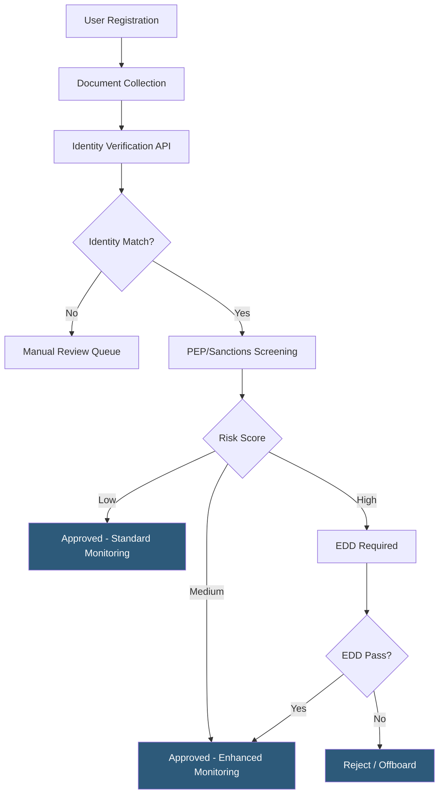

**Category:** Cryptocurrency & Web3 Payments
**Difficulty:** Advanced
**Reading time:** 6 min read

---

Anti-money laundering (AML) and Know Your Customer (KYC) procedures are mandatory identity and risk management controls that crypto payment operators must implement to prevent financial crime. They form the operational backbone of compliance programs, combining automated identity verification with ongoing transaction monitoring to satisfy regulatory requirements across jurisdictions.

- **KYC (Know Your Customer)** — process of verifying customer identity through document checks, biometrics, and database lookups before onboarding
- **AML (Anti-Money Laundering)** — set of laws, regulations, and procedures to detect and prevent conversion of illicit funds into legitimate assets
- **CDD (Customer Due Diligence)** — baseline risk assessment including identity verification and understanding of business relationship
- **EDD (Enhanced Due Diligence)** — deeper investigation required for high-risk customers, PEPs, or large transactions
- **PEP (Politically Exposed Person)** — individual holding or having held prominent public position; requires elevated scrutiny
- **Blockchain analytics** — on-chain data analysis tools (Chainalysis, Elliptic) that score wallet addresses for illicit associations
- **Risk scoring** — automated model assigning risk levels to customers based on geography, transaction patterns, and wallet history
- **Liveness detection** — biometric technique confirming a real person is present during identity verification to prevent spoofing

KYC and AML in crypto payment systems operate as a layered pipeline. During onboarding, users submit government-issued ID and a selfie. Identity verification providers like Jumio, Onfido, or Stripe Identity use OCR to extract document data, cross-reference it against authoritative databases, and apply liveness detection to confirm the person is physically present. This automated step typically completes in under 30 seconds.

Once identity is verified, the customer undergoes sanctions and PEP screening using databases like OFAC SDN, UN Consolidated List, and commercial PEP registries. High-risk customers—those in high-risk jurisdictions (FATF grey/black lists), operating in cash-intensive businesses, or flagged as PEPs—require Enhanced Due Diligence, which may include source-of-funds documentation and senior management approval.

After onboarding, ongoing transaction monitoring applies behavioral analytics to detect anomalies: sudden spikes in volume, structuring patterns (breaking large amounts into smaller transactions to avoid thresholds), or payments to flagged wallet addresses. Blockchain analytics platforms score each counterparty wallet, tracing funds through multiple hops. Risk rules trigger automatic holds or SAR filings when thresholds are breached.

Customer records must be refreshed periodically—typically annually for standard customers, quarterly for high-risk—to capture changes in risk profile. The entire lifecycle is audit-logged for regulatory examination.

- Crypto exchanges onboarding retail customers for fiat-to-crypto conversion
- Payment processors integrating KYC APIs into hosted checkout flows
- NFT marketplaces verifying high-value buyers above AML thresholds
- DeFi front-ends implementing sanctions screening at the UI layer
- Corporate treasury teams conducting due diligence on crypto custodians

| Advantage | Disadvantage |
|-----------|--------------|
| Satisfies regulatory requirements and prevents license revocation | Adds friction to user onboarding, increasing drop-off rates |
| Protects business from being used for money laundering | Identity verification APIs add per-verification costs ($0.50–$3+) |
| Enables correspondent banking relationships | Biometric data collection raises privacy concerns and GDPR obligations |
| Automated monitoring scales to millions of transactions | High false-positive rates in blockchain analytics waste analyst time |

- [Crypto Payment Compliance](crypto-payment-compliance.md)
- [Crypto Tax Reporting](crypto-tax-reporting.md)
- [Blockchain Payment Auditing](blockchain-payment-auditing.md)

---
*Part of the [Cryptocurrency & Web3 Payments](index.md) category · [Back to Master Index](../../index.md)*
