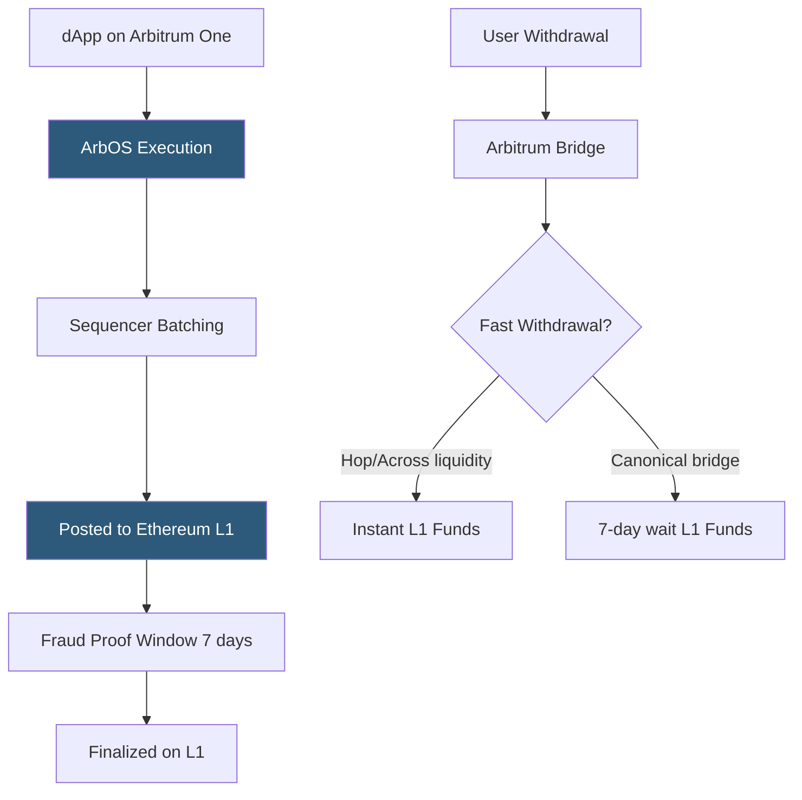

**Category:** Cryptocurrency & Web3 Payments
**Difficulty:** Advanced
**Reading time:** 6 min read

---

Arbitrum is an optimistic rollup network on Ethereum offering Ethereum-level security with 95%+ lower transaction fees and 250ms block times. Its large DeFi TVL, native USDC, and full EVM compatibility make it a leading L2 for payment integrations requiring both cost efficiency and Ethereum security guarantees.

- **Arbitrum One** — the main Arbitrum network; an optimistic rollup secured by Ethereum
- **Arbitrum Nova** — separate chain for gaming/social using AnyTrust for lower fees; less decentralized
- **ArbOS** — Arbitrum's custom EVM-compatible execution environment running on validator nodes
- **Nitro** — Arbitrum's second-gen stack with WASM-based fraud proofs; powers Arbitrum One today
- **7-day challenge window** — withdrawal delay from Arbitrum One to Ethereum mainnet
- **Native USDC on Arbitrum** — Circle-issued USDC (`0xaf88d...`) vs bridged USDC.e (`0xff970...`)
- **Arbitrum Orbit** — Arbitrum's framework for launching custom L3 chains on top of Arbitrum

Arbitrum One uses optimistic execution: transactions are processed by the sequencer without generating proofs. The sequencer batches transactions and posts compressed calldata to Ethereum. Fraud proofs (interactive, using WASM) allow challengers to dispute invalid state transitions within 7 days. If no valid fraud proof is submitted in this window, the batch is considered final.

Payment integration on Arbitrum is identical in code to Ethereum: same Solidity contracts, same ethers.js/viem integration, same MetaMask connection — only the chain ID changes (42161 for Arbitrum One). RPC providers (Alchemy, Infura, QuickNode) provide Arbitrum endpoints. Transaction fees are priced in ETH and typically cost $0.01–0.10 for token transfers depending on L1 data costs.

For payment workflows, Arbitrum's 250ms block time provides excellent UX. The primary complexity arises with withdrawals: native Arbitrum bridge withdrawals take 7 days to land on Ethereum mainnet. Third-party bridges (Hop Protocol, Across, Stargate) provide fast withdrawal liquidity (seconds to minutes) for a bridge fee (typically 0.05–0.5%). These are suitable for operational settlement but introduce bridge smart contract risk.

Native USDC on Arbitrum (the Circle-issued `0xaf88d` contract) is preferable to bridged USDC.e (`0xff970`) which is Ethereum USDC locked in the bridge contract. Major DeFi protocols on Arbitrum (Uniswap v3, Aave v3, GMX) offer deep liquidity for USDC, enabling sophisticated settlement and yield strategies within Arbitrum before bridging to mainnet.

Arbitrum Orbit enables application-specific chains (AppChains) using Arbitrum's stack, allowing payment-focused chains with custom gas tokens and fee structures.

- High-volume DEX payment routing with deep DeFi liquidity on Arbitrum
- DeFi protocol payment automation leveraging Aave/Uniswap composability
- NFT marketplace payments with sub-$0.10 fees
- Gaming economies using Arbitrum Nova for ultra-low-cost in-game transactions
- Enterprise payment networks requiring Ethereum security at lower cost

| Advantage | Disadvantage |
|-----------|--------------|
| Ethereum security via fraud proofs | 7-day canonical withdrawal delay |
| Full EVM compatibility — no code changes | Sequencer is currently centralized (single point) |
| $0.01–0.10 per transaction vs Ethereum $1–50 | Fast bridge liquidity providers charge fees |
| Large DeFi ecosystem for composable payments | Bridge smart contract risk for third-party fast bridges |
| Native USDC available from Circle | Transaction ordering under sequencer control (MEV possible) |

- [Layer 2 Scaling for Payments](layer-2-scaling-for-payments.md)
- [Optimism Payment Layer](optimism-payment-layer.md)
- [Gas Fee Management](gas-fee-management.md)

---
*Part of the [Cryptocurrency & Web3 Payments](index.md) category · [Back to Master Index](../../index.md)*
