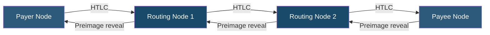

**Category:** Cryptocurrency & Web3 Payments
**Difficulty:** Advanced
**Reading time:** 7 min read

---

The Lightning Network is a Layer 2 payment protocol built on Bitcoin that enables near-instant, near-zero-fee payments by routing transactions through a network of off-chain payment channels. It solves Bitcoin's throughput limitations for micropayments and high-frequency commerce use cases.

- **Payment channel** — bidirectional off-chain channel opened by locking BTC in an on-chain multisig; closes by broadcasting the final balance
- **HTLC (Hash Time-Locked Contract)** — cryptographic mechanism enabling trustless multi-hop payment routing
- **Invoice (BOLT-11)** — payment request string encoding amount, destination, and expiry; scanned as QR code
- **Routing node** — Lightning node that forwards payments for a fee, providing network liquidity
- **Inbound liquidity** — capacity to receive Lightning payments; must be provisioned by opening channels from remote nodes
- **LND / Core Lightning** — the two dominant Lightning node implementations
- **LNURL** — protocol extensions enabling reusable payment links, login, and withdraw flows

Lightning channels are opened by two parties publishing a 2-of-2 multisig funding transaction on the Bitcoin blockchain. Both parties can send and receive within the channel's capacity without further on-chain activity. Channel state is updated by exchanging signed commitment transactions, with each update invalidating the prior state via revocation keys.

Payments routed across multiple hops use HTLCs: each hop locks funds contingent on the recipient revealing a preimage (secret) corresponding to a hash in the invoice. When the final recipient reveals the preimage, the secret propagates back along the route, atomically unlocking funds at each hop. This ensures either the entire payment succeeds or all locked funds are returned — no partial failures.

Pathfinding is handled by the sending node, which queries its local view of the network graph to identify routes with sufficient liquidity and acceptable fees. Modern implementations use probabilistic pathfinding with liquidity probing to improve success rates. Fee structure consists of a base fee per payment and a proportional fee rate.

For merchants, accepting Lightning requires running a Lightning node (LND, Core Lightning, or Eclair) with adequately funded inbound channels. Services like Lightning Loop, Pool, and Amboss facilitate liquidity acquisition. Hosted Lightning solutions (Voltage, Alby, Breez) reduce operational burden. BOLT-12 "offers" (a newer standard) provide reusable static payment codes without per-invoice generation.

- Micropayment-intensive platforms (tipping, pay-per-article, streaming sats)
- High-frequency retail transactions where on-chain fees are prohibitive
- Exchanges and wallets enabling instant BTC transfers between users
- Gaming and in-app purchases requiring sub-second settlement
- Machine-to-machine (M2M) payment streams in IoT applications

| Advantage | Disadvantage |
|-----------|--------------|
| Near-instant settlement (< 1 second) | Channel management and liquidity complexity |
| Fees measured in satoshis (fractions of a cent) | Requires maintaining online Lightning node |
| Scales Bitcoin to millions of TPS theoretically | Payment routing can fail without adequate liquidity |
| Off-chain enhances privacy vs. on-chain | Channels must be closed on-chain if disputes arise |
| Enables Bitcoin micropayments under $0.01 | Maximum payment size limited by channel capacity |

- [BTCPay Server Self-Hosted](btcpay-server-self-hosted.md)
- [On-Chain vs Off-Chain Payments](on-chain-vs-off-chain-payments.md)
- [Layer 2 Scaling for Payments](layer-2-scaling-for-payments.md)

---
*Part of the [Cryptocurrency & Web3 Payments](index.md) category · [Back to Master Index](../../index.md)*
