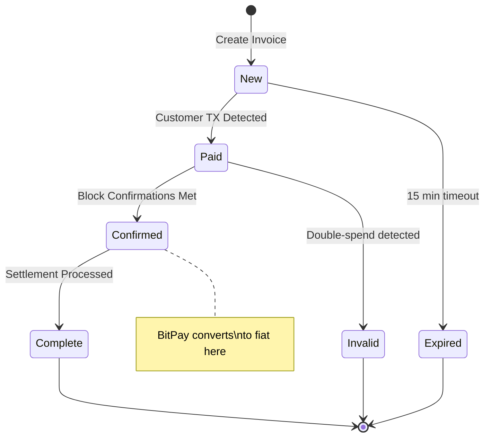

**Category:** Cryptocurrency & Web3 Payments
**Difficulty:** Intermediate
**Reading time:** 6 min read

---

BitPay is one of the oldest crypto payment processors, providing merchant tools to accept Bitcoin, Ethereum, and other major cryptocurrencies with optional instant fiat conversion to eliminate price volatility risk. It serves both e-commerce and in-person payment scenarios with POS integrations.

- **Invoice** — BitPay's core payment object; expires after 15 minutes and locks in the exchange rate
- **Instant settlement** — BitPay converts crypto to fiat and deposits to merchant bank, removing volatility exposure
- **BitPay Checkout** — hosted payment page rendered in an iframe or redirect flow
- **IPN (Instant Payment Notification)** — server-to-server callback on payment status changes
- **Refund address** — customer-provided wallet address for returning funds if an order is cancelled
- **Speed policy** — merchant-configurable setting for how many confirmations to wait before marking paid
- **Bitcore** — open-source Bitcoin infrastructure library developed by BitPay

A merchant's server calls the BitPay API to create an invoice specifying the fiat price (e.g., $49.99 USD). BitPay calculates the equivalent crypto amount using its live rate feed and returns an invoice URL valid for 15 minutes. The customer visits the hosted checkout, chooses their payment coin, and sends the exact amount.

BitPay monitors the blockchain for the incoming transaction. When it detects payment, the invoice moves to "Paid" state and an IPN fires. Once the configured confirmation threshold is reached (configurable as "high," "medium," or "low" speed), the invoice becomes "Confirmed." BitPay then executes the merchant's settlement preference: either converting to fiat and sweeping to a connected bank account, or crediting the merchant's BitPay wallet in crypto.

Merchants can integrate via direct API, official plugins (WooCommerce, Magento, OpenCart, Shopify), or a simple payment button. For in-person retail, BitPay offers a point-of-sale app that generates QR-coded invoices. The platform handles all compliance obligations for crypto-to-fiat conversion, provides transaction records for accounting, and issues 1099-K forms for US merchants exceeding IRS thresholds.

- Retail and e-commerce merchants wanting crypto acceptance with zero volatility risk
- Travel and hospitality booking platforms serving crypto-wealthy demographics
- B2B invoicing for international payments avoiding SWIFT fees
- Point-of-sale crypto acceptance in physical stores
- Nonprofits accepting large crypto donations with immediate fiat conversion

| Advantage | Disadvantage |
|-----------|--------------|
| Instant fiat settlement eliminates volatility | Custodial; merchant trusts BitPay with funds |
| 15-minute rate lock gives price certainty | 1% processing fee on transactions |
| POS app available for in-person retail | Limited coin support vs. newer processors |
| Strong compliance and reporting tooling | Requires KYC/business verification |
| Long-standing platform with enterprise clients | Invoice expiry creates UX friction |

- [Coinbase Commerce Integration](coinbase-commerce-integration.md)
- [Crypto-to-Fiat Conversion](crypto-to-fiat-conversion.md)
- [Cryptocurrency Price Volatility Handling](cryptocurrency-price-volatility-handling.md)

---
*Part of the [Cryptocurrency & Web3 Payments](index.md) category · [Back to Master Index](../../index.md)*
