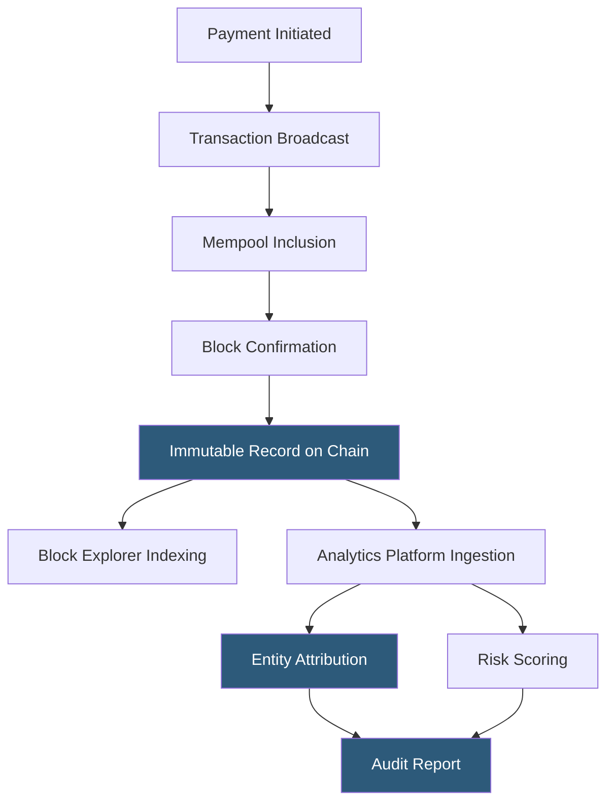

**Category:** Cryptocurrency & Web3 Payments
**Difficulty:** Advanced
**Reading time:** 6 min read

---

Blockchain payment auditing is the process of verifying, tracing, and documenting cryptocurrency transactions for compliance, financial reporting, and fraud investigation purposes. Unlike traditional auditing, blockchain's immutable public ledger enables any party to independently verify transaction history, while also requiring specialized tools to interpret raw on-chain data into meaningful business records.

- **Block explorer** — public tool (Etherscan, Blockchain.com, Solscan) for browsing transactions, blocks, and addresses on a specific blockchain
- **Transaction hash (TXID)** — unique cryptographic identifier for each blockchain transaction, serving as the immutable audit receipt
- **Address clustering** — heuristic technique linking multiple wallet addresses to a single entity based on co-spending patterns
- **Blockchain analytics** — specialized platforms (Chainalysis, Elliptic, TRM Labs) providing entity attribution, risk scoring, and investigation tools
- **Merkle proof** — cryptographic proof that a specific transaction is included in a block, enabling lightweight verification
- **Smart contract audit** — code review verifying that payment smart contracts behave as intended without exploitable vulnerabilities
- **On-chain forensics** — investigative analysis tracing fund flows across hops and mixers to identify illicit activity origin
- **Proof of reserves** — cryptographic attestation by custodians that they hold assets backing user balances

Blockchain payment auditing leverages the protocol-level immutability of distributed ledgers. Every transaction is permanently recorded in a block with a cryptographic hash linking it to previous blocks, making retroactive alteration computationally infeasible. Auditors query this public record through block explorer APIs or full node RPC interfaces.

For financial statement audits, auditors obtain the merchant's wallet addresses and independently retrieve transaction history via blockchain APIs to reconcile against internal books. Each TXID serves as an immutable receipt: it proves amount, sender address, recipient address, timestamp, and network fees. Smart contract payment flows are more complex—auditors must trace token transfer events through ERC-20 logs rather than native ETH transfers.

Compliance audits use blockchain analytics platforms to go beyond raw data. Tools like Chainalysis Reactor visualize fund flows as graphs, automatically attributing wallet addresses to known entities (exchanges, mixers, darknet markets). This enables auditors to assess whether payment flows pass through high-risk intermediaries, satisfying AML audit requirements.

For smart contract payment systems, auditors commission formal security audits from firms like OpenZeppelin, Trail of Bits, or Certik. These reviews check for reentrancy vulnerabilities, integer overflow issues, access control flaws, and business logic errors that could allow unauthorized fund extraction.

Proof-of-reserves audits—increasingly required of custodians post-FTX—use Merkle tree constructions to allow any user to verify their balance is included in the custodian's total holdings without revealing other users' balances. Third-party auditors (Armanino, Mazars) attest to the on-chain evidence.

- Financial auditors reconciling crypto revenue for annual financial statement audits
- Compliance teams investigating suspicious transaction patterns for SAR filings
- Merchants verifying payment receipt before fulfilling orders without waiting for confirmations
- Investigators tracing stolen funds through mixing services and exchange withdrawals
- Custodians issuing proof-of-reserves attestations to restore customer trust

| Advantage | Disadvantage |
|-----------|--------------|
| Immutable ledger provides tamper-proof audit trail | Pseudonymous addresses require analytics tools for entity attribution |
| Public blockchains allow independent third-party verification | Privacy coins (Monero, Zcash shielded) significantly impede tracing |
| Transaction hashes serve as universally verifiable receipts | High transaction volumes on Layer 2s create complex cross-chain audit paths |
| Blockchain analytics automates large-scale investigation | Analytics platforms are expensive ($50K–$200K+/year for enterprise licenses) |

- [Crypto Payment Compliance](crypto-payment-compliance.md)
- [AML/KYC for Crypto Payments](aml-kyc-for-crypto-payments.md)
- [On-Chain vs Off-Chain Payments](on-chain-vs-off-chain-payments.md)

---
*Part of the [Cryptocurrency & Web3 Payments](index.md) category · [Back to Master Index](../../index.md)*
