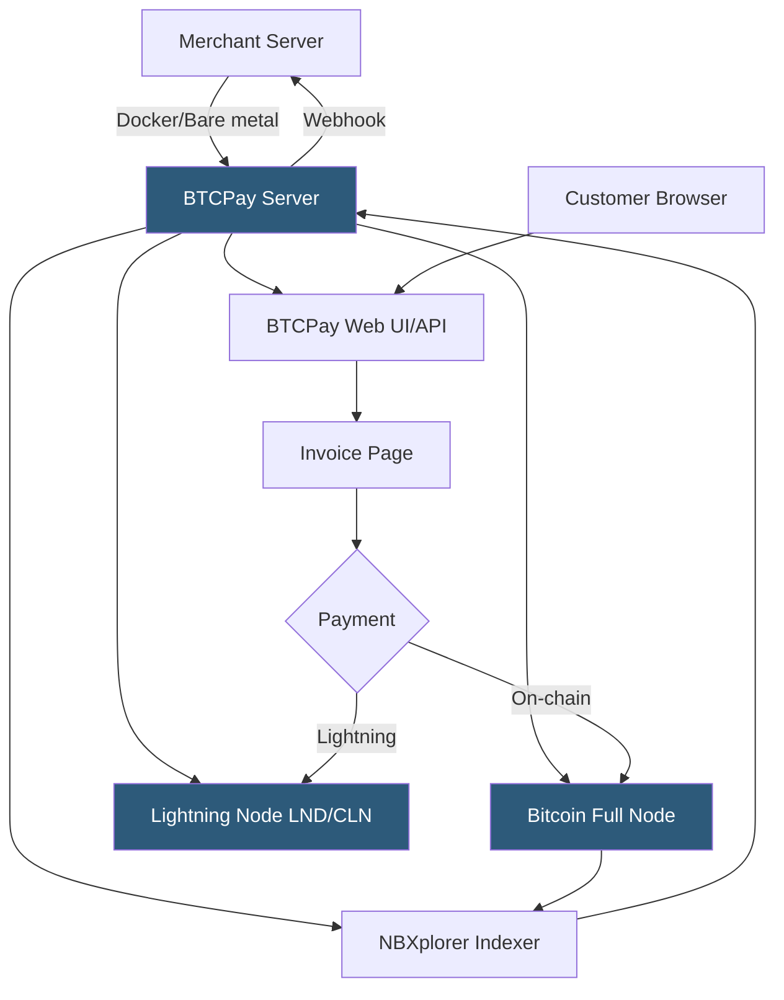

**Category:** Cryptocurrency & Web3 Payments
**Difficulty:** Advanced
**Reading time:** 7 min read

---

BTCPay Server is a free, open-source, self-hosted cryptocurrency payment processor that gives merchants complete sovereignty over their payment infrastructure — no third-party fees, no KYC requirements, and no counterparty risk. It supports Bitcoin (including Lightning Network), Monero, Litecoin, and dozens of altcoins through plugins.

- **Full node** — BTCPay runs its own Bitcoin node to independently verify transactions without trusting external services
- **NBXplorer** — BTCPay's lightweight transaction indexer that watches wallet addresses without a full block explorer dependency
- **Lightning Network** — BTCPay natively integrates LND, Core Lightning, and Eclair for instant payments
- **Store** — BTCPay's multi-tenant unit; one instance can host multiple independent merchant stores
- **Invoice** — payment request with expiry, amount, and accepted coin list
- **Payjoin (P2EP)** — privacy-enhancing payment protocol supported by BTCPay
- **Greenfield API** — BTCPay's modern REST API replacing the legacy BitPay-compatible API

BTCPay Server is deployed via Docker Compose (the recommended method), which orchestrates the Bitcoin full node, NBXplorer, the BTCPay application, and optionally a Lightning node into a coordinated stack. The full node syncs the entire Bitcoin blockchain (approximately 600GB as of 2025), which takes 1–3 days initially but provides independent, trustless transaction verification.

NBXplorer sits between the full node and BTCPay, scanning blocks for transactions to watched addresses using gap-limit HD wallet derivation. This is significantly lighter than running a block explorer. When a payment arrives, NBXplorer fires an internal event that BTCPay picks up, updates the invoice state, and fires webhooks to the merchant's application.

For Lightning payments, BTCPay manages channel liquidity, peer connections, and invoice generation internally. Incoming Lightning payments settle instantly with no on-chain confirmation wait. BTCPay supports Autopilot for automated channel management and integrates with Lightning Loop for submarine swaps to manage inbound/outbound liquidity.

The Greenfield REST API enables full programmatic control: creating stores, invoices, pulling reports, and managing webhooks. Existing BitPay integrations can use the compatibility API layer. Plugins extend BTCPay to support Shopify, WooCommerce, Magento, and dozens of other platforms. Multi-tenant hosting allows a single BTCPay instance to serve as a payment processor for many merchants, making it viable for hosting providers to offer white-label payment processing.

- Bitcoin-native businesses wanting zero-fee, self-sovereign payment processing
- Privacy-focused merchants avoiding KYC requirements of custodial processors
- Hosting providers offering white-label crypto payment services
- Nonprofits and activists in high-risk jurisdictions needing censorship-resistant payments
- Developers building Lightning-native applications needing a full payment backend

| Advantage | Disadvantage |
|-----------|--------------|
| Zero processing fees | Significant infrastructure overhead (600GB+ storage) |
| Complete self-sovereignty and privacy | Requires DevOps expertise to deploy and maintain |
| No KYC or third-party dependency | Lightning liquidity management is complex |
| Lightning Network support built-in | Initial blockchain sync takes days |
| Active open-source community and plugins | No built-in fiat conversion or bank settlement |

- [Bitcoin Lightning Network Payments](bitcoin-lightning-network-payments.md)
- [On-Chain vs Off-Chain Payments](on-chain-vs-off-chain-payments.md)
- [Crypto Payment Compliance](crypto-payment-compliance.md)

---
*Part of the [Cryptocurrency & Web3 Payments](index.md) category · [Back to Master Index](../../index.md)*
