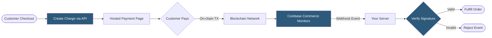

**Category:** Cryptocurrency & Web3 Payments
**Difficulty:** Intermediate
**Reading time:** 6 min read

---

Coinbase Commerce is a hosted crypto payment gateway that enables merchants to accept Bitcoin, Ethereum, Litecoin, and stablecoins without managing private keys or on-chain complexity. It abstracts wallet custody, transaction monitoring, and confirmation tracking behind a simple API and hosted checkout UI.

- **Charge** — a single payment request object with a fixed amount and expiration window
- **Checkout** — a reusable payment page linked to a product or donation flow
- **Webhook** — HTTP callback delivering real-time charge status events to your server
- **Confirmation threshold** — number of on-chain blocks before a payment is marked confirmed
- **Underpayment** — when a customer sends less than the required amount; Commerce flags but does not auto-resolve
- **Overpayment** — excess funds sent; merchant must manually refund on-chain
- **API key** — server-side credential used to create charges and verify webhook signatures

When a merchant creates a charge via the REST API, Coinbase Commerce generates a unique receiving address for each accepted cryptocurrency and returns a hosted checkout URL. The customer navigates to this URL, selects their preferred coin, and sends the exact amount to the generated address within the expiration window (typically 60 minutes).

Commerce continuously monitors the blockchain for incoming transactions to that address. When a transaction appears in the mempool, it fires a `charge:pending` webhook. Once the transaction reaches the merchant-configured confirmation threshold (e.g., 3 blocks for ETH), it fires `charge:confirmed`. Your server must validate each webhook's HMAC-SHA256 signature using your shared webhook secret before acting on it.

For e-commerce integrations, official plugins exist for WooCommerce, Shopify, and Magento. For custom stacks, the Commerce.js SDK wraps the REST API in JavaScript. Merchants never hold private keys — Coinbase custodies all funds and settles to the merchant's Coinbase account, from which fiat conversion or withdrawal can be triggered. This custodial model means merchants accept Coinbase's counterparty and compliance risk in exchange for operational simplicity.

- E-commerce stores adding crypto as an alternative payment method alongside Stripe/PayPal
- Digital content or SaaS platforms accepting global payments without banking restrictions
- Donation pages for nonprofits or open-source projects
- Event ticketing with crypto-native audiences
- Marketplaces with international sellers needing borderless settlement

| Advantage | Disadvantage |
|-----------|--------------|
| No private key management required | Custodial — Coinbase holds funds |
| Multi-coin support out of the box | Network confirmation delays (minutes to hours) |
| Official plugins for major platforms | Underpayments require manual resolution |
| Webhook-driven fulfillment is straightforward | Exchange rate volatility during payment window |
| No KYC required for merchants initially | Subject to Coinbase platform risk and terms |

- [BTCPay Server Self-Hosted](btcpay-server-self-hosted.md)
- [Crypto Payment Compliance](crypto-payment-compliance.md)
- [Cryptocurrency Price Volatility Handling](cryptocurrency-price-volatility-handling.md)

---
*Part of the [Cryptocurrency & Web3 Payments](index.md) category · [Back to Master Index](../../index.md)*
