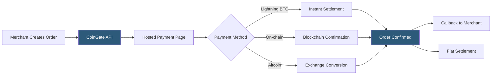

**Category:** Cryptocurrency & Web3 Payments
**Difficulty:** Beginner
**Reading time:** 5 min read

---

CoinGate is a European cryptocurrency payment gateway supporting 70+ cryptocurrencies with a focus on Lightning Network Bitcoin payments, fiat settlement, and an extensive plugin library for popular e-commerce platforms. It handles order management, exchange rate locking, and compliance obligations on the merchant's behalf.

- **Order** — CoinGate's payment object created per transaction with price lock
- **Lightning Network** — Bitcoin Layer 2 enabling near-instant, near-free BTC micropayments
- **Fiat settlement** — automatic conversion and bank transfer in EUR or USD
- **Price lock period** — window during which the quoted crypto amount is guaranteed
- **Callback URL** — endpoint CoinGate POSTs to on order status changes
- **Billing** — CoinGate's module for recurring/subscription crypto payments
- **Withdrawal** — transferring settled funds to bank or crypto wallet

CoinGate integration begins with API key generation in the merchant dashboard. Orders are created server-side by POSTing order details (price, currency, callback URL, success/cancel redirects) to the CoinGate API. The response includes a hosted payment URL where customers choose from 70+ coins.

CoinGate's distinctive feature is native Lightning Network support. When a customer selects BTC via Lightning, CoinGate generates a BOLT-11 invoice that compatible wallets (Phoenix, Muun, BlueWallet) can pay in seconds for a fraction of a cent in fees. This makes it practical for small-value transactions where on-chain fees would be prohibitive.

For altcoin payments, CoinGate converts received coins to the merchant's settlement currency using its internal exchange, eliminating volatility exposure. Settlement occurs daily to the merchant's bank account in EUR or USD, or weekly to a crypto wallet. The callback system delivers signed POST requests on status changes (paid, canceled, expired, refunded), and merchants should verify the token parameter against their API key to authenticate events.

Official plugins cover WooCommerce, PrestaShop, OpenCart, Magento 2, WHMCS, and others. The 1% flat fee applies to all transactions, with volume discounts available.

- Small to mid-size online retailers wanting broad coin acceptance
- Digital goods platforms benefiting from Lightning micropayments
- Hosting and SaaS providers serving crypto-paying customers
- Affiliate and content platforms enabling Lightning tipping
- Businesses in the EU requiring EUR bank settlement

| Advantage | Disadvantage |
|-----------|--------------|
| Native Lightning Network support | 1% fee on all transactions |
| 70+ coin support with altcoin conversion | Requires European business for best settlement terms |
| Extensive CMS plugin library | Less brand recognition in enterprise contexts |
| Daily fiat settlement available | Callback verification less robust than HMAC webhooks |
| Clean dashboard and reporting | Limited in-person/POS tooling |

- [Bitcoin Lightning Network Payments](bitcoin-lightning-network-payments.md)
- [BTCPay Server Self-Hosted](btcpay-server-self-hosted.md)
- [Crypto-to-Fiat Conversion](crypto-to-fiat-conversion.md)

---
*Part of the [Cryptocurrency & Web3 Payments](index.md) category · [Back to Master Index](../../index.md)*
